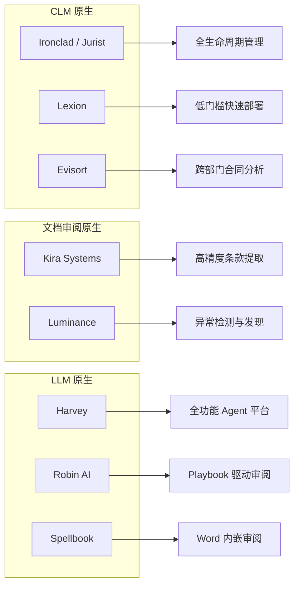
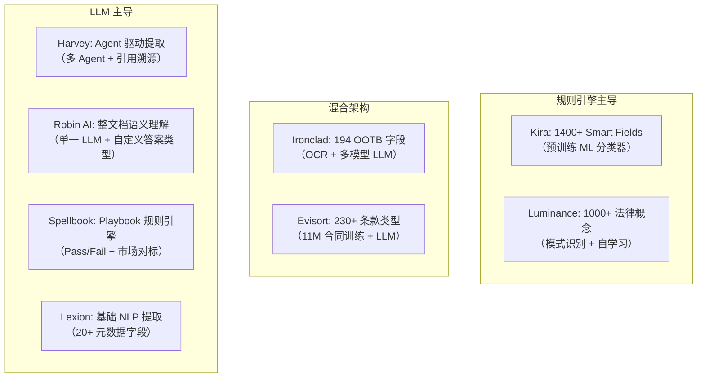
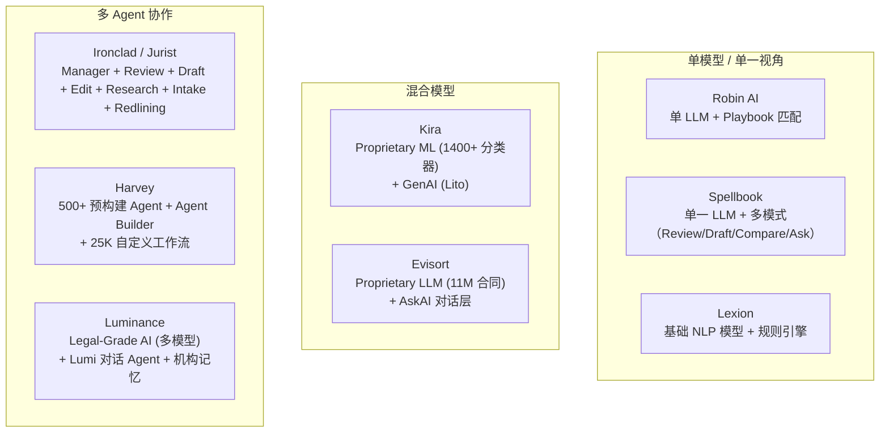
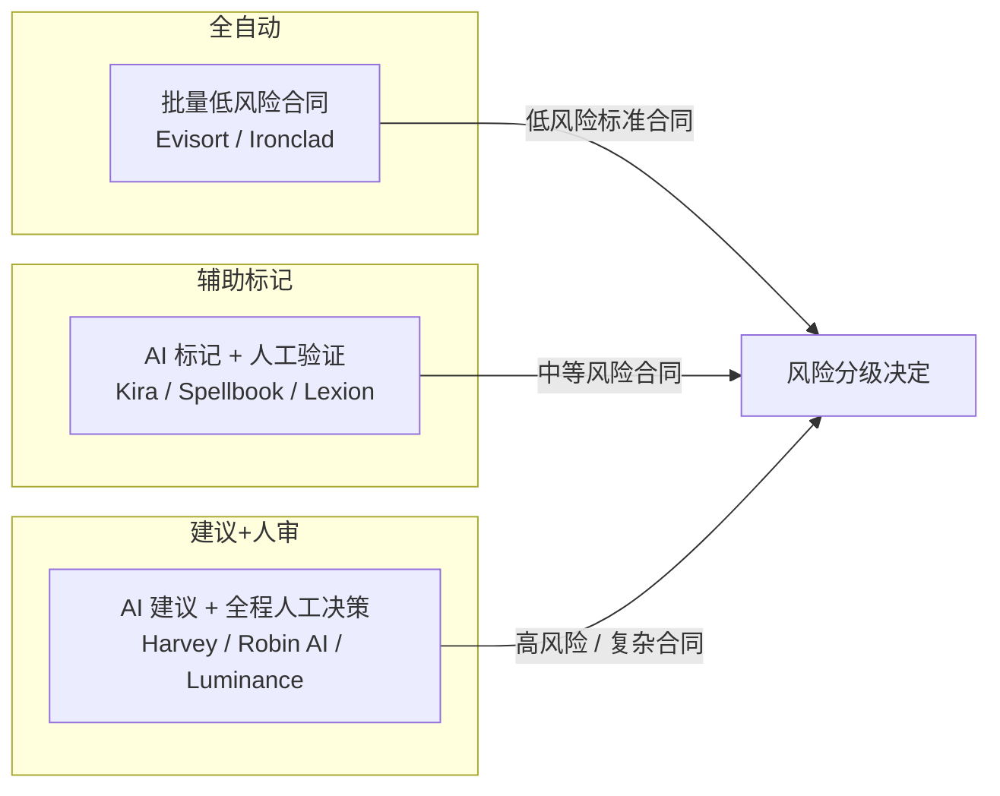
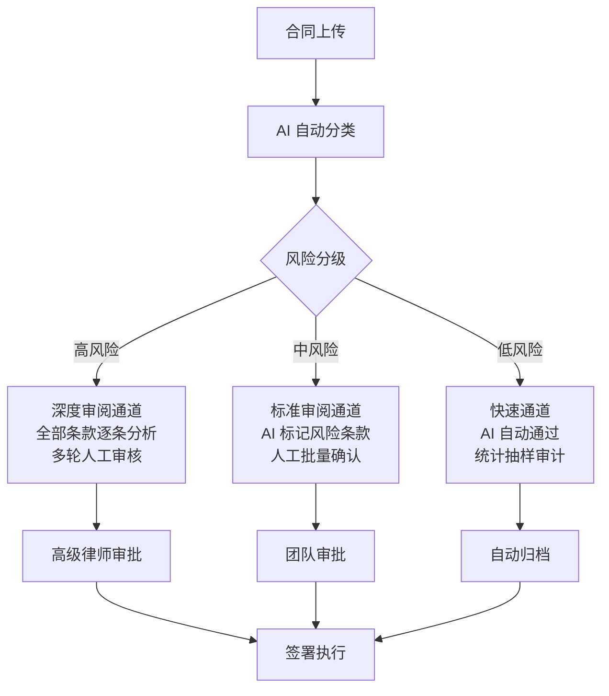
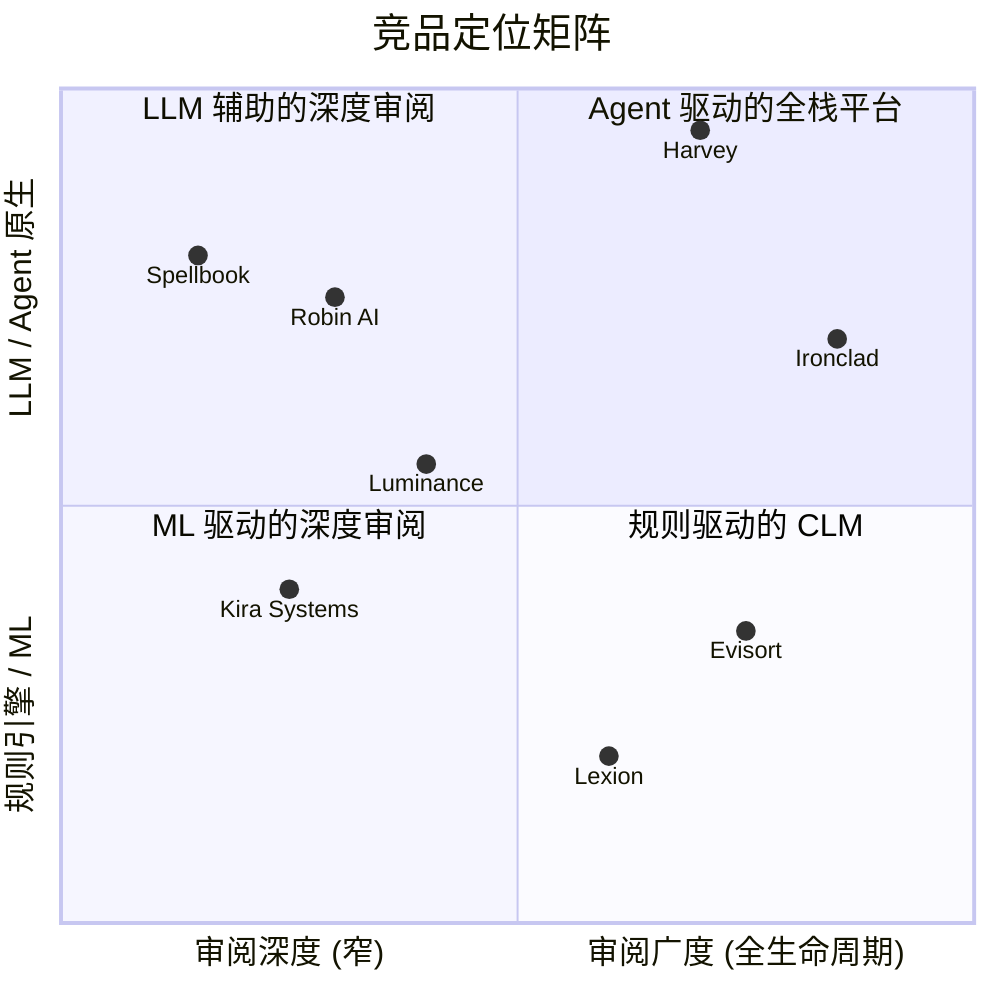

# 竞品文档审核流程拆解

> **版本**: v1.0
> **创建日期**: 2026-07-29
> **状态**: Active
> **分析范围**: 8 款 AI 合同/法务文档审阅产品全流程拆解
> **上游文档**: `docs/01_business_research/business_summary.md`

---

## 目录

1. [竞品概览](#1-竞品概览)
2. [文档上传与预处理](#2-文档上传与预处理)
3. [文档解析与结构化](#3-文档解析与结构化)
4. [AI Agent 审核](#4-ai-agent-审核)
5. [人工审核环节 HITL 实现](#5-人工审核环节-hitl-实现)
6. [流程编排与自动化](#6-流程编排与自动化)
7. [综合对比与洞察](#7-综合对比与洞察)

---

## 1. 竞品概览

### 1.1 竞品画像

| 产品 | 母公司 | 定位 | 核心差异化 | 估值/ARR | 目标用户 |
|------|--------|------|-----------|----------|---------|
| **Ironclad (Jurist)** | Ironclad | Enterprise CLM + AI Agent 平台 | 多 Agent 架构嵌入 CLM 全生命周期 | $150M ARR | 企业法务 + 法律运营 |
| **Kira Systems** | Litera | ML 驱动的合同智能分析 | 1400+ Smart Fields + GenAI 混合架构 | — | 律所 M&A + 企业法务 |
| **Luminance** | Luminance Technologies | Legal-Grade AI 全栈平台 | 模式识别 + 异常检测 + 机构记忆 | $30M ARR | 律所 + 企业法务 |
| **Harvey** | Harvey AI | LLM 原生的 Agent 平台 | 500+ 预构建 Agent + Agent Builder | ~$11B 估值 / $50M ARR | AmLaw 律所 + 企业法务 |
| **Robin AI** | Robin AI | 中端市场合同审阅 | Playbook 驱动 + 人工验证优先 | — | 中端法务 + 采购团队 |
| **Spellbook (Rally)** | Rally | MS Word 嵌入的 AI 助手 | 6 阶段审阅流程 + 市场对标 | $120M+ 融资 | 律所 + 企业法务 |
| **Lexion** | DocuSign | AI 原生 CLM | 邮件驱动 + 快速上手 | — | 中小企业法务 |
| **Evisort** | Workday | AI 合同分析与 CLM | 11M 合同训练库 + Workday 生态 | — | 企业运营 + 法务 + 采购 |

### 1.2 产品架构起源

---

## 2. 文档上传与预处理

### 2.1 文档格式支持

| 格式 | Ironclad | Kira | Luminance | Harvey | Robin AI | Spellbook | Lexion | Evisort |
|------|:--:|:--:|:--:|:--:|:--:|:--:|:--:|:--:|
| PDF | Y | Y | Y | Y | Y | Y (via Word) | Y | Y |
| DOCX | Y | Y | Y | Y | Y | Y (原生) | Y | Y |
| DOC (旧版) | Y | Y | — | — | — | — | — | — |
| 图片 (PNG/JPG) | Y (API) | — | — | — | — | — | — | — |
| PPT/PPTX | Y (API) | — | — | — | — | — | — | — |
| XLS/XLSX | Y (API) | — | — | — | — | — | — | — |
| MSG/EML | Y (API) | — | Y (邮件附件) | — | — | — | Y (邮件载体) | — |
| TXT | Y (API) | — | — | — | — | — | — | — |
| 扫描件 OCR | Y (最佳) | Y | Y (Tesseract) | — | — | — | Y | Y (有限) |

**关键发现**: Ironclad 文件格式支持最广泛（12+ 格式），Spellbook 因深度绑定 Word 而最聚焦。

### 2.2 上传方式对比

| 上传方式 | Ironclad | Kira | Luminance | Harvey | Robin AI | Spellbook | Lexion | Evisort |
|---------|:--:|:--:|:--:|:--:|:--:|:--:|:--:|:--:|
| 拖拽上传 | Y | Y | Y | Y | Y | — (Word 内) | Y | Y |
| API 接入 | Y (Smart Import) | — | — | — | — | — | — | — |
| 邮件接收 | Y | — | — | — | — | — | Y (核心) | — |
| 云盘集成 | Y (Dropbox/OneDrive/Box) | — | Y (G-Drive/Salesforce/SharePoint 计划) | Y (iManage/NetDocs/SharePoint) | Y (G-Drive/SharePoint/Salesforce) | — | Y (Slack/Teams) | Y (Box/G-Drive/SharePoint) |
| DMS 集成 | — | Y (iManage) | — | Y (iManage/NetDocs/SharePoint) | — | — | — | — |

**关键发现**: Harvey 和 Ironclad 在企业集成深度上领先；Lexion 的邮件驱动入口对非法律团队最友好。

### 2.3 预处理能力

| 能力 | Ironclad | Kira | Luminance | Harvey | Robin AI | Spellbook | Lexion | Evisort |
|------|:--:|:--:|:--:|:--:|:--:|:--:|:--:|:--:|
| OCR (扫描转文本) | Y | Y | Y (Tesseract + 自研) | — | — | — | Y | Y |
| 自动格式转换 | Y (DOCX->PDF) | — | — | — | — | — (原生 Word) | — | — |
| 文档结构保留 | Y | Y | Y | Y | — | Y (原生 Word) | — | — |
| 元数据自动提取 | Y (194 字段) | Y (1400+ Smart Fields) | Y | Y | Y | Y | Y (20+ 字段) | Y (230+ 条款) |
| 文档自动分章 | — | — | Y (布局分析) | — | — | — | — | Y |
| 超链接追踪 | Y (Intake Agent) | — | — | — | — | — | — | — |

### 2.4 批量处理能力

| 指标 | Ironclad | Kira | Luminance | Harvey | Robin AI | Spellbook | Lexion | Evisort |
|------|---------|------|-----------|--------|---------|-----------|--------|---------|
| 单次批量上限 | 2000 文件 | — | — | 100,000 文档/项目 | 数千文档 | — | — | 10,000 文档 |
| 单文件上限 | 100MB / 100 页 | — | — | — | — | — | — | — |
| 批量处理速度 | — | 10x 搜索加速 (2025) | 180K 文档 2 周 | 50M+ 条款/周 | — | — | — | 10K/15 小时 |
| 批量结果交付 | CSV (邮件) | Analysis Grid | 可视化仪表板 | Review Table | Excel (多文档) | — | 仪表板 | 仪表板 |

---

## 3. 文档解析与结构化

### 3.1 技术方案对比

### 3.2 条款提取能力对比

| 能力 | Ironclad | Kira | Luminance | Harvey | Robin AI | Spellbook | Lexion | Evisort |
|------|:--:|:--:|:--:|:--:|:--:|:--:|:--:|:--:|
| OOTB 条款提取 | 194 字段 | 1400+ Smart Fields | 1000+ 法律概念 | 合同 Agent 可配置 | 模板库 | Playbook 规则 | 20+ 字段 | 230+ 条款 |
| 自定义提取字段 | Y (训练数据) | Y (Generative Smart Fields) | Y (布局分析) | Y (Agent Builder) | Y (自定义答案类型) | Y (自定义 Playbook) | Y | Y (20+ 小时训练) |
| 实体识别 (日期/金额/方) | Y | Y | Y | Y | Y | Y | Y | Y |
| 跨条款关联分析 | — | — | Y (义务关联) | Y (Review Table) | Y (跨章节引用) | — | — | Y |
| 修订标记处理 | Y (Redlining Agent) | — | Y | Y (Word 跟踪修订) | Y (用户/对方编辑区分) | Y (原生 Word) | Y (基础) | — |
| 多语言支持 | 有限 (US 日期格式) | Y (Generative Smart Fields 任意语言) | 有限 (非 MS 格式差) | Y | — | — | — | — |
| 表格数据提取 | 困难 (已知局限) | — | — | — | — | — | — | — |
| 准确率基准 | 91.5% 满意度 | 90%+ | — | — | — | — | < 90% | 80-90% |

**核心洞察**: Kira 的 1400+ Smart Fields 代表了最成熟的规则引擎方案；Harvey 的 Agent 驱动提取代表了 LLM 原生的未来方向；Lexion 的 sub-90% 准确率是显著短板。

### 3.3 长文档处理策略

| 产品 | 长文档 (> 50 页) 处理策略 |
|------|--------------------------|
| **Ironclad** | 100 页硬限制；Intake Agent 可处理 100 页合同 + 追踪超链接内容 |
| **Kira** | 智能分段 + Smart Fields 跨段提取；10x 搜索架构支持万级文档 |
| **Luminance** | 布局分析分段 → 逐段 AI 分析 → 跨段概念关联 |
| **Harvey** | Harvey Vault 单项目 100K 文档；Agent 分阶段提取 → Review Table 结构化呈现 |
| **Robin AI** | 整文档语义理解；问题是按全文阅读合成的，非逐段拼接 |
| **Spellbook** | Word 环境无独立上传；Review Mode 支持整文档 + 选中部分 |
| **Lexion** | 100 页建议上限；大文件标注为"challenging" |
| **Evisort** | OCR 分段；10K 文档批次；长文档性能受 OCR 质量影响显著 |

---

## 4. AI Agent 审核

### 4.1 AI 审核架构对比

### 4.2 风险识别方法论

| 产品 | 方法 | 说明 |
|------|------|------|
| **Ironclad** | **Playbook 规则匹配 + LLM 推理** | Redlining Agent 按组织 Playbook 逐条检查；多模型按任务选择 |
| **Kira** | **预训练 ML 分类器 + GenAI 辅助** | Smart Fields 以 90%+ 准确率分类条款；Generative Smart Fields 支持自然语言创建新规则 |
| **Luminance** | **模式识别异常检测 + Lumi LLM** | 自动识别偏离标准模板的条款；Deep Coding 无需预训练即可发现非标准条款 |
| **Harvey** | **Agent 自主推理 + Playbook 边界约束** | Agent 自主分解审阅目标；Playbook 内自动执行，超出边界触发人工暂停 |
| **Robin AI** | **Playbook 完全匹配** | 逐条比对 Playbook 预设立场；建议预批准的 Fallback 语言；风险分级输出 |
| **Spellbook** | **Playbook Pass/Fail + 市场对标** | 每个规则对合同条款判定 Pass/Fail；Benchmarks 对比 2300+ 合同类型的行业基准 |
| **Lexion** | **基础 NLP + 规则匹配** | AI Contract Assist 在 Word 中按公司 Playbook 审阅；准确率 < 90% |
| **Evisort** | **Proprietary LLM 语义理解** | 11M 合同训练模型；AskAI 支持自然语言风险查询；需 20+ 小时训练达到最优 |

### 4.3 自定义审阅规则 / Playbook 能力

| 产品 | Playbook 创建方式 | Playbook 复杂度 | 组织级管理 |
|------|------------------|:---:|:---:|
| **Ironclad** | Playbook 编辑器 (规则 + 立场 + Fallback) | 高 | Y (组织级 Context) |
| **Kira** | Generative Smart Fields (自然语言 prompt) | 中 | Y (项目级 GenAI 开关) |
| **Luminance** | 审批模板 + 标准条款库 | 中 | Y (机构记忆架构) |
| **Harvey** | Agent Builder (自然语言 + Playbook Editor) + Playbook Creation Agent (对话式创建) | 高 | Y (组织级 Context) |
| **Robin AI** | 配置化 Playbook (立场 + Fallback + 答案类型) | 高 | Y (Enterprise 专属) |
| **Spellbook** | Playbook 规则集 + 偏好学习 (自适应) | 中 | Y |
| **Lexion** | AI Contract Assist 配置 | 低 | 有限 |
| **Evisort** | 自定义条款训练 (20+ 小时) | 中 | Y (Workday 集成) |

### 4.4 行业 / 法域专用模板

| 产品 | 行业模板 | 法域覆盖 | 专业知识库 |
|------|---------|:---:|-----------|
| **Ironclad** | 企业全行业 (得益于 CLM 广覆盖) | 主要英语法域 | 组织自有 Playbook |
| **Kira** | M&A、房地产、银行、金融、税务、IP、PE | 50+ 法域 | 100 万+ 合同训练集 |
| **Luminance** | 金融服务、法律、采购、合规 | 70+ 国家运营 | 150M+ 法律文档训练 |
| **Harvey** | M&A、基金、劳动与就业、IP、白领调查 | 英语法域为主 | 25K+ 自定义工作流 |
| **Robin AI** | NDA、供应商协议、销售合同、ISO 合规 | 英语法域 | 4.5M+ 法律文档 |
| **Spellbook** | 2300+ 合同类型对标基准 | 英语法域 | 偏好学习 (自适应) |
| **Lexion** | 生物科技、制药、医疗、技术 | 英语法域 | 有限 |
| **Evisort** | 企业通用 + Workday(HR/财务) | 英语法域 | 11M 合同训练集 |

### 4.5 AI 审核自动化程度

| 自动化级别 | 代表产品 | 描述 |
|-----------|---------|------|
| **高自动化** (全自动 + 抽查) | Ironclad、Evisort | 低风险标准合同自动通过；高风险升级人工 |
| **中自动化** (AI 标记 + 批量验证) | Kira、Spellbook、Lexion | AI 完成初筛和标记；人工集中审核异常项 |
| **低自动化** (AI 建议 + 全程人工) | Harvey、Robin AI、Luminance | 每个关键决策点设人工检查点；AI 定位于加速而非替代 |

---

## 5. 人工审核环节 (HITL 实现)

### 5.1 HITL 节点位置

```mermaid
flowchart LR
    Upload["上传"] --> Preprocess["预处理"]
    Preprocess --> Extract["AI 提取"]
    Extract --> Risk["AI 风险识别"]
    Risk --> Human1{"&#9970; 人工审核节点 1<br/>提取结果验证"}
    Human1 --> Redline["AI 红线和建议"]
    Redline --> Human2{"&#9970; 人工审核节点 2<br/>修改建议审批"}
    Human2 --> Final["最终审批"]
```

### 5.2 HITL 交互形式对比

| 产品 | 交互形式 | 信心指示 | 引用溯源 | 协同审阅 |
|------|---------|:--:|:--:|:--:|
| **Ironclad** | 绿色 AI 建议标记 + 接受/拒绝/修改三种操作；批量结果 CSV 邮件交付 | Y (建议置信度) | Y (链接到源位置) | Y (工作流分配) |
| **Kira** | Analysis Grid 表格视图 + 内联聊天；逐字段验证 | Y (90%+ 准确率) | Y (内置源引用) | Y (大型协作审阅) |
| **Luminance** | 色码风险标注 + Word 内一键替换；TAR 编码异常观察 | Y (95% 置信阈值) | Y (Lumi 引用回答) | Y (团队路由) |
| **Harvey** | 计划审查 → 分阶段决策点 → 决策日志；Playbook 外暂停询问 | Y (决策分级) | Y (源段落引用基石) | Y (团队协作) |
| **Robin AI** | 表格报告 + 可点击引用 + 接受/拒绝/修改；Automated Review 10 分钟内完成 | Y (点击验证) | Y (精确源段落链接) | 有限 (托管服务) |
| **Spellbook** | Word 内跟踪修订 + 评论 + 接受/拒绝/修改；律师名下生成 | Y (Pass/Fail) | Y (条款定位) | Y (并行审批路径) |
| **Lexion** | Word 内红线 + 审批链；基础审计日志 | 有限 | 有限 | Y (审批工作流) |
| **Evisort** | AskAI 对话 + 仪表板验证；ABA Rule 5.3 HITL 协议 | Y (元数据置信度) | 有限 | Y (工作流路由) |

### 5.3 AI 标记引导注意力的方式

| 产品 | 注意力引导机制 |
|------|---------------|
| **Ironclad** | 绿色高亮 AI 建议；未验证记录特殊图标标记 |
| **Kira** | Analysis Grid 即时总览所有文档的风险与趋势 |
| **Luminance** | 色码风险分级 (红/黄/绿)；异常检测自动推送到审阅者 |
| **Harvey** | Review Table 结构化呈现偏离条款；Playbook 外条款自动升级 |
| **Robin AI** | 报告表格 + 排序/筛选快速定位高风险区域 |
| **Spellbook** | Pass/Fail 二分 + 风险严重度标注 + Market Benchmark 对比 |
| **Lexion** | AI Contract Assist 在 Word 中标记缺失条款和不合规语言 |
| **Evisort** | AskAI 自然语言查询 + 仪表板风险卡片 |

### 5.4 HITL 设计模式总结

基于 8 款竞品分析，当前主流的 HITL 模式可归纳为四种：

| 模式 | 代表产品 | 工作方式 | 适用场景 |
|------|---------|---------|---------|
| **内联审批** | Spellbook, Lexion | 在原生编辑器 (Word) 中直接审批 AI 建议，逐条接受/修改/拒绝 | 日常合同审阅，律师熟悉 Word |
| **面板审批** | Kira, Robin AI | 在专门的审阅面板 (表格) 中批量审查，点击引用验证来源 | 多文档审阅，批量合规检查 |
| **对话审批** | Luminance, Evisort, Harvey | AI 助手对话式呈现风险、回答问题，审阅者在对话中做决策 | 复杂分析，探索性审阅 |
| **工作流审批** | Ironclad, Lexion | AI 标记嵌入 CLM 审批链，按角色路由，SLA 计时 | 企业级合同管理，多人协同 |

### 5.5 审核进度追踪与 SLA 管理

| 产品 | 进度追踪 | SLA 管理 | 提醒机制 |
|------|:--:|:--:|:--:|
| **Ironclad** | Y (CLM 原生) | Y (合同周期 SLA) | Y (自动提醒) |
| **Kira** | Y (项目级) | — | — |
| **Luminance** | Y (工作流状态) | — | — |
| **Harvey** | Y (工作流状态) | — | Y (定时后台执行) |
| **Robin AI** | Y (验证状态) | — | Y (续约提醒) |
| **Spellbook** | Y (版本控制) | — | — |
| **Lexion** | 有限 (基础审计) | Y (审批链计时) | Y (续约/里程碑提醒) |
| **Evisort** | Y (工作流仪表板) | Y (可配 SLA + 升级) | Y (合规里程碑提醒) |

**关键发现**: Ironclad 和 Evisort 在 SLA 管理上最成熟，因为它们是 CLM 原生平台。纯审阅工具 (Kira, Spellbook) 通常不在产品中内置进度管理。

---

## 6. 流程编排与自动化

### 6.1 自定义审阅流程

| 产品 | 流程定制方式 | 条件分支 | 并行审批 | 动态路由 |
|------|-------------|:--:|:--:|:--:|
| **Ironclad** | CLM 工作流引擎 + Agentic Workflow | Y (高风险深度 / 低风险快速) | Y | Y |
| **Kira** | 项目配置 + Intelligent Workflows | — | Y (协作审阅) | — |
| **Luminance** | 自动化路由 + 审批模板 | Y (标准 vs 非标分流) | — | Y (自动路由) |
| **Harvey** | Agent Builder (25K+ 自定义工作流) | Y (条件 Agent 逻辑) | Y | Y (Agent 自主路由) |
| **Robin AI** | 端到端平台 + 模板工作流 | — | — | — |
| **Spellbook** | 6 阶段流程 + 多审阅模式选择 | Y (风险分级队列) | Y (并行审批路径) | — |
| **Lexion** | No-Code 拖拽构建器 | Y (但有刚性问题) | Y (审批链) | 有限 |
| **Evisort** | 可配置工作流 (4.5/5 评分) | Y | Y | Y |

### 6.2 条件分支策略

**竞品实现对比**:

| 分流逻辑 | Ironclad | Harvey | Luminance | Spellbook |
|---------|:--:|:--:|:--:|:--:|
| 合同类型分流 | Y | Y | Y | Y |
| 风险评分分流 | Y | Y (Playbook 边界) | Y (异常检测) | Y (风险分级) |
| 金额阈值分流 | Y (CLM 原生) | — | — | Y |
| 对方方风险分流 | Y | — | — | — |
| Agent 自主路由 | Y (Agentic) | Y (Agent Builder) | — | — |

### 6.3 审阅后自动操作

| 自动操作 | Ironclad | Kira | Luminance | Harvey | Robin AI | Spellbook | Lexion | Evisort |
|---------|:--:|:--:|:--:|:--:|:--:|:--:|:--:|:--:|
| 自动生成修订版 (Redline) | Y (Redlining Agent) | Y (Lito 集成) | Y (一键重拟) | Y (Word 跟踪修订) | Y (Word Add-In) | Y (Word 原生) | Y (AI Contract Assist) | 有限 |
| 自动生成审阅报告 | Y | Y (Analysis Grid) | Y | Y (Review Table / Memo) | Y (Word/Excel) | Y | Y | Y |
| 自动发送通知 | Y | — | Y (自动路由) | Y | — | — | Y | Y |
| 自动归档 | Y (Repository) | — | Y (中央合同管理) | Y (Vault) | Y (Legal Intelligence Platform) | Y | Y | Y |
| 自动生成交付物 | Y | — | — | Y (Word/PPT/Excel) | Y (Legal AI Assistant) | — | — | — |
| 合规持续监控 | Y | — | Y | Y (定时后台 Agent) | — | — | Y (自动提醒) | Y (实时合规) |

### 6.4 外部系统集成生态

| 集成类别 | Ironclad | Kira | Luminance | Harvey | Robin AI | Spellbook | Lexion | Evisort |
|---------|:--:|:--:|:--:|:--:|:--:|:--:|:--:|:--:|
| **DMS** | — | iManage | — | iManage, NetDocuments, SharePoint | — | — | — | — |
| **云存储** | Dropbox, OneDrive, Box | — | G-Drive, Salesforce, SharePoint (计划) | — | G-Drive, SharePoint, Salesforce | — | — | Box, G-Drive, SharePoint |
| **电子签章** | Y (内置 + DocuSign) | — | — | — | — | — | Y (DocuSign, 但体验差) | Y (内置) |
| **CRM** | Salesforce | — | Salesforce (计划) | — | Salesforce | — | Salesforce (弱) | — |
| **HR/财务** | — | — | — | — | — | — | — | Y (Workday 原生) |
| **MS Office** | Word, Outlook | Word (Lito) | Word | Word, Outlook, 365 Copilot | Word | Word (核心) | Word | Word, Outlook |
| **协作工具** | Slack, Teams | — | — | — | — | — | Slack, Teams | — |
| **API 开放度** | Y (Smart Import API) | — | — | — | — | — | — | — |

**关键发现**: Harvey 的 DMS 集成最全面 (iManage + NetDocuments + SharePoint)；Evisort 借力 Workday 拥有独特的 HR/财务数据协同；Ironclad 的开放 API 最适合自定义集成；Lexion 的 Salesforce 和 DocuSign 集成是已知弱点。

---

## 7. 综合对比与洞察

### 7.1 五维成熟度热力图

以各维度综合评估 (1-5 分，5 为最成熟):

| 产品 | 文档上传与预处理 | 解析与结构化 | AI 审核 | HITL 实现 | 流程编排 | **综合** |
|------|:--:|:--:|:--:|:--:|:--:|:--:|
| **Ironclad** | 5 | 4 | 5 | 4 | 5 | **4.6** |
| **Harvey** | 4 | 5 | 5 | 5 | 5 | **4.8** |
| **Kira** | 4 | 5 | 4 | 4 | 3 | **4.0** |
| **Luminance** | 3 | 4 | 4 | 4 | 4 | **3.8** |
| **Robin AI** | 3 | 4 | 3 | 5 | 3 | **3.6** |
| **Spellbook** | 3 | 4 | 4 | 5 | 3 | **3.8** |
| **Lexion** | 3 | 2 | 2 | 3 | 3 | **2.6** |
| **Evisort** | 4 | 4 | 3 | 3 | 4 | **3.6** |

### 7.2 核心差异维度

### 7.3 最佳实践提炼

**文档上传**: 最成熟的产品 (Ironclad) 支持 12+ 格式 + API + 多源上传 + 批量 + OCR。基准实践应为至少支持 PDF、DOCX 和云端导入。

**文档解析**: 行业正在从纯 ML 分类器 (Kira) 转向混合架构 (ML + LLM)。Ironclad 和 Harvey 的多模型/多 Agent 方法代表了前沿。自定义提取字段能力已经从"需要训练数据"变为"自然语言描述即可"。

**AI 审核**: 行业共识是 Playbook 驱动 + 分级自动化。高/中/低风险分流是标准架构。领先者 (Ironclad、Harvey) 正在实现 Agent 级别的自主工作流编排。

**HITL 实现**: 四种主流交互模式 -- 内联审批 (Spellbook)、面板审批 (Kira)、对话审批 (Luminance/Harvey)、工作流审批 (Ironclad/Lexion) -- 各有适用场景。最佳产品支持至少两种模式。引用溯源已成为行业标配。

**流程编排**: CLM 原生产品 (Ironclad、Evisort) 天然优势明显。纯审阅工具正在通过 Agent Builder (Harvey) 或模块扩展 (Spellbook) 补足这一环节。

### 7.4 市场空白与机会

基于上述分析，以下是当前市场中的关键空白，可能构成新产品的差异化机会：

| # | 空白领域 | 当前状态 | 机会描述 |
|---|---------|---------|---------|
| 1 | **中文 / 亚洲法域支持** | 所有 8 款产品均以英语法域为主，多语言支持有限 | 构建以中国法、亚太法域为核心知识库的审阅产品 |
| 2 | **端到端 HITL + Agent 混合架构** | Harvey 和 Ironclad 在接近但尚未完全融合 | 将 LangGraph interrupt 机制深度嵌入 Agent 工作流 |
| 3 | **长文档 (>100页) 智能分段** | 多数产品有页数限制或性能下降 | 针对 100+ 页复杂合同的专门分段与上下文保留方案 |
| 4 | **垂直行业深度定制** | 仅 Lexion 尝试了行业化 (生物科技/制药) | 针对特定行业 (如房地产租赁、金融衍生品) 的深度术语和条款知识 |
| 5 | **中端市场定价** | 高品质产品 (Harvey/Ironclad) 价格昂贵；低价产品 (Lexion) 准确率不足 | 高准确率 + 可承受价格的中间地带 |
| 6 | **表格与手写 OCR 突破** | 所有产品均承认表格和手写识别是已知短板 | 专用表格解析和手写 OCR 模型可构成技术壁垒 |
| 7 | **跨文档关联审阅** | Kira 和 Harvey 有部分能力，但非核心 | 多文档交叉引用、一致性检查、矛盾检测 |
| 8 | **审阅质量量化评估** | 仅 Kira 提供引用溯源，但无标准化质量评分 | 审阅完整性、一致性、准确性的量化打分体系 |

### 7.5 对 Agent Teams 项目的启示

**直接可用**:
- 分级告警 + 色码标注 (Luminance / Ironclad 已验证)
- 引用溯源 (Harvey / Robin AI 已验证)
- Playbook Pass/Fail + Fallback 语言建议 (Robin AI / Spellbook 已验证)
- 内联审批 (Spellbook Word Add-In) + 面板审批 (Kira Analysis Grid) 双模式

**需适配调整**:
- 从英语法域转向中文法域需要重新训练底层模型或选择合适的中文 LLM
- CLM 级别的流程编排可能超出 MVP 范围，可从审阅专精切入
- 多 Agent 架构 (Ironclad / Harvey) 是差异化机会，但需要 LangGraph 等编排框架支撑
- 批量处理在 MVP 阶段可简化，但要避免 Lexion 的准确率陷阱

**应警惕的风险**:
- Lexion 的 sub-90% 准确率导致用户不信任的教训：准确率基线必须达标
- Luminance 部署周期长的问题：模型训练和调优的时间和资源成本
- 中断风暴 (见 `business_summary.md` 第四节)：分级策略是唯一解

---

## 附录 A: 信息来源

本报告综合以下来源的研究：

| 来源类型 | 数量 | 代表来源 |
|---------|:--:|---------|
| 竞品官网与产品文档 | 8 产品 | ironcladapp.com, harvey.ai, luminance.com, kirasystems.com, robinai.com, spellbook.com, lexion.ai, evisort.com |
| 产品评測平台 | 3 | staymodern.ai, trustradius.com, G2 |
| 行业媒体 | 5 | artificiallawyer.com, legalfutures.co.uk, blockchain.news, itbrief.co.uk, legalnewsfeed.com |
| 投资分析 | 2 | sacra.com, tipranks.com |
| 竞品对比工具 | 3 | rfp.wiki, hyperstart.com, contractzy.io |
| 学术/AI 设计指南 | 4 | arxiv.org, awslabs.github.io, github.com (ai-system-design-guide), koreadeep.com |

## 附录 B: 缩写对照

| 缩写 | 全称 |
|------|------|
| CLM | Contract Lifecycle Management (合同生命周期管理) |
| HITL | Human-in-the-Loop (人机协同) |
| DMS | Document Management System (文档管理系统) |
| OCR | Optical Character Recognition (光学字符识别) |
| OOTB | Out-of-the-Box (开箱即用) |
| SLA | Service Level Agreement (服务等级协议) |
| TAR | Technology Assisted Review (技术辅助审阅) |
| M&A | Mergers & Acquisitions (企业并购) |
| NDA | Non-Disclosure Agreement (保密协议) |

---

> **相关文档**:
> - `../01_business_research/business_summary.md` — 业务调研汇总
> - `../01_business_research/legal_contract_review_research.md` — 业务调研报告
> - `../01_business_research/technical_challenges_review.md` — 技术反方审查报告
> - `../../CLAUDE.md` — 项目上下文指引
