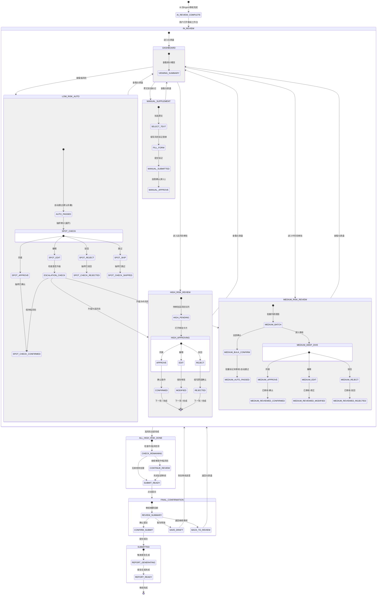

# 人工审批状态交互链路设计

> **版本**: v1.0
> **创建日期**: 2026-07-30
> **文档性质**: 交互链路规范 -- 严格基于上游业务建模的分级处置策略
> **上游依赖**:
> - `docs/03_business_modeling/business_model.md` -- 业务实体模型 + 分级告警策略
> **下游读者**: 前端原型设计 (`docs/05_product_prototype/`)、系统架构设计 (`docs/06_system_architecture/`)、数据模型设计 (`docs/07_data_model/`)

---

## 一、设计总览

### 1.1 设计范围

本文档定义**AI 审核完成状态 (`AI_REVIEW_COMPLETE`) 到最终报告提交状态 (`SUBMITTED`)** 的完整人工审批交互链路，覆盖：

| 设计域 | 核心交互 | 对应业务建模策略 |
|--------|---------|----------------|
| 审批入口与导航 | 仪表盘 + 任务队列 + 并排视图 | `business_model.md` SS 6.2 前端原型输入 |
| 高风险强制审批 | 逐条审批卡片 (approve/edit/reject) | `business_model.md` SS 4.1 分级告警: 高风险 100% 强制 |
| 中风险批量审批 | 批量提交 + 选择性深入 | `business_model.md` SS 4.1 分级告警: 中风险批量可选 |
| 低风险自动 + 抽样 | 默认折叠 + 抽样审计 + 升级路径 | `business_model.md` SS 4.1 分级告警: 低风险自动通过 |
| 手动补充标记 | 原文划选 + 风险标记表单 | `business_model.md` SS 2.6 漏报控制 |
| 审批完成与提交 | 审阅摘要 + 最终确认 + 报告触发 | `business_model.md` SS 3.2 场景 3: 审计追踪与报告 |
| 状态流转总图 | Mermaid 状态图 | `business_model.md` SS 4.1 三层反馈闭环 |

### 1.2 操作规范格式

每个审批操作按 6 要素描述：

```
触发条件 -> 系统响应 -> 用户可操作 -> UI 要素 -> 数据变更 -> 下一状态
```

### 1.3 核心业务实体（复用自 business_model.md SS 4.3）

| 实体 | 审批链路中的角色 |
|------|----------------|
| **Document** | 审批对话的根上下文，携带文档状态 |
| **Clause** | 原文定位锚点，条款类型标签 |
| **RiskFlag** | AI 生成的待审批风险标记，携带等级/类别/置信度/判定依据 |
| **ReviewDecision** | 每次人工审批操作的裁定记录 |
| **PlaybookRule** | 审批卡片中展示的标准条款对比源 |
| **AuditLog** | 不可篡改的全链路操作时间线 |
| **ReviewReport** | 最终提交后触发生成的审阅报告 |

---

## 二、审批入口与导航

### 2.1 审核结果总览仪表盘

#### 触发条件
AI 多 Agent 审核完成，系统生成所有 RiskFlag 并进入 `AI_REVIEW_COMPLETE` 状态，用户打开审阅工作台首页。

#### 系统响应
聚合 RiskFlag 列表，按风险等级分桶统计，渲染仪表盘。

#### UI 要素

```
┌─────────────────────────────────────────────────────────────────────┐
│  审阅工作台 - 文档: NDA_2026_v3.pdf                         [提交] [暂存] │
├─────────────────────────────────────────────────────────────────────┤
│                                                                     │
│  ┌──────────┐   ┌──────────┐   ┌──────────┐   ┌──────────┐        │
│  │  🔴 高风险 │   │  🟡 中风险 │   │  🟢 低风险 │   │  ⬜ 手动补充 │        │
│  │    3      │   │    12     │   │    45     │   │    0      │        │
│  │  待审批   │   │  待批量   │   │  已自动   │   │  待添加   │        │
│  │  ████████ │   │  ██░░░░░░ │   │  ████████ │   │  ──────   │        │
│  │  0/3 完成 │   │  2/12 深入│   │ 45 通过   │   │  点击划选  │        │
│  └──────────┘   └──────────┘   └──────────┘   └──────────┘        │
│                                                                     │
│  整体进度: ████████████████░░░░░░░░░░░░░░ 47/60 项已处理            │
│                                                                     │
└─────────────────────────────────────────────────────────────────────┘
```

#### 关键设计说明

- **高风险卡片**: 必须全部变为"已确认/已修正/已驳回"才允许进入最终提交。进度条用红色表示剩余项的紧迫性。
- **中风险卡片**: 显示"已深入审核数/总数"，未深入的默认自动通过。进度条用黄色。
- **低风险卡片**: 显示自动通过总数 + 抽查样本数。进度条用绿色。
- **手动补充卡片**: 显示已添加的人工标记数量。灰色调表示"非 AI 产出"。
- **整体进度条**: 计算公式 = (高风险已完成 + 中风险已处理 + 低风险已通过 + 手动已提交) / (高风险总数 + 中风险总数 + 低风险总数 + 手动总数)。所有高风险未完成时，"提交"按钮置灰。

#### 数据变更
无数据变更。仅读取 `RiskFlag[]` 和 `ReviewDecision[]` 做聚合统计展示。

#### 下一状态
- 用户点击"高风险"统计卡片 -> 进入高风险强制审批队列 (SS 三)
- 用户点击"中风险"统计卡片 -> 进入中风险批量审批视图 (SS 四)
- 用户点击"低风险"统计卡片 -> 展开低风险自动通过列表 (SS 五)
- 用户在原文中划选 -> 手动补充标记入口 (SS 六)
- 所有高风险处理完毕 -> 提交按钮可用 -> 点击进入最终确认页 (SS 七)

---

### 2.2 审核任务队列

#### 触发条件
用户在仪表盘点击某一风险等级卡片，或点击侧边栏"待审核队列"。

#### 系统响应
根据筛选条件查询 RiskFlag 列表，按默认排序规则排列。

#### UI 要素

```
┌──────────────────────────────────────────────────────────────┐
│  待审核队列                                   筛选: [风险等级▾] [类别▾] │
│                                           排序: [风险等级↓] [位置↑]    │
├──────────────────────────────────────────────────────────────┤
│  # │ 条款类型       │ 风险等级 │ 风险类别       │ 置信度 │ 状态  │
│  1 │ 保密义务范围    │ 🔴 高   │ 定义过宽        │ 92%   │ 待审核│  ← 当前
│  2 │ 保密期限        │ 🔴 高   │ 期限不合理       │ 88%   │ 待审核│
│  3 │ 除外信息定义    │ 🔴 高   │ 缺失关键条款     │ 95%   │ 待审核│
│  4 │ 管辖法律        │ 🟡 中   │ 法域不利        │ 78%   │ 待审核│
│  5 │ 赔偿条款        │ 🟡 中   │ 单向赔偿        │ 85%   │ 待审核│
│  ...                                                    │
│                                          共 15 项待处理       │
└──────────────────────────────────────────────────────────────┘
```

#### 筛选与排序支持

| 筛选项 | 可选值 |
|--------|-------|
| 风险等级 | 高风险 / 中风险 / 低风险 / 手动补充 |
| 风险类别 | 定义过宽 / 期限不合理 / 缺失关键条款 / 法域不利 / 单向赔偿 / 保密范围 / ... |
| 条款类型 | 保密义务 / 保密期限 / 除外信息 / 管辖法律 / 赔偿 / ... |
| 状态 | 待审核 / 已确认 / 已修正 / 已驳回 / 未审核-自动通过 / 已审核-确认 |

| 排序项 | 说明 |
|--------|------|
| 风险等级↓ | 默认：高 > 中 > 低 > 手动 |
| 位置↑ | 按条款在原文中出现顺序 |
| 置信度↓ | AI 置信度从高到低 |
| 状态 | 按审批状态分组 |

#### 关键设计说明

- 默认排序为"风险等级↓ + 位置↑"，确保审核员优先关注高风险，同时保持在文档中的阅读流畅感。
- 点击列表项 -> 进入该条款的审批详情（高风险进入 SS 三，中风险进入 SS 四的深入模式），同时并排视图左面板滚动定位到对应条款。

#### 数据变更
无数据变更。仅查询 `RiskFlag[]` 并按筛选排序条件返回。

#### 下一状态
- 点击高风险项 -> SS 三 高风险强制审批卡片
- 点击中风险项 -> SS 四 中风险深入审核
- 点击低风险项 -> SS 五 低风险详情查看

---

### 2.3 审核任务分配（多人协同）

#### 触发条件
团队管理者将审阅任务分配给多人时，从任务队列切换到分配视图。

#### UI 要素

```
┌──────────────────────────────────────────────────────────────────┐
│  任务分配                                      审阅员: 3 人在线      │
├──────────────────────────────────────────────────────────────────┤
│                                                                  │
│  ┌─ 张三 (主审) ─────────────────────────────────────────────┐   │
│  │  高风险条款: 3 项    [查看详情]  进度: ████████░░ 2/3        │   │
│  │  当前: 保密义务范围 (高风险 · 定义过宽)                     │   │
│  └──────────────────────────────────────────────────────────┘   │
│                                                                  │
│  ┌─ 李四 (复核) ─────────────────────────────────────────────┐   │
│  │  中风险条款: 6 项    [查看详情]  进度: ██░░░░░░░░ 2/6        │   │
│  │  当前: 管辖法律 (中风险 · 法域不利)                         │   │
│  └──────────────────────────────────────────────────────────┘   │
│                                                                  │
│  ┌─ 王五 (补充审查) ─────────────────────────────────────────┐   │
│  │  中风险条款: 6 项    [查看详情]  进度: ██░░░░░░░░ 1/6        │   │
│  │  当前: 赔偿条款 (中风险 · 单向赔偿)                         │   │
│  └──────────────────────────────────────────────────────────┘   │
│                                                                  │
│  分配规则: 高风险 → 张三(主审) + 自动通知李四(复核)               │
│            中风险 → 均分给李四/王五                               │
│            低风险 → 系统自动通过，全员可抽查                      │
│                                                                  │
└──────────────────────────────────────────────────────────────────┘
```

#### 关键设计说明

- **MVP 阶段**：单人审阅为主，多人协同视图作为 v2 扩展。本文档以单人审阅为主线设计交互，多人场景在关键节点标注差异。
- **冲突处理 (v2)**：同一风险标记被多人审批时，采用"先到先得 + 锁定"机制。打开审批卡片时锁定该 RiskFlag（2 分钟超时自动释放），避免并发修改。主审的裁定优先于复核。
- **通知机制 (v2)**：任务分配完成后，通过系统内通知（非邮件/Slack）告知被分配者。

#### 数据变更 (v2)
- `RiskFlag.assigned_to` 字段写入被分配者 ID (v2)
- `RiskFlag.locked_by` + `RiskFlag.locked_at` 字段用于并发控制 (v2)

#### 下一状态
点击被分配的任务 -> 进入对应风险等级的审批视图。

---

### 2.4 并排视图导航

#### 触发条件
用户进入审批工作台，或从任务队列/仪表盘点击任一 RiskFlag。

#### 系统响应
渲染双面板布局：左面板加载原文并定位到选中条款，右面板展示对应风险卡片。

#### UI 要素

```
┌────────────────────────────────┬──────────────────────────────────┐
│  合同原文 (NDA_2026_v3.pdf)      │  风险分析                          │
│                                │                                  │
│  ...                           │  ┌────────────────────────────┐  │
│  第 3 条 保密义务                │  │  🔴 高风险 · 定义过宽       │  │
│  ┌────────────────────────┐    │  │  AI 置信度: 92%             │  │
│  │ 接收方承诺对其因履行本   │    │  │  条款位置: 第3条第1款        │  │
│  │ 协议而知悉的、与披露方   │    │  │                            │  │
│  │ 有关的任何及所有信息     │◀───│──│  "任何及所有信息"过于宽泛     │  │
│  │（下称"保密信息"）承担     │    │  │  缺少合理性与标识义务的      │  │
│  │ 保密义务。               │    │  │  排除条款。                  │  │
│  │ 【高亮底色: 红色 - 高亮】  │    │  │                            │  │
│  └────────────────────────┘    │  │  Playbook 标准:              │  │
│  第 3.1 款 ...                 │  │  "接收方应对披露方明确标识    │  │
│  ...                           │  │  为'保密'的信息承担保密义务"   │  │
│                                │  │                            │  │
│                                │  │  [同意✓] [编辑✏] [驳回✗]  │  │
│                                │  └────────────────────────────┘  │
│                                │                                  │
│                                │  (下一个风险: 保密期限 · 高风险)    │
│                                │                                  │
└────────────────────────────────┴──────────────────────────────────┘
```

#### 关键交互规则

1. **点击风险卡片 -> 原文定位**：用户点击右侧面板的任一风险卡片，左侧原文面板自动滚动到对应条款位置，并以对应风险色（红/黄/绿）的底色高亮 2 秒后渐隐为浅色持续高亮。
2. **点击原文高亮区域 -> 风险卡片切换**：用户在原文中点击某一个已标记的高亮条款区域，右侧面板自动切换为对应风险卡片。
3. **键盘导航**：
   - `Tab` / `Shift+Tab`：在风险卡片元素间移动焦点
   - `Enter`：确认当前焦点的风险卡片的默认操作（高风险默认为"同意"，中风险深入查看后可选）
   - `J` / `K`：向下/向上切换风险卡片（Vim 风格，面向效率型用户）
   - `1` / `2` / `3`：快速执行"同意"/"编辑"/"驳回"操作
4. **滚动同步**：右侧面板滚动到风险卡片时，左侧原文面板同步定位。
5. **并排比例调节**：左右面板的宽度比例可拖拽调整（默认 50:50），支持收起右侧面板进入"纯阅读模式"。

#### 数据变更
无数据变更。仅将当前选中的 `RiskFlag.id` 设置为 UI 状态中的 `active_risk_flag_id`。

#### 下一状态
用户在风险卡片上执行审批操作 -> 进入对应操作流程。

---

## 三、高风险条款强制审批 (Interrupt - 不可跳过)

### 3.1 设计约束

> **来源**: `business_model.md` SS 4.1: "高风险（红色）：100% 强制人工审核，不可跳过"
> **技术实现**: 基于 LangGraph `interrupt()` + `Command(resume=...)` + Checkpointer

**核心约束：**

1. **不可跳过 (Non-Skippable)**: 高风险条款进入 `interrupt` 状态后，AI 工作流暂停。用户必须对每一个高风险 RiskFlag 执行审批操作（approve / edit / reject）才能恢复流程。
2. **不可批量**: 高风险条款必须逐条审批，不能批量全选"同意"绕过审核。
3. **不可为空**: 驳回操作必须填写驳回原因（不低于 10 个字符），编辑操作必须实际修改内容，防止空操作绕过。
4. **阻塞提交**: 系统级约束：存在任一高风险 RiskFlag 处于 `PENDING_REVIEW` 状态时，"提交"按钮全局置灰不可点击。

---

### 3.2 审批卡片结构

#### UI 要素

```
┌──────────────────────────────────────────────────────────────────┐
│  🔴 高风险审批 #1/3                          进度: 1/3 已完成       │
│                                                                  │
│  ┌─ 条款定位 ─────────────────────────────────────────────────┐ │
│  │  条款类型: 保密义务范围           文档位置: 第3条第1款         │ │
│  │  原文: "接收方承诺对其因履行本协议而知悉的、与披露方有关的     │ │
│  │         任何及所有信息（下称"保密信息"）承担保密义务。"        │ │
│  │  页数: P.2  │  段落: 3-5  │  [在原文中定位→]                │ │
│  └────────────────────────────────────────────────────────────┘ │
│                                                                  │
│  ┌─ AI 判定 ──────────────────────────────────────────────────┐ │
│  │  风险等级: 🔴 高风险          风险类别: 定义过宽              │ │
│  │  AI 置信度: ████████░░ 92%                                   │ │
│  │  判定依据:                                                    │ │
│  │  1. "任何及所有信息" -- 范围无边界，未排除以下信息：            │ │
│  │     a) 接收方在披露前已合法持有的信息                          │ │
│  │     b) 非因接收方过错而进入公有领域的信息                      │ │
│  │     c) 接收方从有权披露的第三方合法获得的信息                  │ │
│  │  2. 未要求披露方对保密信息进行合理标识                         │ │
│  └────────────────────────────────────────────────────────────┘ │
│                                                                  │
│  ┌─ Playbook 对比 ────────────────────────────────────────────┐ │
│  │  标准条款 (Playbook Rule #NDA-003):                           │ │
│  │  "接收方应对披露方以书面形式明确标识为'保密'的信息承担保       │ │
│  │   密义务。保密信息不包括：(i) 接收方在披露前已合法持有的信      │ │
│  │   息；(ii) 非因接收方违反本协议而已为公众所知的信息；(iii)     │ │
│  │   接收方从有权披露的第三方合法获得的信息。"                    │ │
│  │                                                               │ │
│  │  差异: 缺少标识要求 + 缺少三项标准排除                         │ │
│  │  偏离程度: 严重偏离                                            │ │
│  └────────────────────────────────────────────────────────────┘ │
│                                                                  │
│  ┌─ AI 修改建议 ──────────────────────────────────────────────┐ │
│  │  建议将"与披露方有关的任何及所有信息"替换为:                    │ │
│  │  "披露方以书面形式明确标识为'保密'的信息，但不包括：            │ │
│  │   (i) 接收方在披露前已合法持有的信息；                         │ │
│  │   (ii) 非因接收方违反本协议而进入公有领域的信息；               │ │
│  │   (iii) 接收方从有权披露的第三方合法获得的信息。"              │ │
│  └────────────────────────────────────────────────────────────┘ │
│                                                                  │
│  ┌─ 审批历史 (如有) ──────────────────────────────────────────┐ │
│  │  (多人协同时展示其他审批人的决策记录)                           │ │
│  └────────────────────────────────────────────────────────────┘ │
│                                                                  │
│  ═══════════════════════════════════════════════════════════════  │
│                                                                  │
│  [✓ 同意]          [✏ 编辑]          [✗ 驳回]                    │
│                                                                  │
└──────────────────────────────────────────────────────────────────┘
```

---

### 3.3 操作 1: 同意 (Approve)

#### 触发条件
审核员确认 AI 标记准确无误，点击"同意"按钮。

#### 系统响应
- 高危操作二次确认（弹窗）：
  ```
  ┌──────────────────────────────────┐
  │  确认审批操作                      │
  │                                  │
  │  你即将确认此 AI 风险标记为有效。     │
  │  风险等级: 🔴 高风险               │
  │  风险类别: 定义过宽                │
  │  条款: 保密义务范围                │
  │                                  │
  │  [取消]            [确认同意]      │
  └──────────────────────────────────┘
  ```
- 提交后：卡片收起为"已确认"摘要态，自动切换到下一个待审批高风险条款。
- 若为所有高风险中的最后一项，卡片收起后显示"所有高风险条款已审批完毕"提示，引导进入中风险批量审批或最终提交。

#### 用户可操作
- 在二次确认弹窗中取消操作 -> 回到审批卡片
- 确认操作 -> 自动前进到下一个高风险项

#### UI 要素
- [✓ 同意] 按钮：绿色主色调，高亮
- 二次确认弹窗：居中模态框，遮罩层
- 审批卡片收起态：
  ```
  ✅ 已确认 · 保密义务范围 (高风险 · 定义过宽) — 2026-07-30 14:32
  ```

#### 数据变更

| 操作 | 实体 | 字段 | 值 |
|------|------|------|----|
| INSERT | ReviewDecision | decision_type | `"approve"` |
| INSERT | ReviewDecision | reviewer_id | 当前用户 ID |
| INSERT | ReviewDecision | risk_flag_id | 当前 RiskFlag.id |
| INSERT | ReviewDecision | comment | `null` (同意无备注) |
| INSERT | ReviewDecision | timestamp | UTC now |
| UPDATE | RiskFlag | status | `PENDING_REVIEW` -> `CONFIRMED` |
| INSERT | AuditLog | action | `"REVIEW_APPROVE"` |
| INSERT | AuditLog | details | `{risk_flag_id, reviewer_id, timestamp, previous_status: "PENDING_REVIEW", new_status: "CONFIRMED"}` |

#### 下一状态
- RiskFlag.status: `PENDING_REVIEW` -> `CONFIRMED`
- 存在其他待审批高风险 -> 自动切换到下一个 `PENDING_REVIEW` 的高风险卡片
- 所有高风险已处理 -> 弹提示引导进入中风险审批或最终提交
- 系统进入 `HIGH_RISK_ALL_REVIEWED` 内部状态（如果所有高风险处理完毕）

---

### 3.4 操作 2: 编辑 (Edit)

#### 触发条件
审核员认为 AI 标记的基本方向正确但需要修正（调整风险等级、修改风险类别、编辑修改建议措辞），点击"编辑"按钮。

#### 系统响应
- 审批卡片展开编辑模式，可编辑字段变为输入控件。
- 不可编辑部分（条款定位、AI 原始判定、Playbook 标准对比、AI 原始修改建议）保留为只读参考。

#### 用户可操作
- 修改风险等级（红色下拉：高风险 / 中风险 / 低风险 / 无风险-驳回）
- 修改风险类别（类别下拉，可多选）
- 编辑修改建议措辞（富文本编辑区，可自由撰写替换后文本）
- 填写编辑备注（理由字段，不低于 10 字符）
- 保存修改 or 取消

#### UI 要素

```
┌──────────────────────────────────────────────────────────────────┐
│  🔴 高风险审批 #1/3  【编辑模式】                                  │
│                                                                  │
│  ... (条款定位 - 只读) ...                                       │
│  ... (AI 原始判定 - 只读) ...                                    │
│  ... (Playbook 对比 - 只读) ...                                  │
│                                                                  │
│  ┌─ 你的修正 ──────────────────────────────────────────────────┐ │
│  │  风险等级: [🔴 高风险 ▾]  ← 可调整                           │ │
│  │  风险类别: [定义过宽 ▾] [+ 添加类别]                          │ │
│  │                                                               │ │
│  │  修改建议 (可编辑):                                           │ │
│  │  ┌─────────────────────────────────────────────────────────┐ │ │
│  │  │ 建议将...替换为:                                         │ │ │
│  │  │ "披露方以书面形式明确标识为'保密'的信息..."               │ │ │
│  │  │ (AI 原始建议作为可编辑的初始值)                           │ │ │
│  │  └─────────────────────────────────────────────────────────┘ │ │
│  │                                                               │ │
│  │  编辑备注:                                                    │ │
│  │  ┌─────────────────────────────────────────────────────────┐ │ │
│  │  │ (必填，不低于 10 个字符)                                  │ │ │
│  │  └─────────────────────────────────────────────────────────┘ │ │
│  └────────────────────────────────────────────────────────────┘ │
│                                                                  │
│  [取消]                          [保存修改]                       │
│                                                                  │
└──────────────────────────────────────────────────────────────────┘
```

#### 数据变更

| 操作 | 实体 | 字段 | 值 |
|------|------|------|----|
| INSERT | ReviewDecision | decision_type | `"edit"` |
| INSERT | ReviewDecision | reviewer_id | 当前用户 ID |
| INSERT | ReviewDecision | risk_flag_id | 当前 RiskFlag.id |
| INSERT | ReviewDecision | comment | 编辑备注文本 |
| INSERT | ReviewDecision | modified_fields | `{risk_level, risk_category, edit_suggestion}` (JSON 记录修改了哪些字段) |
| INSERT | ReviewDecision | original_values | `{risk_level: "高", risk_category: "定义过宽", edit_suggestion: "..."}` (修改前快照) |
| INSERT | ReviewDecision | new_values | `{risk_level: "中", risk_category: "期限不合理", edit_suggestion: "..."}` (修改后值) |
| UPDATE | RiskFlag | risk_level | 若用户修改，则更新为新的风险等级 |
| UPDATE | RiskFlag | risk_category | 若用户修改，则更新为新的风险类别 |
| UPDATE | RiskFlag | edit_suggestion | 若用户修改，则更新为新的修改建议 |
| UPDATE | RiskFlag | status | `PENDING_REVIEW` -> `MODIFIED` |
| INSERT | AuditLog | action | `"REVIEW_EDIT"` |
| INSERT | AuditLog | details | `{risk_flag_id, modified_fields, original_values, new_values}` |

#### 关键设计说明

- **等级降级处理**: 审核员将高风险降为中/低风险时，该 RiskFlag 移出高风险强制审批队列，进入对应等级的处置流程（中风险 -> 批量视图，低风险 -> 自动通过列表）。对于审核员来说，编辑保存后该项从高风险队列消失，卡片自动切换到下一个高风险项。
- **等级升级处理**: 审核员将风险等级从高进一步提升（本已是高，通常不再提升；除非出现"极高"或"严重"等扩展等级），保持在强制审批队列。
- **修改审计**: `original_values` 和 `new_values` 提供完整的修改前后对比，用于审计追踪。
- **编辑有效性验证**: 若用户未做任何实际修改，保存按钮置灰（"无变更，无需保存"）。

#### 下一状态
- RiskFlag.status: `PENDING_REVIEW` -> `MODIFIED`
- 若用户降级为 "无风险-驳回" -> 等同于 reject 操作 (SS 3.5)
- 若修改后风险等级仍为"高风险" -> 视为该高风险项已处理，切换下一个高风险项
- 若修改后降级为中风险 -> 从中风险批量视图中可见该项
- 若修改后降级为低风险 -> 从低风险自动通过列表中可见该项
- 所有高风险处理完毕 -> 引导进入下一阶段

---

### 3.5 操作 3: 驳回 (Reject)

#### 触发条件
审核员认为 AI 误报此风险（该条款实际无风险或风险不成立），点击"驳回"按钮。

#### 系统响应
- 弹出驳回原因填写表单（必填，不低于 10 字符）
- 驳回是一种强操作：确认驳回后，该 RiskFlag 的风险标记被移除，不再出现在任何待审队列中，但保留在审计日志中。

#### 用户可操作
- 填写驳回原因
- 确认驳回 or 取消

#### UI 要素

```
┌──────────────────────────────────┐
│  驳回 AI 风险标记                  │
│                                  │
│  条款: 保密义务范围                │
│  AI 标记: 🔴 高风险 · 定义过宽     │
│                                  │
│  驳回原因 (必填，不低于 10 字符):   │
│  ┌────────────────────────────┐  │
│  │                            │  │
│  │  例如: "该条款为行业标准表述， │  │
│  │  在实际司法实践中此类措辞    │  │
│  │  已被广泛接受。"            │  │
│  │                            │  │
│  └────────────────────────────┘  │
│                                  │
│  ⚠️ 驳回后此风险标记将被移除，      │
│  该条款在审阅报告中显示为          │
│  "AI 标记 · 人工裁定: 驳回"。      │
│                                  │
│  [取消]            [确认驳回]      │
└──────────────────────────────────┘
```

#### 关键设计说明

- **驳回不可逆**: 确认驳回后，该项从所有待审队列中移除。若审核员误操作，需要从"已驳回"历史中重新激活（见 SS 3.6 驳回恢复）。
- **驳回不等于删除**: 驳回的 RiskFlag 保留在数据库（status=`REJECTED`），仅在活跃审批队列中不展示。最终审阅报告中会体现"AI 标记 X 项，其中人工驳回 Y 项"。
- **驳回原因长度验证**: 低于 10 字符（排除空白）提交按钮置灰。
- **驳回原因质量提示**: 不强制审核员写长篇理由，但占位符文本提供行业场景的示例写法，引导写有意义的驳回原因。

#### 数据变更

| 操作 | 实体 | 字段 | 值 |
|------|------|------|----|
| INSERT | ReviewDecision | decision_type | `"reject"` |
| INSERT | ReviewDecision | reviewer_id | 当前用户 ID |
| INSERT | ReviewDecision | risk_flag_id | 当前 RiskFlag.id |
| INSERT | ReviewDecision | comment | 驳回原因文本 |
| UPDATE | RiskFlag | status | `PENDING_REVIEW` -> `REJECTED` |
| UPDATE | RiskFlag | is_active | `true` -> `false` (从活跃审批队列中移除) |
| INSERT | AuditLog | action | `"REVIEW_REJECT"` |
| INSERT | AuditLog | details | `{risk_flag_id, reviewer_id, reject_reason, timestamp}` |

#### 下一状态
- RiskFlag.status: `PENDING_REVIEW` -> `REJECTED`
- 该项从审批队列中移除
- 切换到下一个待审批高风险项
- 所有高风险处理完毕 -> 引导进入下一阶段

---

### 3.6 驳回恢复

#### 触发条件
审核员驳回后想重新评估该项。

#### 系统响应
在"已驳回"历史面板中（可从审批页面侧边访问），审核员可查看所有已驳回项并选择"恢复审批"。

#### 用户可操作
- 查看已驳回列表
- 点击"恢复审批" -> 该 RiskFlag 重新进入 PENDING_REVIEW 状态，回到高风险队列

#### 数据变更

| 操作 | 实体 | 字段 | 值 |
|------|------|------|----|
| INSERT | ReviewDecision | decision_type | `"reinstate"` |
| UPDATE | RiskFlag | status | `REJECTED` -> `PENDING_REVIEW` |
| UPDATE | RiskFlag | is_active | `false` -> `true` |
| INSERT | AuditLog | action | `"REVIEW_REINSTATE"` |

#### 下一状态
- RiskFlag 回到高风险审批队列
- 仪表盘进度计数回退（高风险待审批数 +1）

---

### 3.7 高风险强制审批的不可跳过性 -- 实现约束

> **重点设计说明**

**系统层面的强制约束，而非仅 UI 层面的限制：**

1. **工作流层面**: LangGraph `interrupt()` 造成的暂停在 Checkpointer 中持久化。只有所有高风险项的 RiskFlag.status 从 `PENDING_REVIEW` 转变为 `CONFIRMED` / `MODIFIED` / `REJECTED`，后端才接受 `Command(resume=...)` 调用，工作流才能继续推进至报告生成。

2. **API 层面**: 提交接口 (`POST /api/reviews/{review_id}/submit`) 在接收到请求时：
   ```
   验证逻辑:
   SELECT COUNT(*) FROM risk_flags
   WHERE review_id = :review_id
     AND risk_level = '高'
     AND status = 'PENDING_REVIEW';
   ```
   若 `count > 0`，返回 HTTP 409 Conflict，错误信息: "存在 X 项高风险条款尚未审批，无法提交。"

3. **前端层面**: 存在任一高风险项 `status == 'PENDING_REVIEW'` 时：
   - "提交"按钮置灰
   - 仪表盘整体进度条显示未完成态（红色尾部）
   - 提交按钮 hover tooltip: "请先完成所有高风险条款的审批"

4. **并发安全**: 多人协同时，高风险项被用户 A 打开审批卡片时，后端设置 `RiskFlag.locked_by = user_A_id` 和 `RiskFlag.locked_at = now()`。若用户 B 尝试打开同一风险项，返回"该条款正由 {user_A_name} 审核中"。锁超时 2 分钟自动释放。只有持锁用户可执行 approve/edit/reject。

---

## 四、中风险条款批量审批

### 4.1 批量提交视图

#### 触发条件
用户在仪表盘点击"中风险"卡片，或从任务队列切换到中风险视图。

#### 系统响应
查询所有中风险 RiskFlag，以列表形式展示。

#### UI 要素

```
┌──────────────────────────────────────────────────────────────────┐
│  🟡 中风险条款 (12 项)                        批量操作:            │
│                                              [✓ 全部确认] [深入审核] │
├──────────────────────────────────────────────────────────────────┤
│                                                                  │
│  □ │ 条款类型     │ 风险类别   │ 置信度 │ 状态          │ 操作   │
│  ──┼─────────────┼───────────┼───────┼──────────────┼───────│
│  ☑ │ 管辖法律     │ 法域不利   │ 78%   │ 已审核-确认    │ [撤销] │
│  ☑ │ 赔偿条款     │ 单向赔偿   │ 85%   │ 已审核-确认    │ [撤销] │
│  ☐ │ 保密信息归还 │ 期限模糊   │ 81%   │ 未审核        │ [深入] │
│  ☐ │ 违约金条款   │ 金额过高   │ 76%   │ 未审核        │ [深入] │
│  ☐ │ 转让条款     │ 限制缺失   │ 83%   │ 未审核        │ [深入] │
│  ☐ │ 完整协议条款 │ 优先权冲突 │ 79%   │ 未审核        │ [深入] │
│  ...                                                             │
│                                                                  │
│  ───────────────────────────────────────────────────────────────  │
│  已审核: 2/12  │  确认中: 0  │  未审核: 10                        │
│                                                                  │
│  [全部确认为已审核]  ← 一键将剩余 10 项标记为"未审核-自动通过"      │
│                                                                  │
└──────────────────────────────────────────────────────────────────┘
```

#### 关键设计说明

**中风险默认处置策略**（核心设计决策）:

| 审核员操作 | 标记状态 | 含义 | 审阅报告呈现 |
|-----------|---------|------|------------|
| 深入查看 + 点"同意" | `已审核-确认 (REVIEWED_CONFIRMED)` | 审核员亲自审阅并同意 AI 标记 | 标注"已审核-确认"，附带审核员 ID 和时间戳 |
| 未做任何操作 | `未审核-自动通过 (UNREVIEWED_AUTO_PASSED)` | 审核员信任 AI 判断，未投入时间审查 | 标注"未审核-自动通过"，附带置信度作为参考 |
| 深入查看 + 点"编辑" | `已审核-修正 (REVIEWED_MODIFIED)` | 审核员深入审阅并修正了 AI 标记 | 标注"已审核-修正"，附带原始值 -> 修改值的 diff |
| 深入查看 + 点"驳回" | `已审核-驳回 (REVIEWED_REJECTED)` | 审核员认为 AI 误报 | 标注"已审核-驳回"，附带驳回原因 |

> **为什么中风险默认"自动通过"而非"强制审核"**：
> 1. 效率与安全的平衡：中风险条款占审阅总量约 35-40%，若全部强制审核将导致"中断风暴"(interrupt storm)和审核疲劳 (`business_summary.md` SS 4.1 风险缓解 P1)。
> 2. 竞品分析支持：Ironclad 和 Kira 均采用中风险分级策略（非 100% 强制），行业实践表明中风险强制审核导致 ROI 快速递减。
> 3. MVP 场景适配：NDA 协议的中风险条款（如管辖法律、违约金等）在实际法务审阅中通常不需要逐条深度分析，AI 的初筛判断已足够。

**两种标记的区分意义**：
- `未审核-自动通过` 和 `已审核-确认` 对最终报告的风险统计影响相同，但对审计追踪的可解释性影响不同：前者说明"审核员信任 AI"，后者说明"审核员亲自确认"。
- 在法律责任追溯场景中，`已审核-确认` 的决策权重高于 `未审核-自动通过`。

---

### 4.2 批量操作: 全部确认

#### 触发条件
审核员点击"全部确认为已审核"按钮。

#### 系统响应
- 弹出二次确认：
  ```
  ┌──────────────────────────────────────────┐
  │  批量确认中风险条款                         │
  │                                          │
  │  即将确认 10 项中风险条款，                    │
  │  标记为 "未审核-自动通过"                      │
  │                                          │
  │  这些条款将：                                │
  │  - 保留 AI 原始标记                          │
  │  - 视为审核通过                              │
  │  - 在报告中标注"未审核-自动通过"               │
  │                                          │
  │  建议：如有不确定的条款，请先深入审核            │
  │                                          │
  │  [取消]              [确认全部通过]           │
  └──────────────────────────────────────────┘
  ```
- 确认后，所有剩余未审核中风险项批量更新。

#### 数据变更

| 操作 | 实体 | 字段 | 值 |
|------|------|------|----|
| INSERT (N条) | ReviewDecision | decision_type | `"batch_approve"` |
| INSERT (N条) | ReviewDecision | comment | `"批量确认 - 未审核自动通过"` |
| BATCH UPDATE | RiskFlag | status | `PENDING_REVIEW` -> `AUTO_APPROVED` |
| BATCH UPDATE | RiskFlag | resolution | `"UNREVIEWED_AUTO_PASSED"` |
| INSERT (N条) | AuditLog | action | `"REVIEW_BATCH_APPROVE"` |

#### 下一状态
- 批量项全部进入 `AUTO_APPROVED`
- 用户可选择进入低风险抽样，或直接进入最终确认页

---

### 4.3 中风险深入审核

#### 触发条件
审核员对某个中风险条款有疑问，点击"深入"按钮。

#### 系统响应
为该中风险项展开详细审批卡片，界面结构与高风险审批卡片完全相同（SS 3.2），支持 approve / edit / reject 三种操作。

#### 与高风险审批卡片的差异

| 维度 | 高风险 | 中风险 (深入模式) |
|------|--------|-----------------|
| 卡片标题色 | 红色 (`#DC2626`) | 黄色 (`#D97706`) |
| 操作按钮组 | 同意 / 编辑 / 驳回 | 完全一致 |
| 驳回原因 | 必填 >= 10 字符 | 必填 >= 10 字符 |
| 可否跳过 | 不可跳过 (强制) | 可关闭回到列表 (非强制) |
| 关闭按钮 | 无 (必须做出决定) | 有 [← 返回列表] 按钮 |
| 自动前进 | 处理后自动到下一个高风险项 | 处理后回到中风险列表 |
| 状态标记 | `CONFIRMED` / `MODIFIED` / `REJECTED` | `REVIEWED_CONFIRMED` / `REVIEWED_MODIFIED` / `REVIEWED_REJECTED` |
| resolution 字段 | `"HUMAN_CONFIRMED"` | `"REVIEWED_CONFIRMED"` (区分中高风险) |

#### 数据变更
与高风险 approve / edit / reject 的数据变更相同，区别如下：

| 比对维度 | 高风险 | 中风险深入 |
|---------|--------|-----------|
| ReviewDecision.decision_type | `"approve"` / `"edit"` / `"reject"` | `"approve_medium"` / `"edit_medium"` / `"reject_medium"` |
| RiskFlag.resolution | `"HUMAN_CONFIRMED"` | `"REVIEWED_CONFIRMED"` |
| RiskFlag.status | `CONFIRMED` / `MODIFIED` / `REJECTED` | `REVIEWED_CONFIRMED` / `REVIEWED_MODIFIED` / `REVIEWED_REJECTED` |

#### 下一状态
- 回到中风险批量提交列表
- 该项在列表中显示更新后的状态和标记

---

## 五、低风险条款自动通过 + 抽样

### 5.1 设计约束

> **来源**: `business_model.md` SS 4.1: "低风险（绿色）：自动通过 + 统计抽样审计"

低风险条款的处置策略是"信任 AI + 随机验证"：绝大多数低风险标记直接通过，少数被随机抽取供审核员抽查，作为对 AI 漏报统计风险的主动防御。

---

### 5.2 自动通过条款展示

#### 触发条件
用户在仪表盘点击"低风险"卡片，或页面滚动至低风险区域。

#### 系统响应
查询所有低风险 RiskFlag，默认折叠为摘要行，用户可展开查看列表。

#### UI 要素

```
┌──────────────────────────────────────────────────────────────────┐
│  🟢 低风险条款 - 全部自动通过 (45 项)            [展开列表 ▾]      │
│                                                                  │
│  抽样审计: 已抽取 5 项 (11%) 供抽查，已审核 4/5                    │
│                                                                  │
│  (展开后 ↓)                                                       │
│  ┌──────────────────────────────────────────────────────────────┐ │
│  │ # │ 条款类型     │ 风险类别   │ 置信度 │ 状态          │ 查看  │ │
│  │ 1 │ 通知条款     │ 措辞可优化 │ 65%   │ 自动通过       │ [→]  │ │
│  │ 2 │ 可分割性条款 │ 措辞不完整 │ 68%   │ 自动通过       │ [→]  │ │
│  │ 3 │ 副本效力     │ 法律引用旧 │ 72%   │ 🎲抽查 (待审)  │ [审核]│ │
│  │ 4 │ 标题条款     │ 措辞冗余   │ 63%   │ 自动通过       │ [→]  │ │
│  │ 5 │ 通知地址     │ 地址缺失   │ 70%   │ 🎲抽查 (已确认) │ [→]  │ │
│  │ ...                                                            │ │
│  └──────────────────────────────────────────────────────────────┘ │
│                                                                  │
│  风险提示: 低风险条款可能存在 AI 漏报，建议完成抽样审计后再提交。    │
│                                                                  │
└──────────────────────────────────────────────────────────────────┘
```

#### 数据变更
- 低风险 RiskFlag 在 AI 审核完成后自动标记为 `status = AUTO_APPROVED`, `resolution = AUTO_PASSED`
- 抽样项额外标记 `sampled = true`

#### 下一状态
- 审核员点击抽样项的"审核" -> 进入 SS 5.3 抽样审计详情
- 审核员发现有问题的条款 -> 触发 SS 5.4 升级路径

---

### 5.3 抽样审计入口

#### 抽样策略

| 参数 | MVP 默认值 | 说明 |
|------|-----------|------|
| 抽样比率 (sample_rate) | 11% (≈ N/9) | 可配置，范围 5%-20% |
| 抽样方式 | 分层随机 (stratified random) | 按条款类型分层，确保每种条款类型至少 1 个样本 |
| 最小抽样数 | 下限: 1; 上限: 无 | 即使只有 1 条低风险条款，也抽取 1 条供检查 |
| 抽样时机 | AI 审核完成时自动执行 | 审核员无需手动触发抽样 |
| 种子 | 基于 document.id 的确定性种子 | 同一文档每次看到相同的抽样集合，防止审核员"刷新"绕过不喜欢的样本 |

#### UI 要素

抽样项在列表中用 🎲 图标标识，面板顶部统计行显示："抽样审计: 已抽取 N 项 (X%) 供抽查，已审核 M/N"。

---

### 5.4 抽样审计详情

#### 触发条件
审核员点击抽样项的"审阅"按钮。

#### 系统响应
展开详细审批卡片，界面结构与高风险审批卡片相同（SS 3.2），但操作逻辑略有差异。

#### 操作差异

| 操作 | 与高风险相同的部分 | 低风险抽样的特殊行为 |
|------|------------------|-------------------|
| **同意** | 二次确认弹窗 | 标记为 `SPOT_CHECK_CONFIRMED`（区别于 AUTO_PASSED） |
| **编辑** | 可修改风险等级/类别/建议 | 若提升为高风险 -> 触发升级路径 (SS 5.5) |
| **驳回** | 需填写驳回原因 | 标记为 `SPOT_CHECK_REJECTED`（意味着此标记本身无效） |

#### 审批卡片

```
┌──────────────────────────────────────────────────────────────────┐
│  🟢 低风险 · 抽样审计        抽样进度: 3/5 已完成                   │
│                                                                  │
│  (卡片结构与高风险审批卡片相同)                                     │
│                                                                  │
│  ⚠️ 这是抽样审计项 —— 你的判断可能触发风险升级。                     │
│                                                                  │
│  [✓ 同意]    [✏ 编辑]    [✗ 驳回]    [跳过此样本→]                 │
│                                                                  │
└──────────────────────────────────────────────────────────────────┘
```

#### 关键设计说明

- "跳过此样本"按钮是低风险抽样特有的操作：审核员看了样本并判断没问题，但不想执行任何操作（与"同意"类似但语义不同：同意 = "AI 标记正确"，跳过 = "我不想深入，信任 AI"）。
- "跳过此样本"将该项标记为 `SPOT_CHECK_SKIPPED`，与 `AUTO_PASSED` 区分。

#### 数据变更

| 操作 | RiskFlag.status | RiskFlag.resolution | AuditLog.action |
|------|----------------|---------------------|-----------------|
| 同意 | `SPOT_CHECK_CONFIRMED` | `SPOT_CHECK_CONFIRMED` | `SPOT_CHECK_APPROVE` |
| 编辑 | 若提升等级 -> 见 SS 5.5 | — | `SPOT_CHECK_EDIT` |
| 驳回 | `SPOT_CHECK_REJECTED` | `SPOT_CHECK_REJECTED` | `SPOT_CHECK_REJECT` |
| 跳过 | `SPOT_CHECK_SKIPPED` | `SPOT_CHECK_SKIPPED` | `SPOT_CHECK_SKIP` |

---

### 5.5 抽样发现问题的升级路径

#### 触发条件
审核员在抽样审计中将低风险条款的风险等级提升为中或高。

#### 系统响应
- 弹出升级确认：
  ```
  ┌──────────────────────────────────────────┐
  │  ⚠️ 风险升级确认                          │
  │                                          │
  │  你正在将 "通知条款" 从 🟢 低风险           │
  │  升级为 🔴 高风险。                        │
  │                                          │
  │  此操作将：                                │
  │  - 将该条款移至高风险强制审批队列            │
  │  - 更新风险等级和相关标记                   │
  │  - 记录此升级操作到审计日志                 │
  │                                          │
  │  [取消]              [确认升级]            │
  └──────────────────────────────────────────┘
  ```
- 确认后：该项从低风险列表中移除，追加到高风险审批队列

#### 数据变更

| 操作 | 实体 | 字段 | 值 |
|------|------|------|----|
| INSERT | ReviewDecision | decision_type | `"escalate"` |
| INSERT | ReviewDecision | comment | 升级原因 |
| UPDATE | RiskFlag | risk_level | `低` -> `中` 或 `高` |
| UPDATE | RiskFlag | status | `AUTO_APPROVED` -> `PENDING_REVIEW` |
| UPDATE | RiskFlag | escalated | `false` -> `true` |
| UPDATE | RiskFlag | escalated_from | `低` |
| UPDATE | RiskFlag | escalated_by | 当前用户 ID |
| INSERT | AuditLog | action | `"RISK_ESCALATE"` |
| INSERT | AuditLog | details | `{from: "低", to: "高", reason, ...}` |

#### 关键设计说明

- 升级后，仪表盘高风险计数 +1，低风险计数 -1。
- 升级是不可逆的（升级后不能降回低风险自动通过状态），但审核员仍可在高风险审批中对升级后的项执行 approve/edit/reject。
- 升级是抽样审计中最有价值的交互之一：它直接体现了 HITL 体系中人工审核对 AI 漏报的修正能力。

---

## 六、手动补充标记

### 6.1 设计约束

> **来源**: `business_model.md` SS 1.2 非对称风险: "漏报（False Negative）控制仍然困难 -- AI 看不到的风险不会被中断"
> **场景**: 审核员在阅读原文时发现 AI 遗漏的风险条款

手动补充标记是 HITL 体系中对 AI 漏报的核心防御机制。本文档重点回答：**手动标记是否需要第二人确认？**

---

### 6.2 手动标记入口

#### 触发条件
审核员在并排视图的原文面板中阅读文档时，发现一段未被 AI 高亮标记的条款存在问题。

#### 用户可操作
1. **划选原文**：在左面板原文中用光标选中条款文本范围（与 PDF 标注工具的选区交互一致）
2. **触发标记**：划选后，选区内出现浮动工具条：
   ```
   ┌──────────────────────────────┐
   │ 🏷 标记为风险  │  📋 复制     │
   └──────────────────────────────┘
   ```
3. **填写标记表单**：点击"标记为风险"后，右侧面板弹出标记表单。

#### UI 要素

```
┌──────────────────────────────────────────────────────────────────┐
│  ✋ 手动补充风险标记                                               │
│                                                                  │
│  ┌─ 选中的原文 ────────────────────────────────────────────────┐ │
│  │ "接收方不得将保密信息用于本协议目的之外的任何用途。"           │ │
│  │  条款范围: 第2条第3款  │  字符位置: 142-175                 │ │
│  └────────────────────────────────────────────────────────────┘ │
│                                                                  │
│  风险等级:     [🔴 高风险 ▾]                                     │
│  风险类别:     [请选择类别 ▾]  [+ 自定义类别]                     │
│  详细说明:     (必填，不低于 20 个字符，说明为何认为此处有风险)      │
│  ┌─────────────────────────────────────────────────────────────┐ │
│  │                                                             │ │
│  └─────────────────────────────────────────────────────────────┘ │
│  修改建议:     (可选)                                              │
│  ┌─────────────────────────────────────────────────────────────┐ │
│  │                                                             │ │
│  └─────────────────────────────────────────────────────────────┘ │
│                                                                  │
│  [取消]                          [提交标记]                       │
│                                                                  │
└──────────────────────────────────────────────────────────────────┘
```

#### 数据变更

| 操作 | 实体 | 字段 | 值 |
|------|------|------|----|
| INSERT | Clause | clause_type | 审核员选择或手动输入 |
| INSERT | Clause | raw_text | 选中的原文文本 |
| INSERT | Clause | position_start | 选区起始字符偏移 |
| INSERT | Clause | position_end | 选区结束字符偏移 |
| INSERT | Clause | source | `"MANUAL"` (区分于 AI 提取的条款) |
| INSERT | RiskFlag | risk_level | 审核员设置 |
| INSERT | RiskFlag | risk_category | 审核员设置 |
| INSERT | RiskFlag | source | `"MANUAL"` |
| INSERT | RiskFlag | confidence | `null` (非 AI 生成，无置信度) |
| INSERT | RiskFlag | status | `MANUAL_PENDING_CONFIRMATION` (见 SS 6.3) |
| INSERT | RiskFlag | created_by | 当前用户 ID |
| INSERT | ReviewDecision | decision_type | `"manual_add"` |
| INSERT | ReviewDecision | comment | 审核员填写的详细说明 |
| INSERT | AuditLog | action | `"REVIEW_MANUAL_ADD"` |

---

### 6.3 手动标记的确认机制 -- 设计理由

> **重点设计说明**

#### 设计决策: 单人审核场景下直接生效

**MVP 阶段（单人审阅）：手动标记提交后直接生效，不需第二人确认。**

**设计理由（5 条）：**

1. **业务场景匹配**: MVP 阶段面向的是企业法务和律师的"单人审阅"场景。单人审阅下不存在第二人可确认的条件。引入强制确认机制意味着需要额外的用户角色和协作基础设施，超出 MVP 范围。

2. **效率优先于冗余**: 审核员在阅读原文时发现漏报，是注意力高度集中的时刻。此时要求其记录并等待第二人确认，会打断审阅心流，造成实际工作中审核员选择口头记录而不使用系统的反模式。

3. **个人责任制下的替代信任模型**: 单人审阅场景中，审核员本身就是最终决策责任的承担者。其手动添加的标记和其 approve/edit/reject 的裁定具有同等的法律效力——都是该审核员个人专业判断的体现。第二人确认不会增加额外责任保护。

4. **区别标记提供可追溯性**: 所有手动标记的 `RiskFlag.source = "MANUAL"` 且无 AI 置信度字段，在审阅报告中与其他 AI 标记明确区分。审计追踪完整记录了手动标记的全链路，满足可追溯性需求。审核员的上司或客户可以在审阅报告中明确识别哪些标记来自 AI、哪些来自人工。

5. **低风险场景的防御优先**: 抽样审计（SS 五）已经提供了针对 AI 漏报的系统级防御。审核员在抽样中发现漏报 -> 直接触发升级路径。这个路径比"第二人确认"更高效，因为它不需要等第二人空闲。

#### v2 扩展方向（团队审阅）

| 场景 | 确认机制 | 触发条件 |
|------|---------|---------|
| 单人审阅 (MVP) | 直接生效 | 默认 |
| 双人审阅 (v2) | 主审标记 -> 复核确认 | 审阅 setting: `requires_peer_review = true` |
| 团队审阅 (v2) | 标记进入"补充项队列"，任意第二人确认 | 审阅 setting: `team_review_mode = true` |
| 外部协作 (v3) | 标记 -> 通知文档提交方 | 跨组织审阅场景 |

---

### 6.4 手动标记提交后的流程

#### 触发条件
审核员提交手动标记表单。

#### 系统响应
- 表单关闭
- 原文中对应区域高亮为灰色底色（表示"手动标记"）
- 右侧面板自动切换为刚创建的风险卡片
- 仪表盘手动补充计数 +1

#### 用户可操作
- 对手动标记执行 approve / edit / reject（与 AI 生成的高风险卡片相同）
- 审批操作后，手动标记 status 变为 `MANUAL_CONFIRMED` / `MANUAL_MODIFIED` / `MANUAL_REJECTED`

#### 数据变更 (approve 后)

| 操作 | 实体 | 字段 | 值 |
|------|------|------|----|
| INSERT | ReviewDecision | decision_type | `"approve_manual"` |
| UPDATE | RiskFlag | status | `MANUAL_PENDING_CONFIRMATION` -> `MANUAL_CONFIRMED` |
| INSERT | AuditLog | action | `"REVIEW_MANUAL_APPROVE"` |

#### 下一状态
- 手动标记进入"已确认"状态
- 在审阅报告中归类为"手动补充 - 已确认"

---

### 6.5 手动标记的原文高亮样式

| 标记来源 | 高亮颜色 | 边框样式 | 含义 |
|---------|---------|---------|------|
| AI - 高风险 | 红色底色 (`rgba(220,38,38,0.15)`) | 红色左边框 3px | AI 标记，高风险 |
| AI - 中风险 | 黄色底色 (`rgba(217,119,6,0.15)`) | 黄色左边框 3px | AI 标记，中风险 |
| AI - 低风险 | 绿色底色 (`rgba(22,163,74,0.10)`) | 绿色左边框 3px | AI 标记，低风险 |
| 手动补充 | 灰色底色 (`rgba(107,114,128,0.12)`) | 灰色虚线左边框 3px | 人工发现，非 AI 产出 |
| 当前选中 (any) | 叠加蓝色外发光 | 蓝色外边框 2px | 当前焦点项 |

---

## 七、审批完成与提交

### 7.1 最终提交条件

#### 触发条件
以下条件全部满足时，仪表盘的"提交"按钮变为可用状态：

| # | 条件 | 检查逻辑 |
|---|------|---------|
| 1 | 所有高风险项已处理 | `SELECT COUNT(*) FROM risk_flags WHERE risk_level = '高' AND status = 'PENDING_REVIEW'` 结果为 0 |
| 2 | 至少执行过一次操作 | 存在至少 1 条 ReviewDecision 记录（防止空提交）|
| 3 | (v2) 同级评审已完成 | 若设置了双人审阅，所有高风险项必须经过确认 (v2) |

#### UI 要素

"提交"按钮的状态转换：
```
置灰 + tooltip                可点击 + 主色调
"请先完成所有高风险条款审批"     "提交审阅结果"
```

---

### 7.2 最终确认页

#### 触发条件
审核员点击"提交"按钮。

#### 系统响应
进入最终确认页，展示审阅摘要和统计。

#### UI 要素

```
┌──────────────────────────────────────────────────────────────────┐
│  审阅最终确认 - NDA_2026_v3.pdf                                   │
│                                                                  │
│  ═══════════════════════════════════════════════════════════════  │
│  审阅摘要                                                         │
│  ═══════════════════════════════════════════════════════════════  │
│                                                                  │
│  ┌─ AI 风险标记统计 ───────────────────────────────────────────┐ │
│  │  🔴 高风险: 3 项                                            │ │
│  │     ✅ 已确认: 2     ✏ 已修正: 0     ✗ 已驳回: 1            │ │
│  │                                                              │ │
│  │  🟡 中风险: 12 项                                           │ │
│  │     🔍 已审核-确认: 2     ⏭ 未审核-自动通过: 10             │ │
│  │                                                              │ │
│  │  🟢 低风险: 45 项                                           │ │
│  │     ⚡ 自动通过: 40     🎲 抽样审计: 5 (4✅ 已确认, 1⏭ 跳过) │ │
│  │                                                              │ │
│  │  ✋ 手动补充: 2 项                                          │ │
│  │     📌 已确认: 2                                            │ │
│  └──────────────────────────────────────────────────────────────┘ │
│                                                                  │
│  ┌─ 审阅操作明细 ──────────────────────────────────────────────┐ │
│  │  总计 AI 标记:       60 项                                   │ │
│  │  ├─ 人工确认:         6 项 (10%)                             │ │
│  │  ├─ 人工修正:         0 项  (0%)                             │ │
│  │  ├─ 人工驳回:         1 项  (1.7%)                           │ │
│  │  ├─ 自动通过:        50 项 (83.3%)                           │ │
│  │  ├─ 抽样审计:         5 项  (8.3%)                           │ │
│  │  └─ 手动补充:         2 项                                   │ │
│  │                                                              │ │
│  │  审阅耗时: 12 分钟                                           │ │
│  │  审阅操作: 15 次审批                                         │ │
│  └──────────────────────────────────────────────────────────────┘ │
│                                                                  │
│  ┌─ 高风险条款最终状态 ────────────────────────────────────────┐ │
│  │  1. 保密义务范围 (定义过宽) .............. ✅ 已确认          │ │
│  │  2. 保密期限 (期限不合理) ................ ✅ 已确认          │ │
│  │  3. 除外信息定义 (缺失关键条款) ........... ✗ 已驳回          │ │
│  │     驳回原因: "该条款将除外信息定义分散在第5条和第8条..."       │ │
│  └──────────────────────────────────────────────────────────────┘ │
│                                                                  │
│  ┌─ 操作 ──────────────────────────────────────────────────────┐ │
│  │                                                              │ │
│  │  [← 返回继续审阅]    [暂存草稿]    [确认提交，生成报告 →]      │ │
│  │                                                              │ │
│  └──────────────────────────────────────────────────────────────┘ │
│                                                                  │
└──────────────────────────────────────────────────────────────────┘
```

---

### 7.3 最终提交操作

#### 触发条件
审核员在最终确认页点击"确认提交，生成报告"。

#### 系统响应
- 后端验证（再次检查高风险全部处理、至少一次操作）
- 调用 LangGraph `Command(resume=...)` 恢复工作流
- 触发报告 Agent 生成审阅报告 (ReviewReport)
- 工作流进入 `REPORT_GENERATING` 状态

#### 用户可操作
- 确认提交（不可撤销）
- 返回继续审阅

#### UI 要素
- 提交前最后一次确认弹窗：
  ```
  ┌──────────────────────────────────────────┐
  │  确认提交审阅结果                           │
  │                                          │
  │  提交后将：                                │
  │  - 生成正式审阅报告                         │
  │  - 锁定所有审批操作                         │
  │  - 不可再修改任何审定                       │
  │                                          │
  │  确认提交？                                │
  │                                          │
  │  [取消]                [确认提交]          │
  └──────────────────────────────────────────┘
  ```
- 提交后显示报告生成进度（spinner / 进度条）

#### 数据变更

| 操作 | 实体 | 字段 | 值 |
|------|------|------|----|
| UPDATE | Document | status | `IN_REVIEW` -> `SUBMITTED` |
| UPDATE | Document | submitted_at | UTC now |
| UPDATE | Document | submitted_by | 当前用户 ID |
| UPDATE | ReviewReport | status | `GENERATING` (异步生成) |
| INSERT | AuditLog | action | `"REVIEW_SUBMIT"` |
| INSERT | AuditLog | details | `{total_risk_flags: 62, approved: 6, modified: 0, rejected: 1, auto_passed: 50, manual: 2, ...}` |

#### 下一状态
- `SUBMITTED` -> 报告生成中 -> `REPORT_READY`
- 用户被重定向到报告预览页（不属于本文档范围，见 `docs/05_product_prototype/`）

---

### 7.4 暂存草稿

#### 触发条件
审核员在审批过程中（任意阶段）点击"暂存"/"保存"按钮，或从最终确认页点击"暂存草稿"。

#### 系统响应
保存当前所有审批进度到后端，不触发工作流推进。

#### 数据变更
- `Document.status`: 保持 `IN_REVIEW`（或从 `AI_REVIEW_COMPLETE` 变为 `IN_REVIEW`）
- 所有已有的 `ReviewDecision` 记录保持不变
- `AuditLog`: `"REVIEW_SAVE_DRAFT"` 记录保存时间点和审批状态快照

#### 下一状态
- 用户可从仪表盘重新进入，恢复到暂存时的审批进度
- 恢复时，已完成的高风险项保持已完成，未完成的继续保持 PENDING_REVIEW

---

## 八、状态流转图



---

## 九、关键交互约束速查表

| # | 约束 | 适用区域 | 实现层面 | 严重性 |
|---|------|---------|---------|:------:|
| 1 | 高风险项不可跳过 | SS 三 | 工作流 + API + 前端 3 层约束 | P0 |
| 2 | 高风险项不可批量 | SS 三 | 前端不允许高风险批量全选 | P0 |
| 3 | 驳回必须填写原因 (>= 10 字符) | SS 三 SS 四 | 前端 + API 双重验证 | P0 |
| 4 | 编辑必须实际修改内容 | SS 三 SS 四 | 前端 diff 检测 | P0 |
| 5 | 存在 PENDING_REVIEW 高风险项时禁止提交 | SS 七 | API 409 拦截 | P0 |
| 6 | 未审核中风险默认自动通过 | SS 四 | 后端定时 / 提交时触发 | P0 |
| 7 | 手动标记单人场景直接生效 (MVP) | SS 六 | 业务逻辑 | P1 |
| 8 | 低风险抽样不少于 1 条 | SS 五 | 后端抽样逻辑 | P1 |
| 9 | 升级不可逆 | SS 五.5 | 后端状态机 | P1 |
| 10 | 并发锁 (v2) | SS 三.7 | 后端锁机制 | P2 |
| 11 | 同级评审 (v2) | SS 六.3 | 业务配置 + 工作流 | P2 |

---

## 十、对下游设计的衔接指引

### 10.1 对前端原型 (`docs/05_product_prototype/`)

- **核心页面 (4 页)**:
  1. 审批仪表盘 (SS 二.1) -- 4 个统计卡片 + 进度条
  2. 并排审批工作台 (SS 二.4) -- 左侧原文 + 右侧风险卡片
  3. 高风险审批卡片 (SS 三.2) -- 5 个信息区 + 3 个操作按钮
  4. 最终确认页 (SS 七.2) -- 审阅摘要 + 统计 + 提交
- **关键组件**:
  - 风险卡片 (可复用: 高风险 / 中风险深入 / 低风险抽样 共享同一结构)
  - 可编辑风险标记表单 (SS 三.4 编辑模式 + SS 六.2 手动标记表单)
  - 二次确认弹窗 (模态框模式，多处复用)
  - 任务队列列表 (含筛选排序)

### 10.2 对系统架构 (`docs/06_system_architecture/`)

- **HITL 工作流**: 高风险 interrupt 不可跳过 (LangGraph `interrupt()` + Checkpointer 持久化)
- **状态机**: 本文 SS 八 Mermaid 图 -> 后端状态枚举
- **API 端点 (建议)**:
  - `GET /api/reviews/{id}/dashboard` -- 仪表盘聚合数据
  - `GET /api/reviews/{id}/risk-flags?level=&category=&status=` -- 任务队列
  - `POST /api/reviews/{id}/risk-flags/{flag_id}/approve` -- 单个审批
  - `POST /api/reviews/{id}/risk-flags/{flag_id}/edit`
  - `POST /api/reviews/{id}/risk-flags/{flag_id}/reject`
  - `POST /api/reviews/{id}/risk-flags/batch-approve` -- 批量操作
  - `POST /api/reviews/{id}/risk-flags/manual` -- 手动标记
  - `POST /api/reviews/{id}/submit` -- 最终提交 (含高风险验证)
  - `POST /api/reviews/{id}/save-draft` -- 暂存

### 10.3 对数据模型 (`docs/07_data_model/`)

- **RiskFlag 新增字段**:
  - `resolution`: 枚举 (`HUMAN_CONFIRMED` / `UNREVIEWED_AUTO_PASSED` / `REVIEWED_CONFIRMED` / ...)
  - `source`: 枚举 (`AI` / `MANUAL`)
  - `escalated`: boolean
  - `escalated_from`: risk_level (升级前等级)
  - `sampled`: boolean (是否被抽样)
  - `locked_by`: user_id (v2)
  - `locked_at`: timestamp (v2)
- **ReviewDecision 新增字段**:
  - `modified_fields`: JSON (编辑操作记录)
  - `original_values`: JSON
  - `new_values`: JSON
- **ReviewReport 新增字段**:
  - `summary_stats`: JSON (审阅摘要统计数据)

---

> **上游文档**:
> - `../03_business_modeling/business_model.md` -- 业务实体 + 分级告警策略
> **下游文档**:
> - `../05_product_prototype/` -- 前端原型规范
> - `../06_system_architecture/` -- 系统架构设计
> - `../07_data_model/` -- 数据模型设计
