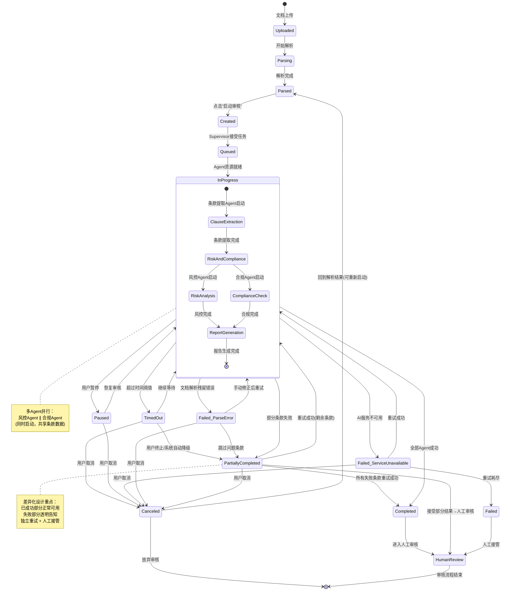

# 中间审核状态交互链路设计

> **版本**: v1.0
> **创建日期**: 2026-07-29
> **文档性质**: 交互流程设计 -- 严格基于上游业务建模，覆盖解析完成至审核结果就绪的全链路
> **上游依赖**:
> - `docs/01_business_research/business_summary.md` -- 业务调研汇总
> - `docs/02_competitive_analysis/analysis_summary.md` -- 竞品分析汇总
> - `docs/03_business_modeling/business_model.md` -- 业务问题建模
> **下游读者**: 产品原型规范 (`docs/05_product_prototype/`)、系统架构设计 (`docs/06_system_architecture/`)

---

## 设计总览

### 设计边界

本文档聚焦于 **解析完成后 → AI 审核执行 → 审核结果就绪** 的完整中间状态交互链路。文档上传与解析阶段（`upload_states_flow.md`）和审核结果的人工裁决阶段（`hitl_review_flow.md`）不在本文档范围内。

### 状态全览

```
文档上传 ──→ 解析中 ──→ 解析完成 ──┬──→ 审核启动 ──→ 审核执行中 ──→ 审核完成 ──→ 人工裁决
                                    │                    │
                                    │                    ├──→ 审核失败 ──→ (重试/人工接管)
                                    │                    │
                                    │                    ├──→ 审核暂停 ──→ (恢复/取消)
                                    │                    │
                                    │                    └──→ 部分成功 ──→ (补审/人工接管)
                                    │
                         (本文档覆盖区域)
```

### 核心设计约束（来自上游）

| 约束 | 来源 | 影响 |
|------|------|------|
| MVP 仅 NDA 协议 | `business_model.md` §5.1 | 条款类型有限（约 8-12 类），简化进度模型 |
| 多 Agent 架构：Supervisor + 4 Agent | `business_summary.md` §3.4 | 需展示 4 个 Agent 的并行/串行进度 |
| 分级 HITL：高(红)/中(黄)/低(绿) | `business_summary.md` §4.1 | 审核完成后的状态过渡到不同深度的人工裁决 |
| LangGraph `interrupt()` + `Command(resume=...)` + Checkpointer | `business_summary.md` §3.2 | 暂停/恢复语义、断点恢复的交互设计 |
| RiskFlag 状态：待审核/已确认/已否决/已修正 | `business_model.md` §4.3 | 审核完成后 RiskFlag 的初始状态为"待审核" |

---

## 一、审核任务启动

### 1.1 解析完成，待启动审核

- **触发条件**: 文档解析 Pipeline 全部完成，条款结构化和位置区间提取完毕，Document 实体状态变为 `parsed`
- **系统响应**:
  1. 解析结果摘要面板出现：显示已提取条款总数、条款类型分布（如保密义务 3 条、期限条款 2 条、例外条款 4 条等）、解析置信度（如有低置信度条款则标注）
  2. 页面主操作区呈现**审核启动卡片**，包含两个核心决策点：审阅范围确认、Playbook 选择
  3. 右侧或底部显示"启动审核"主按钮，状态为可点击
  4. 解析结果旁边提供"查看解析详情"入口，用户可展开逐条款查看结构化提取结果
- **用户可操作**:
  - 点击"查看解析详情"逐条款验证解析质量
  - 手动编辑/修正明显错误的条款分类或文本（可选操作，非必须）
  - 直接在当前页面点击"启动审核"
  - 返回文档上传页面重新上传（如果解析结果严重偏离预期）
- **下一状态**:
  - 用户点击"启动审核" → **1.2 审核前确认**
  - 用户编辑解析结果 → 停留在 **1.1**（系统保存编辑后的条款数据）
  - 用户返回上传页面 → 回到上传流程（本文档范围外）

### 1.2 审核前确认

- **触发条件**: 用户点击"启动审核"按钮
- **系统响应**:
  1. 弹出确认面板（modal 或滑出面板），包含两个确认区域：
     - **审阅范围确认**: 列出所有条款类型及对应条款数，默认全选，允许用户取消勾选不需要 AI 审阅的条款类型（例如用户判断"定义条款"无需风险审查）。MVP NDA 场景下典型条款类型列表：
       - 保密义务 (Confidentiality Obligation)
       - 保密信息定义 (Definition of Confidential Information)
       - 例外条款 (Exclusions/Exceptions)
       - 期限条款 (Term & Duration)
       - 返还/销毁条款 (Return/Destruction)
       - 不绕过条款 (Non-Circumvention)
       - 竞业禁止 (Non-Competition)
       - 管辖法 (Governing Law)
       - 救济条款 (Remedies)
       - 杂项条款 (Miscellaneous)
     - **Playbook 选择**: 选择要应用的审阅规则集。MVP 阶段默认提供"标准 NDA Playbook"，用户也可从已保存的 Playbook 列表中选择（如"严格法务版"、"宽松商业版"、"GDPR 合规强化版"等）
  2. 确认面板底部显示审阅概览：已选条款数 / 总条款数、选中 Playbook 的规则数量、预计审阅耗时（基于条款数估算，如"预计 3-5 分钟"）
- **用户可操作**:
  - 选择/取消选择条款类型
  - 切换 Playbook
  - 点击"开始审核"确认启动
  - 点击"取消"回到 1.1 解析结果页面
- **下一状态**:
  - 点击"开始审核" → **1.3 审核 Agent 就绪**
  - 点击"取消" → 回到 **1.1** 解析完成页
- **设计备注**: 竞品分析显示此环节为差异化机会 -- 多数竞品直接进入审核，不提供范围筛选和 Playbook 选择。为追求效率的用户，可提供"使用默认配置立即审核"快捷入口跳过此步。

### 1.3 审核 Agent 就绪

- **触发条件**: 用户点击"开始审核"，系统提交审核任务到 Supervisor Agent
- **系统响应**:
  1. **非常短暂的过渡状态**（预计 < 2 秒）。如果该步骤耗时可感知（如冷启动），展示加载动画
  2. Supervisor Agent 初始化完成，系统进入 **审核执行中** 阶段
  3. 过渡期间展示以下就绪信息：
     - 显示 4 个专业 Agent 的初始化状态图标：条款提取 Agent、风控 Agent、合规 Agent、报告 Agent
     - 每个 Agent 图标旁边显示状态指示器（就绪中 → 排队中 → 执行中）
     - 显示"审核任务已创建"提示，包含任务 ID（用于后续追踪）
  4. 页面视图自动切换到**审核执行中**的主界面（见 §2）
- **用户可操作**:
  - 无用户操作（过渡状态，自动流转）
- **下一状态**:
  - 自动 → **2.1 整体审核进度展示**

---

## 二、AI 审核执行中

### 设计理念：多 Agent 并行进度可视化

基于上游定义的多 Agent 架构（Supervisor + 4 专业 Agent），审核执行阶段的核心设计挑战是让用户理解 **4 个 Agent 的并行与串行关系**：

```
条款提取 Agent (提取条款结构化数据)
       │
       ├──────→ 风控 Agent (风险识别与分级，消费条款数据)
       │
       └──────→ 合规 Agent (法规符合性检查，消费条款数据)
                      │
                      ├──────→ 报告 Agent (汇总生成审阅报告，消费风控+合规结果)
```

**并行关系**：风控 Agent 和合规 Agent 在条款提取完成后可以**并行执行**。
**串行关系**：报告 Agent 必须等待风控 Agent 和合规 Agent 都完成后才能启动。

这种拓扑结构需要在 UI 中以清晰的方式可视化。

### 2.1 整体审核进度展示

- **触发条件**: 审核任务被 Supervisor 接受，进入执行阶段
- **系统响应**:
  1. **页面布局切换为审核执行视图**：
     - **顶部栏**: 审核状态横幅 — "AI 审核进行中"，旁边显示动态进度条和百分比
     - **左侧区域**: Agent 工作状态面板（4 个 Agent 卡片，见 §2.2-§2.5）
     - **中央区域**: 当前进度的可视化摘要（见下）
     - **右侧区域**: 用户辅助操作区（见 §2.6）
  2. **进度条计算逻辑**：
     - 进度值 = (已完成步骤数 / 总步骤数) × 100%
     - 总步骤数 = 条款提取(1) + 条款数×2(风控+合规各审每条) + 报告生成(1)
     - 实际展示为平滑递增，带动态更新
  3. **中央区域实时动态**：
     - 显示"已审阅条款数 / 总条款数"计数器（实时递增）
     - 显示当前正在审阅的条款名称（如"正在分析: 保密义务条款 §2.1"）
     - 显示已识别的风险标记数（高/中/低分类计数，实时更新）
  4. **审核任务元信息**：任务 ID、启动时间、已运行时长、预估剩余时间（基于当前进度和剩余步骤动态计算）
- **用户可操作**:
  - 查看各 Agent 的详细进度
  - 访问右侧辅助操作区（§2.6）
  - 点击"暂停审核"（→ §5.1）
  - 点击"取消审核"（→ §5.3）
- **下一状态**:
  - 所有 Agent 正常完成 → **3.1 审核全部完成**
  - 任何 Agent 异常终止 → **4.x 审核失败**（根据失败类型）
  - 用户暂停 → **5.1 用户主动暂停**
  - 用户取消 → **5.3 生命周期：已取消**

### 2.2 条款提取 Agent 进度

- **触发条件**: Supervisor 将任务分配给条款提取 Agent
- **系统响应**:
  1. Agent 卡片状态切换为 **执行中**（绿色脉冲动画），卡片内显示：
     - **Agent 名称**: "条款提取 Agent"
     - **状态标签**: "提取中" / "已完成"
     - **进度**: "已提取 7/12 条款"（计数器实时更新）
     - **当前操作**: "正在识别: 保密信息定义条款"（当前正在处理的条款类型名称）
     - **完成项预览**: 已提取的条款类型列表（带勾号），折叠显示，可展开查看详情
  2. 如果用户之前手动编辑了解析结果，条款提取 Agent 将以用户修正后的数据为准
  3. 低置信度条款（解析阶段已标记的）在提取时会被高亮提示，Agent 对此类条款将采用更保守的提取策略
- **用户可操作**:
  - 展开已提取条款列表查看详情
  - 暂停审核（§5.1）
- **下一状态**:
  - 提取完成 → 风控 Agent 和合规 Agent 自动并行启动（§2.3, §2.4）
  - 提取失败 → **4.2 文档解析残留错误**（如果失败原因是条款无法识别）
  - 提取超时 → **4.3 审核超时**

### 2.3 风控 Agent 进度

- **触发条件**: 条款提取 Agent 完成，Supervisor 将风控任务分配给风控 Agent
- **系统响应**:
  1. Agent 卡片状态切换为 **执行中**（橙色脉冲动画，表示风险分析），卡片内显示：
     - **Agent 名称**: "风控 Agent"
     - **状态标签**: "风险分析中"
     - **进度**: "已分析 5/12 条款"（与合规 Agent 可并行，计数独立更新）
     - **当前操作**: "正在分析: 期限条款 §4 → 风险维度: 条款完整性、期限合理性"
     - **已发现风险**: 实时更新的风险统计 — "已发现: 高风险 1 | 中风险 3 | 低风险 2"
       - 每个新发现的风险标记以微动效（如卡片内短暂高亮）提示用户
  2. **当前分析的风险维度**以标签形式展示（至少 3 个维度）：
     - 条款完整性检查：是否存在缺失的必要子条款
     - 风险识别：与 Playbook 标准条款对比，标记偏差
     - 权利义务平衡：识别过度偏向一方的条款
  3. 风控 Agent 和合规 Agent 的卡片在页面上**并排展示**，强调并行执行关系
  4. 两个 Agent 卡片之间可以有连接线或视觉关联，表示它们共享条款提取结果
- **用户可操作**:
  - 点击已发现的风险标记临时预览（仅展示风险等级和条款名，不展示完整分析 -- 完整分析在审核完成后提供）
  - 暂停审核（§5.1）
- **下一状态**:
  - 所有条款风控分析完成 → 继续等待合规 Agent 完成后，报告 Agent 启动（§2.5）
  - 风控分析失败 → **4.4 部分成功**（如果合规 Agent 继续成功）或 **4.1 AI 服务不可用**

### 2.4 合规 Agent 进度

- **触发条件**: 条款提取 Agent 完成，Supervisor 将合规任务分配给合规 Agent（与风控 Agent 并行启动）
- **系统响应**:
  1. Agent 卡片状态切换为 **执行中**（蓝色脉冲动画，表示合规检查），卡片内显示：
     - **Agent 名称**: "合规 Agent"
     - **状态标签**: "合规检查中"
     - **进度**: "已检查 4/12 条款"（与风控 Agent 并行，计数独立更新）
     - **当前操作**: "正在检查: 保密义务条款 §2 → 法规基准: GDPR Art.5, PIPL Art.6"
     - **合规状态**: "已检查: 合规 3 | 需关注 1 | 不合规 0"
  2. **当前检查的法规维度**以标签形式展示：
     - NDA 相关法规符合性（GDPR / PIPL / CCPA 中与保密信息处理相关的条款）
     - 合同要件完整性（签署方、生效日期、保密期限等法定要素）
     - 可执行性检查（条款在法律上是否可强制执行）
  3. **MVP 阶段注意**: 合规范围限定为 NDA 相关的法规要求。跨法域检查不在 MVP 范围（`business_model.md` §5.2）
- **用户可操作**:
  - 点击合规状态统计查看简要分类
  - 暂停审核（§5.1）
- **下一状态**:
  - 所有条款合规检查完成 → 继续等待风控 Agent 完成后，报告 Agent 启动（§2.5）
  - 合规检查失败 → **4.4 部分成功**（如果风控 Agent 继续成功）或 **4.1 AI 服务不可用**

### 2.5 报告 Agent 进度

- **触发条件**: 风控 Agent 和合规 Agent **都**已完成，Supervisor 启动报告 Agent
- **系统响应**:
  1. Agent 卡片状态切换为 **执行中**（紫色脉冲动画），卡片内显示：
     - **Agent 名称**: "报告 Agent"
     - **状态标签**: "报告生成中"
     - **当前操作**: "正在汇总审核结果并生成审阅报告"
     - 由于报告 Agent 是汇总性质的，进度条显示为"处理中"而不是条款级计数
     - 子步骤提示："正在整理风险摘要... → 正在生成条款对比视图... → 正在编译审计日志..."
  2. 前三个 Agent 的卡片状态切换为 **已完成**（绿色静态 + 勾号图标），卡片折叠到结果摘要
  3. 整体进度条推进到 90-95% 区间
- **用户可操作**:
  - 报告生成阶段通常极快（秒级），用户的交互窗口很短
  - 暂停审核（§5.1）-- 但在报告生成阶段暂停的实际影响较小
- **下一状态**:
  - 报告生成完成 → **3.1 审核全部完成**
  - 报告生成失败 → **4.4 部分成功**（风控和合规结果已就绪，仅报告渲染失败）

### 2.6 审核执行中 -- 用户辅助操作区

- **触发条件**: 用户处于审核执行中的任何阶段
- **系统响应**:
  1. 页面右侧固定一个辅助操作区，包含以下功能入口：
     - **查看已解析条款**: 以只读模式浏览解析阶段的结构化条款列表。用户可以提前熟悉文档内容（"审核时我可以先阅读条款" -- 这是竞品分析中提到的差异化体验）
     - **预览原始文档**: 在并排视图中打开原始文档（PDF/DOCX 的渲染视图），可自由滚动浏览，不干扰正在进行的审核
     - **审核配置详情**: 查看当前审核使用的 Playbook 名称和规则摘要
     - **审核日志实时流**: 折叠面板，展开后显示实时操作日志（Agent 状态变更、条款审阅完成等事件），以时间线格式呈现。此为审计追踪的原始数据源
  2. 所有辅助操作都不影响审核执行 -- 它们是只读的浏览功能
- **用户可操作**:
  - 浏览已解析条款列表
  - 阅读原始文档预览
  - 查看 Playbook 规则详情
  - 展开实时审核日志
  - 暂停审核（§5.1）
  - 取消审核（§5.3）
- **下一状态**: 不影响主流程流转

---

## 三、审核完成状态

### 3.1 审核全部完成

- **触发条件**: 全部 4 个 Agent 正常完成各自任务，报告 Agent 生成审阅报告成功
- **系统响应**:
  1. **页面内通知**（优先于弹窗，避免打断用户）：
     - 顶部横幅从"AI 审核进行中"切换为"审核完成"，背景色从蓝色/灰色切换为绿色
     - 简短的成功提示："AI 审核已完成，共审阅 12 条条款，识别 8 个风险标记"
     - 如果用户当前不在审核页面（例如在辅助区浏览文档），通知以非阻断 toast 形式出现在页面右上角
  2. **审核结果摘要预展示**（在进入完整审阅视图前，先给用户一个概要）：
     - **风险统计面板**（视觉突出）：
       - 高风险: N 个（红色，带计数徽章）
       - 中风险: N 个（黄色，带计数徽章）
       - 低风险: N 个（绿色，带计数徽章）
       - **重点提示**: 如果高风险数量 > 0，显示醒目的提醒 -- "检测到 N 个高风险条款，需要您立即关注"
     - **审阅覆盖率**: "已审阅 12/12 条款，覆盖率 100%"
     - **关键发现摘要**: 列出 Top 3 最值得关注的发现（如"保密期限异常偏长"、"缺少数据销毁条款"、"管辖法为对方所在地"）
  3. **Agent 工作摘要**：4 个 Agent 卡片全部显示为"已完成"，每个卡片内显示该 Agent 的产出统计（如风控 Agent: "发现 8 个风险标记"）
  4. 主要操作按钮更新为"进入人工审核"
- **用户可操作**:
  - 查看摘要面板中的风险统计数据
  - 点击"进入人工审核"跳转到并排审阅视图（HITL 阶段，不在本文档范围）
  - 点击"导出报告"下载 PDF 审阅报告
  - 点击"查看审计日志"浏览完整的审核过程记录
  - 如果对结果不满意，点击"重新审核"可回到 §1.2 重新配置并启动（重新审核将覆盖之前的 RiskFlag 数据）
- **下一状态**:
  - 用户点击"进入人工审核" → **3.2 风险摘要展开** → HITL 人工裁决阶段（不在本文档范围，见 `hitl_review_flow.md`）
  - 用户点击"重新审核" → 回到 **1.2** 审核前确认
  - 用户点击"导出报告" → **3.3 报告导出**（本文档仅覆盖导出交互，不覆盖 HITL 审阅）

### 3.2 风险摘要展开

- **触发条件**: 用户在审核完成后查看结果摘要
- **系统响应**:
  1. **风险列表视图**：以分级列表展开所有风险标记，默认按风险等级降序排列（高风险优先）
  2. 每个风险标记条目包含：
     - 风险等级指示器（颜色圆点：红/黄/绿）
     - 关联条款名称和原文定位
     - 风险类别标签（如"条款缺失"、"期限异常"、"权益失衡"、"合规风险"）
     - AI 置信度评分（如 "置信度: 87%"）
     - 一行简要说明（如"保密期限从行业常规的 3-5 年异常延长至 10 年"）
  3. **筛选和排序**：支持按风险等级、条款类型、风险类别筛选；支持按置信度排序
  4. **批量操作入口**：对中风险条款提供批量确认入口（"一键确认全部中风险"），对应上游定义的中风险黄色"批量选择性审核"
- **用户可操作**:
  - 展开/折叠风险标记详情
  - 按风险等级/类型/类别筛选
  - 点击任一风险标记跳转到并排视图的对应位置（进入 HITL 阶段）
  - 批量确认中风险标记（一键 accept）
  - 进入完整的人工审核视图
- **下一状态**:
  - 点击风险标记进入并排视图 → HITL 人工裁决阶段（本文档范围外）
  - 批量确认中风险 → 更新对应 RiskFlag 状态为"已确认"，继续停留在 **3.2**

### 3.3 报告导出

- **触发条件**: 用户点击"导出报告"
- **系统响应**:
  1. 系统生成 PDF 审阅报告（基于报告 Agent 的输出 + 格式化模板）
  2. 报告内容（上行定义，`business_model.md` §4.3 ReviewReport）：
     - 文档基本信息（文件名、上传时间、审阅时间、审阅人）
     - 风险摘要统计
     - 高风险条款清单（含 AI 判定依据和 Playbook 引用）
     - 中风险条款清单
     - 修改建议清单
     - 审计追踪摘要
  3. 导出进度提示（如果 PDF 生成需要时间，通常秒级）
  4. 生成完成后触发浏览器下载
- **用户可操作**:
  - 等待下载完成
  - 取消导出
- **下一状态**: 导出完成后用户仍停留在当前页面，不改变审核流状态

---

## 四、审核失败与异常

### 设计原则

审核失败状态的设计必须遵循以下原则：
1. **失败不丢失数据**：任何阶段失败，已完成的部分结果应当保留并可访问
2. **明确的失败原因**：用户必须知道"为什么失败"，才能做出合理的下一步决策
3. **可操作的恢复路径**：每种失败状态必须提供至少一条清晰的后续操作路径

### 4.1 AI 服务不可用

- **触发条件**: LLM API 调用失败（网络超时、认证失败、服务降级、速率限制等）导致 Agent 无法正常工作
- **系统响应**:
  1. 审核流程在当前阶段停止
  2. 审核状态横幅变为红色："审核中断 — AI 服务连接异常"
  3. 错误信息区域展示：
     - **错误类型**: "LLM API 服务异常" 或 "速率限制" 等具体原因
     - **影响范围**: 哪个 Agent 在哪个阶段失败（如"风控 Agent 在分析第 5/12 条条款时连接中断"）
     - **已保存数据**: 明确告知用户已完成的审阅结果已保存（如"条款提取 Agent 已完成（12/12），风控 Agent 部分完成（5/12），合规 Agent 已完成（12/12）"）
     - **错误详情**: 技术错误信息（折叠展示，供技术支持参考）
     - **建议操作**: "请稍后重试，或切换到人工审核模式"
  4. 失败时刻的 Checkpointer 状态快照被保存，支持后续恢复
  5. 已完成的部分结果在页面上**灰显但可见**，让用户知道哪些数据没有丢失
- **用户可操作**:
  - **重试**: 点击"重试审核"，系统从 Checkpointer 断点恢复（见 §5.2），重新连接 AI 服务并从失败点继续
  - **人工接管**: 点击"转为人工审核"，跳转到 HITL 视图。用户可以看到 AI 已完成的部分分析结果，对 AI 未完成的部分进行全人工审阅
  - **联系支持**: 点击"联系技术支持"（如果是企业内部部署）或查看帮助文档
  - **取消审核**: 放弃本次审核，所有中间结果保留但标记为"已取消"状态
- **下一状态**:
  - 重试成功 → 回到 **2.x 审核执行中**，从断点继续
  - 重试失败（超过重试上限） → 停留在 **4.1**，重试按钮变为禁用状态，显示"已重试 3 次仍失败"
  - 人工接管 → HITL 人工裁决阶段，风险标记中只有 AI 分析完成的部分，其余留空
  - 取消 → **5.3 生命周期：已取消**
- **设计备注**: 竞品分析显示，多数竞品在 AI 服务失败时仅显示模糊错误信息或直接回退到完全手动模式。明确告知"已完成多少、丢失多少"是差异化体验。

### 4.2 文档解析残留错误

- **触发条件**: 解析阶段未能完全识别的问题在审核阶段被条款提取 Agent 或风控 Agent 检测到，导致审核无法继续。例如：PDF 中有扫描图片 OCR 识别错误、DOCX 中的表格格式无法正确解析、非标准文档结构等
- **系统响应**:
  1. 审核在遇到无法处理的条款时暂停
  2. 审核状态横幅变为橙色："审核受阻 — 文档内容识别异常"
  3. 错误信息区域展示：
     - **问题定位**: 明确指出哪个条款/哪个页面区域存在解析问题（如"§3.2 条款 页面第 5 页，段落 2-3 提取异常"）
     - **问题类型**: "OCR 识别低质量" / "表格结构无法解析" / "非标准条款格式" 等分类
     - **影响范围**: "1 条条款无法自动审阅，其余 11 条正常处理"
     - **已保存数据**: 已审核的条款结果全部保存
     - **建议操作**: "您可以手动编辑该条款内容后重试，或跳过该条款转为人工审阅"
  4. 原始文档的对应区域被高亮定位，方便用户直接查看原文
  5. 问题条款在条款列表中标记为"需人工处理"
- **用户可操作**:
  - **手动修正后重试**: 点击问题条款，在编辑框中手动修正/补充条款文本（基于用户阅读原始文档后的理解），然后点击"重新提取该条款"
  - **跳过该条款**: 点击"跳过此条款"，该条款不产生任何 RiskFlag，留给人工裁决阶段处理（在条款列表中标注"未审阅"）
  - **全部人工接管**: 如果多个条款都有解析问题，点击"转为全部人工审核"
  - **重新上传文档**: 如果是文档本身质量问题（扫描件模糊等），返回上传步骤重新处理文档
- **下一状态**:
  - 手动修正后重试成功 → 回到 **2.x 审核执行中**，对该条款重新提取和审核
  - 跳过条款 → 审核继续（§2.x），该条款在最终报告中标注"未审阅"
  - 全部人工接管 → HITL 阶段
  - 重新上传 → 回到上传流程（本文档范围外）

### 4.3 审核超时

- **触发条件**: 审核任务执行时间超过预设阈值（对于 NDA 协议的 MVP 场景，预估正常审核时间为 3-5 分钟，超时阈值建议设为 10 分钟）
- **系统响应**:
  1. 审核状态横幅变为橙色："审核超时 — 处理时间超出预期"
  2. 错误信息区域展示：
     - **超时详情**: "审核已运行 N 分钟，超出预计时间 M 分钟。当前进度：风控 Agent 8/12（可能因条款复杂度较高处理缓慢）"
     - **当前进度**: 明确展示哪个 Agent 在哪个条款上卡住
     - **已保存数据**: 已完成的审阅结果全部保留
     - **建议操作**: "您可以继续等待、终止审核并保留已完成部分、或重试超时的条款"
  3. **重要**: 超时不等于自动终止 -- 审核操作在后台**继续执行**。超时只是对用户的一个**提示**，而非强制中断
- **用户可操作**:
  - **继续等待**: 不做操作，审核继续在后台运行。用户可以切换到辅助操作区浏览文档或条款
  - **终止并保留结果**: 点击"终止审核"，当前已完成的审阅结果保留，未完成部分标注"未审阅"（部分成功状态 → §4.4）
  - **重试超时条款**: 仅重试当前卡住的条款（相当于给 Agent 一次"reset"机会）
- **下一状态**:
  - 继续等待后正常完成 → **3.1 审核全部完成**
  - 终止审核 → **4.4 部分成功** 或 **5.3 已取消**
  - 继续等待后仍然超时（超过二级阈值如 20 分钟）→ 系统自动降级为 **4.4 部分成功**，展示"系统已自动终止长时间运行的审核，已完成 X/12 条款"

### 4.4 部分成功

- **触发条件**: 审核过程中某个 Agent 或某些条款处理失败，但其他部分正常完成。具体场景包括：
  - 风控 Agent 完成但合规 Agent 超时失败
  - 12 条条款中 10 条审阅成功、2 条因内容复杂或解析问题失败
  - 报告 Agent 生成报告失败但风控和合规结果完整
- **系统响应**:
  1. **这是最重要的差异化设计场景**。部分成功的处理方式直接影响用户对系统可靠性的信任度
  2. 审核状态横幅变为分区展示：
     - 顶部显示："审核部分完成 — 10/12 条款已审阅，2 条待处理"
     - 状态颜色为橙色（介于成功绿色和失败红色之间）
  3. **分区结果面板**（三区域布局）：
     - **已成功区域**（绿色边框）：列出全部成功审阅的条款，正常展示风险标记。用户可以正常查看、进入 HITL 裁决。此区域的统计数据在面板顶部汇总："已审阅 10 条，风险标记 7 个"
     - **待处理区域**（橙色边框）：列出失败/未审阅的条款，每条显示：
       - 条款名称和原文位置
       - 失败原因（如"风控 Agent 分析超时"、"条款解析异常"）
       - 操作按钮："重试" / "手动审阅" / "跳过"
       - **关键设计**: 即使 AI 审阅失败，条款原文仍然可见 -- 用户可以基于原文直接进行人工审阅，不需要完全依赖 AI
     - **全局操作区域**（底部）：汇总操作入口
  4. **风险统计分开展示**：
     - 已审阅部分的风险统计（高/中/低）
     - 未审阅部分的计数（"2 条待人工审阅"）
     - 明确提示："风险统计仅覆盖已审阅的 10 条条款，2 条未审阅条款可能包含未识别的风险"
  5. Checkpointer 保存完整的部分完成状态，支持对失败条款的独立重试
- **用户可操作**:
  - **逐条重试**: 对失败条款单独点击"重试"，系统仅针对该条款重新运行审核（不重复已成功的条款）
  - **批量重试**: 对全部失败条款一键重试
  - **转为人工审阅**: 对失败条款直接进入人工审阅模式（不依赖 AI），在并排视图中手动添加 RiskFlag
  - **接受部分结果**: 接受当前已完成的审阅结果，将未审阅条款标记为"人工待审阅"，进入 HITL 流程
  - **重新审核全部**: 放弃当前结果，回到 §1.2 重新开始审核（此操作应需二次确认）
- **下一状态**:
  - 重试成功（所有条款完成） → **3.1 审核全部完成**
  - 重试后部分仍失败 → 停留在 **4.4**，更新失败计数
  - 人工接管 → HITL 阶段
  - 重新审核全部 → 回到 **1.2**
- **设计备注**: 竞品分析中未发现竞品在此场景有优秀处理。大多数竞品在遇到部分失败时要么全部失败回退，要么静默跳过失败条款但不告知用户。此差异化设计建立用户对透明度的信任。

---

## 五、审核中断与恢复

### 5.1 用户主动暂停审核

- **触发条件**: 用户在审核执行中点击"暂停审核"
- **系统响应**:
  1. 暂停确认弹窗："确定要暂停审核吗？当前进度 (8/12 条款已审阅) 将被保存，您可以在稍后继续。"
  2. 用户确认后：
     - 系统通过 LangGraph `interrupt()` 暂停当前 Agent 的执行
     - Checkpointer 保存当前状态的完整快照（包括各 Agent 的进度、已完成的结果、Supervisor 的调度状态）
     - 页面状态切换为"审核已暂停"
     - 所有 Agent 卡片显示为"暂停"状态（灰色静态 + 暂停图标）
     - 审核状态横幅变为黄色："审核已暂停 — 进度已保存 (8/12)"
  3. 暂停后页面保留两个主要操作："继续审核"和"取消审核"
  4. 辅助操作区仍然可访问（查看已解析条款、预览文档），但为只读
- **用户可操作**:
  - **继续审核**: 点击后系统从 Checkpointer 快照恢复（§5.2），审核从暂停点继续执行
  - **取消审核**: 放弃本次审核（§5.3）
  - 浏览辅助操作区的内容（只读）
- **下一状态**:
  - 继续 → 通过 **5.2** 断点恢复 → 回到 **2.x 审核执行中**，从暂停点继续
  - 取消 → **5.3 生命周期：已取消**
- **设计备注**: 暂停后如果审核页面被关闭，用户稍后返回时，系统通过 Checkpointer 自动检测到未完成的审核任务，引导恢复（见 §5.2）

### 5.2 会话断开与 Checkpointer 断点恢复

- **触发条件**: 用户会话意外断开（关闭浏览器、网络中断、设备休眠等），或用户主动暂停后关闭页面，稍后重新打开。系统通过 Checkpointer 检测到存在未完成的审核任务
- **系统响应**:
  1. **返回检测**（用户重新打开应用/页面时）：
     - 系统检查 Checkpointer 中是否存在当前用户的"审核中"或"已暂停"状态的审核任务
     - 如果存在，页面顶部显示恢复提示横幅："检测到您有一个未完成的审核任务（NDA 协议审阅，进度 8/12，暂停于 2 小时前）。"
     - 横幅提供两个操作按钮："继续审核" / "放弃并重新开始"
  2. **断点恢复流程**（用户点击"继续审核"）：
     - 系统从 Checkpointer 中读取完整的审核状态快照
     - 恢复内容包括：
       - Supervisor 的调度状态（当前执行到哪个 Agent、哪些待调度）
       - 各 Agent 的进度和已完成结果（条款提取、风控分析、合规检查的完整中间数据）
       - 已生成的 RiskFlag 实体（不会丢失已完成的审阅结果）
       - 用户的辅助区浏览状态（可选）
     - 恢复后页面重新进入 **2.x 审核执行中** 视图，从断点继续
  3. **恢复进度可视化**（与首次执行的区别）：
     - 进度条直接跳到已完成的百分比位置（而非从 0 开始）
     - 已完成的步骤以静态绿色显示
     - Agent 卡片上，已完成的 Agent 显示"已完成"折叠状态，当前正在执行的 Agent 重新启动并显示"执行中"
  4. **如果恢复失败**（Checkpointer 数据损坏或过期）：
     - 系统显示错误提示："无法恢复审核任务，已完成的结果可能已丢失。"
     - 提供"重新开始审核"入口
     - 如果有部分 RiskFlag 数据已持久化到数据库（独立于 Checkpointer），告知用户可访问哪些已有数据
- **用户可操作**:
  - 点击"继续审核"恢复
  - 点击"放弃并重新开始"回到 §1.1
  - 恢复失败时点击"重新开始审核"
- **下一状态**:
  - 恢复成功 → **2.x 审核执行中**，从断点继续
  - 放弃 → 审核任务标记为"已取消"，回到 **1.1** 解析完成（解析数据保留，可重新启动审核）
  - 恢复失败 → 回到 **1.1** 或 HITL 阶段（取决于已保留的数据完整度）
- **设计备注**: Checkpointer 断点恢复是 LangGraph 的核心能力（`business_summary.md` §3.2）。此交互设计的关键在于让"恢复"成为一个自然的、低认知负担的操作 -- 用户不需要理解 Checkpointer 是什么，只需要看到"上次没审完，继续审"。

### 5.3 审核任务生命周期管理

- **触发条件**: 审核任务在全生命周期中的状态变更
- **系统响应**:
  1. **任务生命周期状态机**：

     | 状态 | 含义 | 进入条件 | 可流转到的状态 |
     |------|------|---------|-------------|
     | **已创建 (Created)** | 审核任务已创建但尚未进入队列 | 用户点击"开始审核"（§1.2） | 排队中、已取消 |
     | **排队中 (Queued)** | 审核任务已提交但等待资源 | Supervisor 接受任务但尚未分配 Agent | 审核中、已取消 |
     | **审核中 (In Progress)** | Agent 正在执行审核 | Supervisor 分配 Agent 并开始执行 | 已完成、已暂停、审核超时、部分成功、已取消、AI 服务不可用、解析异常 |
     | **已暂停 (Paused)** | 用户主动暂停或系统会话断开 | 用户暂停（§5.1）或会话断开（§5.2） | 审核中、已取消 |
     | **已完成 (Completed)** | 全部 Agent 正常完成 | 所有 Agent 正常结束（§3.1） | （终态） |
     | **部分成功 (Partially Completed)** | 部分条款审核成功 | 部分 Agent/条款失败（§4.4） | 已完成（重试成功）、人工审核中、已取消 |
     | **审核超时 (Timed Out)** | 审核执行超时 | 超过预设时间阈值（§4.3） | 审核中（继续等待）、部分成功、已取消 |
     | **失败 (Failed)** | 审核不可恢复地失败 | AI 服务不可用且重试耗尽（§4.1）、严重解析异常 | 人工审核中、已取消 |
     | **已取消 (Canceled)** | 用户主动取消审核 | 用户在任何非终态点击"取消审核" | （终态） |

  2. **状态对用户可见**：审核任务的状态在审核页面上始终可见（通常在顶部横幅中）
  3. **状态持久化**：所有状态变更都通过 Checkpointer + 数据库双重持久化，确保不会因会话断开而丢失
  4. **任务历史列表**：用户可以在任务历史中查看所有审核任务的状态和结果，每个任务显示最终状态标签
- **用户可操作**:
  - 在不同状态执行对应的操作（参见各状态节点的定义）
  - 在任何非终态取消审核
  - 查看任务历史
- **下一状态**: 参见状态表

---

## 六、状态流转图

### 6.1 完整状态流转（Mermaid）



### 6.2 关键状态转换条件速查表

| 当前状态 | 下一状态 | 转换条件 | 用户触发 / 系统自动 |
|---------|---------|---------|:-----------------:|
| Parsed | Created | 用户点击"启动审核" | 用户 |
| Created | Queued | Supervisor 接收并排队 | 系统 |
| Queued | InProgress | Agent 资源分配完成 | 系统 |
| InProgress | Completed | 4 个 Agent 全部成功 | 系统 |
| InProgress | TimedOut | 运行时间超过阈值 | 系统 |
| InProgress | Paused | 用户点击"暂停审核" | 用户 |
| InProgress | Failed_ServiceUnavailable | AI API 调用失败 | 系统 |
| InProgress | Failed_ParseError | 条款解析异常导致无法继续 | 系统 |
| InProgress | PartiallyCompleted | 部分条款审阅失败 | 系统/用户 |
| InProgress | Canceled | 用户点击"取消审核" | 用户 |
| TimedOut | InProgress | 用户选择继续等待 | 用户 |
| TimedOut | PartiallyCompleted | 用户终止 / 系统自动降级 | 用户/系统 |
| Paused | InProgress | 用户点击"继续审核" | 用户 |
| Paused | Canceled | 用户点击"取消审核" | 用户 |
| Failed_ServiceUnavailable | InProgress | 用户重试且成功 | 用户 |
| Failed_ServiceUnavailable | Failed | 重试次数耗尽 | 系统 |
| PartiallyCompleted | InProgress | 用户重试剩余条款 | 用户 |
| PartiallyCompleted | Completed | 重试后全部成功 | 系统 |
| Completed | HumanReview | 用户点击"进入人工审核" | 用户 |
| PartiallyCompleted | HumanReview | 用户接受部分结果 | 用户 |
| Failed | HumanReview | 用户选择人工接管 | 用户 |
| Canceled | Parsed | 用户返回解析结果重新开始 | 用户 |

---

## 附录 A：与其他交互流程的接口

### A.1 上游接口（解析阶段）
- **输入**: Document 实体状态 `parsed`，Clause 实体列表，Document.raw_text
- **解析阶段的输出即本文档的起点**
- 如果解析阶段生成了低置信度标记，这些标记在 §2.2 条款提取 Agent 中被消费

### A.2 下游接口（HITL 人工裁决阶段）
- **输出**: RiskFlag 实体列表（状态: "待审核"），ReviewReport 实体
- **审核完成（§3.1）或部分成功（§4.4）后的"进入人工审核"按钮触发 HITL 流程**
- HITL 流程消费的数据：
  - RiskFlag（含 AI 判定依据、Playbook 引用、原文定位）
  - 完整的条款列表和原文
  - Agent 执行的审计日志

### A.3 并行文裆关系
```
upload_states_flow.md (文档上传与解析)
        │
        ├──→ review_states_flow.md (本文档：AI 审核执行与中间状态)
        │           │
        │           └──→ hitl_review_flow.md (HITL 人工裁决与决策链路)
        │
        └──→ report_export_flow.md (报告生成与导出)
```

---

## 附录 B：交互设计关键决策记录

| # | 决策 | 理由 | 参考来源 |
|---|------|------|---------|
| 1 | 审核启动提供条款范围筛选而非直接启动 | 竞品中仅 Ironclad 提供类似能力（Playbook 选择），但无条款级筛选。NDA 场景中定义条款风险较低，允许用户跳过可节省审阅时间 | `analysis_summary.md` §4.2 差异化方向 |
| 2 | 4 个 Agent 以独立卡片展示并行/串行关系 | 多 Agent 可视化是竞品完全空白的能力。展示 Agent 拓扑结构使用户理解系统的工作方式，建立技术信任 | `business_summary.md` §3.4 多 Agent 架构；`analysis_summary.md` §3.3 市场空白 #1 |
| 3 | 审核完成用页面内通知而非弹窗 | 弹窗打断用户当前操作流程。审核完成后用户可能正在浏览辅助区，应给用户选择何时进入结果查看 | `analysis_summary.md` §4.3 Web 优先原则 |
| 4 | 部分成功时展示"已完成/待处理"分区面板 | 竞品对此场景处理薄弱。透明展示"哪些完成了、哪些失败了"建立信任，避免用户对 AI 可靠性产生全面怀疑 | `business_summary.md` §1.2 非对称风险 |
| 5 | 超时不自动终止，仅提示用户 | 超时的原因可能是条款复杂度高而非系统故障。自动终止会丢失正在处理中的结果。给用户选择权：等待或终止 | `business_summary.md` §2.3 HITL 核心洞察 |
| 6 | Checkpointer 恢复以"上次没审完，继续审"为交互语义 | 技术概念不应暴露给用户。"断点恢复"是技术实现细节，"继续审核"是用户心智模型 | `business_summary.md` §3.2 LangGraph interrupt 机制 |

---

> **上游文档**:
> - `../01_business_research/business_summary.md`
> - `../02_competitive_analysis/analysis_summary.md`
> - `../03_business_modeling/business_model.md`
> **下游文档**:
> - `../05_product_prototype/` -- 产品原型规范（依赖本文档的交互流程定义）
> - `../06_system_architecture/` -- 系统架构设计（依赖本文档的状态流转定义）
