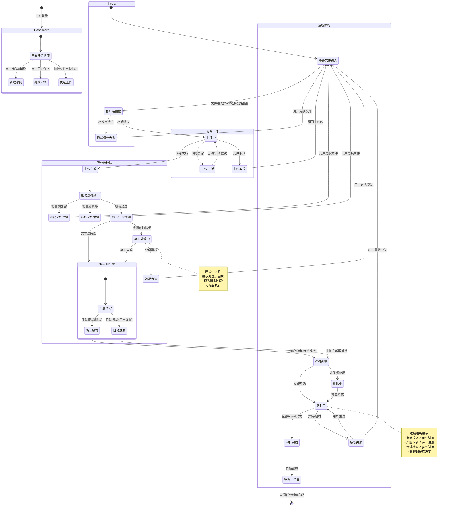

# 文档上传与解析启动 - 核心交互链路设计

> **版本**: v1.0
> **创建日期**: 2026-07-30
> **文档性质**: 交互流程设计文档 -- 覆盖从用户进入系统到解析任务完成的完整交互链路
> **上游依赖**:
> - `docs/01_business_research/business_summary.md` -- 业务调研汇总（用户画像、场景目标、HITL 约束）
> - `docs/02_competitive_analysis/analysis_summary.md` -- 竞品分析汇总（行业基线、市场空白、差异化方向）
> - `docs/03_business_modeling/business_model.md` -- 业务问题建模（MVP 范围、业务实体、核心约束）
> **下游读者**: 产品原型规范 (`docs/05_product_prototype/`)、前端实现计划 (`docs/09_frontend_plan/`)、API 规范 (`docs/08_api_specification/`)

---

## 一、设计概述

### 1.1 设计目标

为 Agent 智能文档审核系统的**文档上传与解析启动**环节设计完整的交互流程，使得法务人员能够在 AI 驱动下，以最少的操作摩擦完成从"获取待审文档"到"进入审阅工作台"的全过程。

### 1.2 设计范围

本设计覆盖 6 个交互状态域，共 16 个交互节点：

```
┌─────────────────────────────────────────────────────────────────────────┐
│  A. 工作台入口        B. 上传交互         C. 文件校验                    │
│  ├─ 审阅任务仪表盘      ├─ 拖拽上传区域      ├─ 上传前客户端预检            │
│  ├─ 新建审阅入口        ├─ 文件选择器        ├─ 格式白名单校验              │
│  └─ 历史/快捷入口       ├─ 粘贴板上传        ├─ 加密/损坏检测              │
│                        └─ 上传进度与取消     └─ OCR 需求检测               │
│                                                                         │
│  D. 解析前配置         E. 解析任务状态      F. 异常路径                    │
│  ├─ 文档类型/标题/标签   ├─ 排队中            ├─ 网络中断恢复               │
│  ├─ Playbook 选择       ├─ 解析中（进度透明）  ├─ 超大文件处理               │
│  └─ 解析触发模式        ├─ 解析完成           ├─ 并发限制排队               │
│                        └─ 解析失败与重试      └─ 重复文件去重               │
└─────────────────────────────────────────────────────────────────────────┘
```

### 1.3 设计约束（来自上游）

| 约束 | 来源 | 对本设计的影响 |
|------|------|--------------|
| MVP 仅 NDA 协议 | `business_model.md` §5.1 | 文档类型选择器默认 NDA 且仅此选项；UI 预留扩展性 |
| 仅 PDF + DOCX | `business_model.md` §5.1 | 格式白名单精确限制为这两种；校验逻辑硬编码 |
| 分级 HITL 告警 | `business_model.md` §5.1 | 上传解析阶段以自动化为主，人工仅在信息补充和异常时介入 |
| Web 平台优先 | `analysis_summary.md` §4.3 | 所有交互为桌面端 Web 设计；暂不考虑 Word 插件和移动端 |
| 解释性数据透明 | `analysis_summary.md` §4.2 | 解析进度展示条款提取、结构化信息提取的实时状态（P0 差异化） |
| 多 Agent 架构 | `business_summary.md` §3.4 | 解析任务由 Supervisor 调度多个专业 Agent 并行/串行执行 |

---

## 二、状态流转总图

### 2.1 Mermaid 状态图



### 2.2 状态流转速览表

| # | 当前状态 | 触发事件 | 下一状态 | 用户可操作 |
|---|---------|---------|---------|-----------|
| 1 | Dashboard | 点击"新建审阅" | 上传区 - 等待文件输入 | 选择入口 |
| 2 | 等待文件输入 | 拖拽/选择/粘贴文件 | 客户端预检 | 选择/拖拽/粘贴文件 |
| 3 | 客户端预检 | 格式不符合白名单 | 格式校验失败 | 查看提示，更换文件 |
| 4 | 客户端预检 | 格式通过 + 大小/页数合规 | 上传中 | 观察进度，可取消 |
| 5 | 格式校验失败 | 用户更换合规文件 | 等待文件输入 | 重新选择文件 |
| 6 | 上传中 | 传输完成 | 服务端校验中 | 等待 |
| 7 | 上传中 | 用户取消 / 网络中断 | 上传取消 / 上传中断 | 取消后重选；中断后等待恢复 |
| 8 | 服务端校验中 | 检测到加密/损坏 | 加密/损坏错误 | 查看原因，更换文件 |
| 9 | 服务端校验中 | 校验通过 | OCR 需求检测 | 等待 |
| 10 | OCR 需求检测 | 扫描版 PDF 检测到 | OCR 处理中 | 等待或后台执行 |
| 11 | OCR 需求检测 | 文本层完整 | 解析前配置 | 补充信息 |
| 12 | 解析前配置 | 用户确认 / 自动触发 | 任务创建 | 填写信息，确认触发 |
| 13 | 任务创建 | 并发槽位可用 | 解析中 | 观察进度 |
| 14 | 任务创建 | 并发槽位满 | 排队中 | 等待或取消 |
| 15 | 解析中 | 所有 Agent 完成 | 解析完成 | 观察进度 |
| 16 | 解析中 | Agent 异常/超时 | 解析失败 | 重试或重新上传 |

---

## 三、详细交互节点设计

### 节点 1：进入审阅工作台

#### 触发条件
- 用户完成登录认证后，系统路由至审阅工作台首页（Dashboard）
- 用户从任意页面点击导航栏"审阅工作台"返回首页

#### 系统响应
1. **页面布局**（自上而下）：
   - **顶部操作栏**：Logo + 主导航（审阅工作台 / 我的任务 / Playbook 管理 / 账号）+ [新建审阅] 主按钮（Primary CTA，蓝色高亮）
   - **统计卡片行**（仅当存在历史数据时显示）：本月审阅数、平均审阅耗时、待处理任务数
   - **快捷上传区**（Dashboard 核心交互区）：大尺寸虚线框区域，中心放置文件图标 + "拖拽文件到此处"文案 + "或点击选择文件"链接 + 支持格式提示（"支持 PDF、DOCX 格式"）
   - **最近审阅列表**：表格形式展示最近 5 条审阅任务（文档标题、类型、创建时间、状态、操作）
   - **底部提示**：MVP 阶段提示"当前支持 NDA 保密协议审阅，更多文档类型即将上线"

2. **快捷上传区交互**：
   - 默认状态：灰色虚线框，中心图标 + 文字，hover 时边框高亮为品牌蓝色，图标轻微放大
   - 文件拖拽悬停时（dragenter/dragover）：边框变为实线蓝色，背景变为浅蓝色（`rgba(brand-blue, 0.05)`），显示"释放文件即可上传"
   - 文件拖离时（dragleave）：恢复默认状态

3. **数据加载**：
   - 统计卡片：异步加载，加载中显示骨架屏
   - 最近审阅列表：分页加载（MVP 单页 5 条即可），加载中显示骨架屏

#### 用户可操作
| 操作 | 触发方式 | 结果 |
|------|---------|------|
| 新建审阅（从顶部按钮） | 点击 [新建审阅] | 路由至独立的上传页面（专注模式） |
| 新建审阅（从快捷区） | 拖拽文件 / 点击快捷上传区 | 进入上传流程，焦点锁定在上传交互区 |
| 继续历史审阅 | 点击列表中某条任务 | 路由至该任务的审阅工作台（场景 2 页面） |
| 查看全部任务 | 点击列表底部"查看全部" | 路由至完整任务列表页 |

#### 下一状态
- **拖拽/选择文件** -> 进入 **节点 2 (拖拽/选择文件上传)** 中的文件进入上传区状态
- **点击"新建审阅"按钮** -> 进入独立上传页面的 **节点 2**
- **点击历史任务** -> 跳转至审阅工作台（超出本文范围，见 `review_workspace_flow.md`）

---

### 节点 2：拖拽/选择文件上传

#### 触发条件
- 用户在 Dashboard 快捷区拖入文件
- 用户在 Dashboard 点击快捷上传区触发文件选择器
- 用户在上传页面点击上传区域触发文件选择器

#### 系统响应

**上传页面布局**（当通过顶部按钮进入时）：
- 左侧：大尺寸上传交互区（占页面宽度 60%），设计与 Dashboard 快捷区一致但尺寸更大
- 右侧：上传指引卡片（"如何准备文档"）：
  - 确保文档为 PDF 或 DOCX 格式
  - 文件大小不超过 50MB
  - 页数不超过 200 页
  - 扫描版 PDF 将自动进行 OCR 处理
  - 文件未加密且可正常打开
- 底部：支持的格式图标行（PDF、DOCX 高亮；其他格式灰色 + "即将支持"）

**文件选择器行为**：
- 调用系统原生文件选择对话框
- `accept` 属性设置为 `.pdf,.docx`
- 单选模式（MVP 阶段），但对话框本身允许多选（预留扩展）

**拖拽交互细节**：
- `dragenter`：边框动画过渡（300ms ease），从灰色虚线变为蓝色实线
- `dragover`：背景变为浅蓝色，鼠标样式 `cursor: copy`
- `dragleave`：恢复动画过渡（300ms ease），回到默认状态
- `drop`：短暂的成功动画（绿色脉冲 200ms）后进入客户端预检

#### 用户可操作
| 操作 | 触发方式 | 结果 |
|------|---------|------|
| 拖拽文件 | 从文件管理器拖入浏览器窗口 | 进入客户端预检 |
| 选择文件 | 点击上传区域 -> 系统文件选择器 | 进入客户端预检 |
| 取消操作 | 不进行任何操作，返回 Dashboard | 停留在等待文件输入状态 |

#### 下一状态
- 文件进入 -> **节点 3 (上传前文件校验)**

---

### 节点 3：粘贴板上传

#### 触发条件
- 用户在任何包含上传区域的页面按下 `Ctrl+V`（Windows）/ `Cmd+V`（Mac）
- 剪贴板中包含文件数据（而非纯文本或图片）

#### 系统响应
1. **检测剪贴板内容类型**：
   - 如果是文件类型数据（`clipboardData.files` 非空）：进入上传流程
   - 如果是图片数据：提示"请粘贴文件而非截图，或先将截图保存为 PDF/DOCX"
   - 如果是纯文本：不拦截，正常处理文本粘贴
2. **成功识别文件后**：触发与节点 2 相同的"拖拽成功"反馈动画（绿色脉冲 200ms）
3. **Toast 提示**："已识别剪贴板文件：{文件名}"，持续 3 秒
4. 如果用户在文档标题输入框中粘贴文本，系统智能判断：`files.length > 0` 时优先作为文件上传处理

#### 用户可操作
| 操作 | 触发方式 | 结果 |
|------|---------|------|
| 粘贴文件 | Ctrl+V / Cmd+V | 进入客户端预检 |
| 粘贴图片 | Ctrl+V / Cmd+V | 看到提示，重新操作 |

#### 下一状态
- 文件识别成功 -> **节点 3 (上传前文件校验)**

---

### 节点 4：上传前文件校验（客户端预检）

#### 触发条件
- 文件通过拖拽、选择器或粘贴板进入系统

#### 系统响应

**校验顺序**（同步执行，前端完成）：

1. **格式校验**（优先级最高）：
   - 检查文件扩展名：白名单为 `.pdf`、`.docx`（不区分大小写）
   - 检查 MIME 类型：白名单为 `application/pdf`、`application/vnd.openxmlformats-officedocument.wordprocessingml.document`
   - **注意**：`application/octet-stream` 类型的文件不直接拒绝，而是标记为"待服务端确认"
   - 不通过 -> **进入节点 6 (格式校验失败)**

2. **文件大小校验**：
   - 限制：50MB（MVP）
   - 不通过 -> 显示：`文件大小 {实际大小} 超出限制（最大 50MB）。请压缩文档或拆分后重新上传。`
   - 同时提供"了解如何压缩 PDF"的帮助链接（可链接到帮助文档锚点）

3. **页数预检**（仅 PDF，前端通过 FileReader + pdf.js 轻量读取）：
   - 限制：200 页（MVP）
   - 仅 PDF 可预检；DOCX 文件由服务端校验页数
   - 不通过 -> 显示：`文档共 {实际页数} 页，超出单次审阅限制（200 页）。建议按章节拆分后分批审阅。`

4. **文件名安全校验**：
   - 移除文件名中的特殊字符（`<>:"/\|?*` 等），替换为下划线
   - 文件名过长（>255 字符）时自动截断

**校验通过后的即时 UI 反馈**：
- 上传区域显示文件卡片：文件图标（PDF/DOCX）+ 文件名 + 文件大小 + 页数（可选）+ [移除] 按钮
- 文件卡片出现动画：从上方滑入（300ms ease-out）
- 上传区域文案切换为"点击更换文件"和"或拖入新文件替换"

#### 用户可操作
| 操作 | 触发方式 | 结果 |
|------|---------|------|
| 确认上传 | 客户端预检自动通过后自动开始上传 | 进入上传中状态 |
| 移除文件 | 点击文件卡片上的 [x] 或 [移除] | 清空文件卡片，回到等待文件输入 |
| 更换文件 | 再次拖拽/点击选择新文件 | 替换当前文件，重新预检 |

#### 下一状态
- 全部校验通过 -> 自动进入 **节点 5 (文件上传中)**
- 格式不通过 -> **节点 6 (格式校验失败)**

---

### 节点 5：文件上传中

#### 触发条件
- 客户端预检通过，文件开始上传至服务端

#### 系统响应

**进度指示器设计**（核心交互组件）：

```
┌─────────────────────────────────────────────────┐
│  📄 NDA_2024_供应商保密协议.pdf                   │
│  12.4 MB                                        │
│                                                 │
│  ████████████████░░░░░░░░░░░░  68%              │
│  已上传 8.4 MB / 12.4 MB                        │
│  速度: 2.1 MB/s  ·  预计剩余: ~2 秒              │
│                                                 │
│  [取消上传]                                      │
└─────────────────────────────────────────────────┘
```

组件属性：
- **进度条**：品牌蓝色填充，带平滑过渡动画（`transition: width 0.3s ease`），高度 6px，圆角 3px
- **百分比**：整数显示，位置在进度条右侧或上方
- **已上传/总大小**：精确到小数点后 1 位
- **速度**：基于最近 3 秒的滑动窗口计算平均值，避免瞬时波动
- **预估剩余时间**：`(总大小 - 已上传) / 当前速度`，每秒更新一次；>60 秒时显示"约 X 分钟"
- **取消按钮**：次要按钮样式（灰色边框），hover 变红色警告

**网络速度自适应 UX**：
- 高速（>5 MB/s）：进度条动画流畅，无需特殊处理
- 中速（1-5 MB/s）：正常展示
- 低速（<1 MB/s）：在进度条下方增加提示"网络较慢，请耐心等待或检查网络连接"
- 极低速（<100 KB/s 持续 10 秒以上）：主动提示"上传速度异常，是否要取消并检查网络？"

#### 用户可操作
| 操作 | 触发方式 | 结果 |
|------|---------|------|
| 取消上传 | 点击 [取消上传] | 弹出确认对话框："确定要取消上传吗？已上传的进度将丢失。" -> 确认后终止请求，返回等待文件输入 |
| 等待完成 | 不做操作 | 上传完成后自动进入服务端校验 |

**取消确认弹窗**：
- 标题："取消上传"
- 内容："已上传 68% (8.4 MB)，取消后进度将丢失。"
- 按钮：[继续上传]（主按钮）+ [确认取消]（危险按钮，红色）

#### 下一状态
- 上传完成 -> **节点 7 (服务端校验)**
- 用户取消 -> 返回 **节点 2 (等待文件输入)**
- 网络中断 -> **节点 13 (网络中断处理)**

---

### 节点 6：格式校验失败

#### 触发条件
- 客户端预检阶段，文件扩展名或 MIME 类型不在白名单中（非 PDF/DOCX）
- MIME 类型为 `application/octet-stream` 时暂不触发此状态

#### 系统响应

**错误提示组件**：

```
┌─────────────────────────────────────────────────┐
│  ⚠️ 不支持的文档格式                              │
│                                                 │
│  文件 "合同模板.xlsx" 为 Excel 格式，暂不支持。     │
│                                                 │
│  当前支持的格式：                                 │
│  ✅ PDF (.pdf)        Adobe 可移植文档格式        │
│  ✅ DOCX (.docx)      Microsoft Word 文档         │
│                                                 │
│  即将支持：Word (.doc)、纯文本 (.txt)              │
│                                                 │
│  建议：将文档导出为 PDF 或 DOCX 格式后重新上传。    │
│  [了解如何导出 PDF]                               │
│                                                 │
│  [选择其他文件]                                   │
└─────────────────────────────────────────────────┘
```

设计细节：
- **错误提示卡片**：黄色/琥珀色边框（左侧 4px 粗线作为严重度指示），浅黄色背景
- **支持格式展示**：绿色勾选图标 + 格式名称 + 一句话描述
- **操作引导**：明确给出"如何解决"的建议，而非仅告知错误
- **帮助链接**："了解如何导出 PDF"链接至帮助中心或展开折叠的图文教程

**不同的不支持格式应有不同的文案**：

| 文件格式 | 特殊文案 |
|---------|---------|
| `.doc` (旧版 Word) | "旧版 Word 格式 (.doc) 暂不支持。请用 Word 打开后另存为 .docx 格式。" |
| `.xlsx/.xls` | "Excel 表格文件暂不支持直接审阅。请将关键条款导出为 PDF/DOCX。" |
| `.txt` | "纯文本格式即将支持，当前请转换为 PDF 或 DOCX。" |
| `.png/.jpg` | "图片格式暂不支持。如为扫描件，请先使用 OCR 工具（如 Adobe Acrobat）转换为可搜索 PDF。" |
| `.zip/.rar` | "压缩包文件请解压后上传单个文档。" |
| 其他未知格式 | 使用通用文案 |

#### 用户可操作
| 操作 | 触发方式 | 结果 |
|------|---------|------|
| 选择其他文件 | 点击 [选择其他文件] / 再次拖拽 | 替换文件，重新进入客户端预检 |
| 查看帮助 | 点击 [了解如何导出 PDF] | 展开内联帮助或跳转帮助中心 |
| 关闭提示 | 点击提示区域外的关闭按钮 | 返回上传区域等待文件输入 |

#### 下一状态
- 用户选择新文件 -> **节点 3 (上传前文件校验)**
- 用户关闭提示 -> **节点 1 (等待文件输入)**

---

### 节点 7：服务端校验（含加密/损坏检测）

#### 触发条件
- 文件上传完成，服务端接收文件后自动进入校验流程

#### 系统响应

**校验流水线（服务端顺序执行）**：

```
上传完成
    │
    ▼
┌──────────────┐    失败    ┌──────────────────┐
│ 1. 文件完整性校验 │─────────▶│ 文件损坏错误         │
│ (MD5/SHA 校验)  │          │ "文件在上传过程中     │
└──────┬───────┘          │  损坏，请重新上传"    │
       │ 通过              └──────────────────┘
       ▼
┌──────────────┐    检测到   ┌──────────────────┐
│ 2. 加密检测     │─────────▶│ 加密文件错误         │
│ (PDF 密码/      │          │ "文件已加密保护，     │
│  DOCX 保护)    │          │  请解除保护后重新上传" │
└──────┬───────┘          └──────────────────┘
       │ 通过
       ▼
┌──────────────┐    超出    ┌──────────────────┐
│ 3. 页数校验     │─────────▶│ 页数超限错误         │
│ (PDF + DOCX)  │          │ "文档共 {n} 页，    │
└──────┬───────┘          │  超出 200 页限制"    │
       │ 通过              └──────────────────┘
       ▼
┌──────────────┐
│ 4. OCR 需求检测 │──────▶ 节点 9
│ (扫描版 PDF?)  │
└──────────────┘
```

**校验等待期 UI**：
- 上传完成，文件卡片进入"校验中"状态
- 进度指示器替换为校验步骤指示器（Step Indicator）：

```
┌─────────────────────────────────────────────────┐
│  📄 NDA_2024_供应商保密协议.pdf    ✅ 上传完成      │
│                                                 │
│  ● 完整性校验  ● 安全检测  ○ 页面统计  ○ 文本分析   │
│  ─────────────────────────────────────────────   │
│  正在进行安全检测...                               │
└─────────────────────────────────────────────────┘
```

**加密文件错误设计**：

```
┌─────────────────────────────────────────────────┐
│  🔒 文件已加密保护                                │
│                                                 │
│  检测到 "NDA_2024_供应商保密协议.pdf" 设置了打开密  │
│  码，系统无法读取文件内容。                        │
│                                                 │
│  如何解决：                                      │
│  1. 使用 Adobe Acrobat 打开文件                  │
│  2. 输入密码 → 文件 → 属性 → 安全性               │
│  3. 在"安全性方法"中选择"无安全性"并保存            │
│  4. 重新上传已解除保护的版本                       │
│                                                 │
│  [查看详细图文教程]           [选择其他文件]        │
└─────────────────────────────────────────────────┘
```

**文件损坏错误设计**：
- 同样的卡片布局
- 图标：⚠️（黄色警告三角）
- 文案差异："文件似乎已损坏或无法正常读取。请尝试用原始软件（Word/Adobe Acrobat）打开确认文件完整性，或重新导出后上传。"

#### 用户可操作
| 操作 | 触发方式 | 结果 |
|------|---------|------|
| 查看详细教程 | 点击 [查看详细图文教程] | 展开折叠的步骤图文说明 |
| 选择其他文件 | 点击 [选择其他文件] | 清空当前，回到等待文件输入 |
| 等待校验完成 | 自动流转 | 进入 OCR 需求检测或解析前配置 |

#### 下一状态
- 校验全部通过 -> **节点 9 (OCR 需求检测)**
- 加密 / 损坏 -> 用户选择新文件后回到 **节点 2 (等待文件输入)**
- 页数超限 -> 用户选择新文件后回到 **节点 2**

---

### 节点 8：OCR 需求检测与处理

#### 触发条件
- 服务端校验通过，系统检测到上传文件为扫描版 PDF（无可提取的文本层）

#### 系统响应

**OCR 需求判断逻辑**：
- 尝试从 PDF 中提取文本
- 如果提取到的文本量 < 50 字符 / 页（平均），判定为扫描版
- 显示 OCR 处理选项

**OCR 处理选项界面**：

```
┌─────────────────────────────────────────────────┐
│  📄 NDA_扫描版.pdf                                 │
│  检测到: 扫描版 PDF（无可搜索文本层）               │
│                                                 │
│  此文档需要先进行 OCR（光学字符识别）处理，          │
│  将扫描图片转换为可搜索的文本，才能进行 AI 审阅。     │
│                                                 │
│  预计处理时间：约 1-2 分钟（共 15 页）              │
│                                                 │
│  ┌─────────────────────────────────────────────┐ │
│  │  ○ 立即处理（推荐）                          │ │
│  │    在当前页面等待 OCR 完成，适合文档较小的情况   │ │
│  │                                             │ │
│  │  ● 后台处理并通知                            │ │
│  │    OCR 在后台执行，完成后通过通知提醒你。       │ │
│  │    你可以在此期间处理其他任务。                │ │
│  └─────────────────────────────────────────────┘ │
│                                                 │
│  [开始 OCR 处理]                                 │
└─────────────────────────────────────────────────┘
```

**OCR 处理进度界面**（选择"立即处理"时）：

```
┌─────────────────────────────────────────────────┐
│  🔍 正在进行 OCR 识别...                          │
│                                                 │
│  ████████████████░░░░░░░░░░░░  8/15 页           │
│  ● 正在识别第 8 页的文字...                       │
│                                                 │
│  已识别: 2,458 词 | 识别质量: 良好 (98.5%)        │
│                                                 │
│  预计剩余: ~45 秒                                │
│  [取消处理]                                      │
└─────────────────────────────────────────────────┘
```

**OCR 差异化设计（vs 竞品黑盒）**：
- 展示每页处理状态（而非仅一个转圈动画）
- 显示识别质量评分，给用户信心
- 显示已提取词汇数量统计
- 提供"后台处理"选项（竞品普遍缺失的能力）

**OCR 失败处理**：

```
┌─────────────────────────────────────────────────┐
│  ⚠️ OCR 处理遇到问题                              │
│                                                 │
│  第 3 页、第 8 页的识别质量过低（<70%），可能影响   │
│  后续 AI 审阅的准确性。                           │
│                                                 │
│  可能原因：                                      │
│  · 扫描件分辨率过低（建议 ≥300dpi）               │
│  · 页面包含手写批注或印章覆盖文字                  │
│  · 页面严重倾斜或变形                             │
│                                                 │
│  [重新上传高清扫描件]    [继续（接受低质量识别）]    │
└─────────────────────────────────────────────────┘
```

#### 用户可操作
| 操作 | 触发方式 | 结果 |
|------|---------|------|
| 立即处理 | 选中"立即处理" -> 点击 [开始 OCR 处理] | 显示 OCR 进度，等待完成 |
| 后台处理 | 选中"后台处理" -> 点击 [开始 OCR 处理] | 返回 Dashboard，任务列表新增 OCR 中的任务项；完成后通知 |
| 取消处理 | 点击 [取消处理] | 返回等待文件输入，可上传其他文件 |
| 接受低质量 | 点击 [继续（接受低质量识别）] | 进入解析前配置，系统标记 OCR 质量风险 |

#### 下一状态
- OCR 处理完成 -> **节点 10 (解析前配置)**
- 后台处理 -> 回到 **Dashboard**，后续通过通知引导回到配置
- OCR 失败 -> **等待文件输入** 或 **节点 10 (解析前配置，带低质量标记)**

---

### 节点 9：解析前信息补充

#### 触发条件
- 文件校验通过（或 OCR 处理完成），文档已就绪，即将触发解析任务

#### 系统响应

**解析前配置界面布局**：

```
┌──────────────────────────────────────────────────────────────┐
│  ← 返回上传        Step 2 / 2: 审阅配置                       │
│                                                              │
│  ┌──────────────────────────────────────┐                   │
│  │ 📄 NDA_2024_供应商保密协议.pdf        │                   │
│  │ 12.4 MB · 15 页 · PDF · ✅ 已就绪    │                   │
│  └──────────────────────────────────────┘                   │
│                                                              │
│  ─── 基本信息 ──────────────────────────────────────────────  │
│                                                              │
│  文档标题 *                                                   │
│  ┌──────────────────────────────────────────────────────┐   │
│  │ NDA_2024_供应商保密协议                                 │   │
│  └──────────────────────────────────────────────────────┘   │
│  默认使用文件名，可修改                                       │
│                                                              │
│  文档类型 *            标签（可选）                            │
│  ┌──────────────────┐  ┌──────────────────────────────────┐ │
│  │ NDA 保密协议  ▾  │  │ + 添加标签                        │ │
│  └──────────────────┘  └──────────────────────────────────┘ │
│  MVP 阶段仅支持 NDA        如：供应商、2024Q3、重要            │
│                                                              │
│  ─── 审阅规则 ──────────────────────────────────────────────  │
│                                                              │
│  Playbook *（选择一套审阅标准）                                │
│  ┌──────────────────────────────────────────────────────┐   │
│  │ ● NDA 标准审阅 (默认)                    ──────────    │   │
│  │ 适用于通用双边 NDA 协议，含 24 条审阅规则。              │   │
│  │ ─────────────────────────────────────────────────── │   │
│  │ ○ NDA 严格审阅                                         │   │
│  │ 适用于涉及核心 IP 的 NDA，附加知识产权保护规则。         │   │
│  │ ─────────────────────────────────────────────────── │   │
│  │ ○ 自定义 Playbook...                                   │   │
│  └──────────────────────────────────────────────────────┘ │
│                                                              │
│  ─── 解析选项 ──────────────────────────────────────────────  │
│                                                              │
│  ☐ 自动触发解析                                              │
│     开启后，下次上传同类型文档将跳过此配置步骤直接开始解析      │
│                                                              │
│  [取消]                              [🚀 开始解析]           │
└──────────────────────────────────────────────────────────────┘
```

**设计决策与说明**：

1. **文档类型选择器**：MVP 阶段仅 `NDA 保密协议` 一项，下拉框设计为单选列表样式（而非禁用态），列表中仅一项可选。列表底部可放一行灰色文字"更多文档类型即将上线（v2）"。这种设计既避免禁用控件的"坏了"的感觉，又让用户感知到未来扩展。

2. **文档标题**：默认使用原始文件名（去除扩展名），可编辑。输入框设计为带下划线的轻量编辑态，表示"可选修改"。

3. **标签**：`+ 添加标签` 触发输入框，输入后回车创建标签胶囊。标签用于用户侧的任务分类和检索，非必填。

4. **Playbook 选择**：列表式单选，默认选中"NDA 标准审阅"。每个 Playbook 项展示：名称 + 一句话描述 + 规则数量。MVP 阶段预置 2 套 NDA Playbook（标准 / 严格）。

5. **自动触发解析**：Checkbox 设计为可选偏好设置。用户勾选后，系统记录偏好（localStorage + 后端用户设置），下次上传同类型文档时跳过配置步骤直接开始解析。此设置可在个人设置中随时修改。

**Step 指示器**：
- 顶部显示 `Step 2 / 2: 审阅配置`
- Step 1 显示为 `✅ 上传文档`（已完成），Step 2 高亮为当前步骤

#### 用户可操作
| 操作 | 触发方式 | 结果 |
|------|---------|------|
| 开始解析 | 点击 [🚀 开始解析] | 创建解析任务，进入解析流程 |
| 修改标题 | 点击标题输入框编辑 | 更新标题文本 |
| 添加标签 | 点击 [+ 添加标签] -> 输入 -> Enter | 创建标签胶囊 |
| 移除标签 | 点击标签胶囊上的 [x] | 移除该标签 |
| 选择 Playbook | 点击 Playbook 项 | 切换选中状态 |
| 返回上传 | 点击 [取消] 或 [← 返回上传] | 返回上传步骤，可更换文件 |

#### 下一状态
- 点击"开始解析" -> **节点 11 (解析排队/执行中)**
- 如果勾选了"自动触发"且之前设置了该偏好 -> 上传完成后跳过此页，直接进入 **节点 11**
- 点击"取消" -> 返回 **节点 2 (等待文件输入)**

---

### 节点 10：解析排队与执行中（核心差异化）

#### 触发条件
- 用户点击"开始解析"或自动触发，系统创建解析任务

#### 系统响应

**这是本设计最重要的差异化节点。** 竞品（Ironclad、Kira、Harvey 等）的解析过程普遍是"黑盒"——展示一个转圈动画或模糊的进度条，用户不知道系统在做什么。本设计提供**透明的、按 Agent 维度的解析进度展示**。

**解析进度界面（全屏专注视图）**：

```
┌──────────────────────────────────────────────────────────────┐
│  🚀 正在解析文档...                                           │
│  NDA_2024_供应商保密协议.pdf                                   │
│                                                              │
│  ┌──────────────────────────────────────────────────────────┐ │
│  │              解析任务进度概览                              │ │
│  │                                                          │ │
│  │  ██████████████████████████████████████░░░  85%           │ │
│  │                                                          │ │
│  │  ┌──────────┐  ┌──────────┐  ┌──────────┐  ┌──────────┐  │ │
│  │  │ 📋 条款提取 │  │ ⚠️ 风险识别 │  │ ✅ 合规检查 │  │ 📊 报告准备 │  │ │
│  │  │  ✅ 完成   │  │  ● 进行中  │  │  ○ 等待中  │  │  ○ 等待中  │  │ │
│  │  │  12 条条款  │  │  5/8 已扫  │  │           │  │           │  │ │
│  │  └──────────┘  └──────────┘  └──────────┘  └──────────┘  │ │
│  └──────────────────────────────────────────────────────────┘ │
│                                                              │
│  ─── 实时解析日志 ──────────────────────────────────────────  │
│                                                              │
│  ● 14:32:05  风险识别 Agent 正在分析第 5 条条款:              │
│             "保密信息的定义与范围" (第 2 页)                   │
│  ● 14:32:02  发现潜在风险标记: 保密期限条款存在模糊描述        │
│  ● 14:31:58  条款提取 Agent 完成: 共提取 12 条结构化条款      │
│  ● 14:31:45  合规检查 Agent 启动，加载 NDA 标准 Playbook...  │
│  ● 14:31:30  文档预处理完成，开始条款结构化提取               │
│                                                              │
│  预计总耗时: ~45 秒  |  已用时间: 00:32                       │
│                                                              │
│  ┌──────────────────────────────────────────────────────────┐ │
│  │ 💡 解析完成后将自动进入审阅工作台。                         │ │
│  │    你也可以:  [最小化到后台]                              │ │
│  └──────────────────────────────────────────────────────────┘ │
└──────────────────────────────────────────────────────────────┘
```

**排队状态**（当并发槽位满时）：

```
┌──────────────────────────────────────────────────────────────┐
│  ⏳ 正在排队等待...                                           │
│  NDA_2024_供应商保密协议.pdf                                   │
│                                                              │
│  ┌──────────────────────────────────────────────────────────┐ │
│  │                                                          │ │
│  │         📋  你在队列中的位置                                │ │
│  │                                                          │ │
│  │              # 2 / 4                                     │ │
│  │         ┌──────────────┐                                 │ │
│  │         │   前面还有 1   │                                 │ │
│  │         │   个任务等待   │                                 │ │
│  │         └──────────────┘                                 │ │
│  │                                                          │ │
│  │  预计等待: ~30 秒                                        │ │
│  │  当前有 3 个解析任务正在执行，1 个任务排队                 │ │
│  └──────────────────────────────────────────────────────────┘ │
│                                                              │
│  [取消排队]              [后台排队，完成后通知我]              │
└──────────────────────────────────────────────────────────────┘
```

**并发限制说明**：
- MVP 阶段采用简单的并发槽位限制（如 3 个并发解析任务 + 最多 5 个排队）
- 按用户维度隔离，不跨用户竞争
- 排队采用 FIFO 策略

#### 用户可操作
| 操作 | 触发方式 | 结果 |
|------|---------|------|
| 最小化到后台 | 点击 [最小化到后台] | 解析在后台继续，返回 Dashboard；任务列表中显示解析进度 |
| 取消排队 | 点击 [取消排队] | 弹出确认后取消，返回解析前配置页面 |
| 后台排队 | 点击 [后台排队，完成后通知我] | 返回 Dashboard，完成后通知 |
| 查看解析日志详情 | 滚动日志区域 | 查看完整解析日志 |

#### 下一状态
- 解析完成 -> **节点 12 (解析完成)**
- 解析失败 -> **节点 13 (解析失败与重试)**
- 用户取消排队 -> **节点 10 (解析前配置)**

---

### 节点 11：解析完成

#### 触发条件
- 所有 Agent（条款提取 + 风险识别 + 合规检查 + 报告准备）成功完成

#### 系统响应

**解析完成过渡动画**（1.5 秒）：
1. 进度条跳至 100%，短暂绿色填充
2. 四个 Agent 状态卡片全部变为 ✅ 完成
3. 显示完成统计摘要（淡入动画）：
   - 提取条款：12 条
   - 风险标记：8 个（高风险 2、中风险 4、低风险 2）
   - 合规问题：3 个
4. 1.5 秒后自动路由至审阅工作台（`/review/{taskId}`）

**完成摘要卡片**：

```
┌──────────────────────────────────────────────────────────────┐
│  ✅ 解析完成！                                                │
│                                                              │
│  ┌──────────┐  ┌──────────┐  ┌──────────┐  ┌──────────┐    │
│  │ 📋 提取条款 │  │ 🔴 高风险  │  │ 🟡 中风险  │  │ 🟢 低风险  │    │
│  │   12 条   │  │   2 个   │  │   4 个   │  │   2 个   │    │
│  └──────────┘  └──────────┘  └──────────┘  └──────────┘    │
│                                                              │
│  正在进入审阅工作台...                                        │
└──────────────────────────────────────────────────────────────┘
```

**如果用户在 Dashboard（后台模式）**：
- 浏览器通知（Notification API）：`"NDA_2024_供应商保密协议.pdf" 解析完成。发现 2 个高风险条款需要关注。`
- 任务列表项状态更新为"待审阅"，出现红色角标表示高风险数量
- Toast 提示（页面内）：同上内容 + [立即查看] 按钮

#### 用户可操作
| 操作 | 触发方式 | 结果 |
|------|---------|------|
| 立即查看（Dashboard） | 点击 Toast 中的 [立即查看] 或任务列表项 | 进入审阅工作台 |
| 无需操作（专注模式） | 自动跳转 | 1.5 秒后进入审阅工作台 |

#### 下一状态
- 自动跳转至**审阅工作台**（场景 2：并排审阅视图，属于 `review_workspace_flow.md` 的范围）

---

### 节点 12：解析失败与重试

#### 触发条件
- 解析过程中 Agent 执行异常、任务超时、或解析结果质量不达标

#### 系统响应

**失败原因分类与对应 UI**：

**类型 A：AI 处理异常**

```
┌──────────────────────────────────────────────────────────────┐
│  ❌ 解析未能完成                                              │
│                                                              │
│  在风险识别阶段遇到问题，未能完成分析。                        │
│                                                              │
│  原因: AI 服务暂时不可用                                      │
│  详情: 风险识别 Agent (agent-risk-reviewer) 在第 3 次重试后   │
│        仍未响应。系统已自动暂停处理。                         │
│                                                              │
│  已完成的进度不会丢失:                                        │
│  ✅ 文档预处理完成                                            │
│  ✅ 条款提取完成 (12 条)                                     │
│  ❌ 风险识别失败                                              │
│  ─ 合规检查未开始                                             │
│  ─ 报告生成未开始                                             │
│                                                              │
│  [🔄 重试解析]    [📤 重新上传]    [📋 查看已完成结果]        │
└──────────────────────────────────────────────────────────────┘
```

关键设计点：
- **保存已完成进度**：条款提取的结果不丢失，重试时从失败点继续（非从头开始）
- **重试按钮**为主 CTA（蓝色），重新上传为次要选项
- **查看已完成结果**允许用户进入审阅工作台查看已完成的部分（如已提取的条款列表）

**类型 B：文档内容问题**

```
┌──────────────────────────────────────────────────────────────┐
│  ⚠️ 文档内容可能存在问题                                      │
│                                                              │
│  解析完成，但检测到以下问题：                                  │
│  · 文档内容以非中文/英文为主（检测到: 82% 法文内容）           │
│  · 疑似非 NDA 协议文档（AI 置信度: 34%）                      │
│  · 文档结构不完整（缺少签名页）                               │
│                                                              │
│  建议:                                                       │
│  · 确认上传了正确的文档                                       │
│  · 如确认无误，仍可继续审阅（AI 准确性可能受影响）             │
│                                                              │
│  [继续审阅（接受风险）]        [更换文档]                      │
└──────────────────────────────────────────────────────────────┘
```

**类型 C：解析超时**

```
┌──────────────────────────────────────────────────────────────┐
│  ⏰ 解析超时                                                  │
│                                                              │
│  解析已超过预计时间限制（5 分钟），系统已暂停处理。            │
│                                                              │
│  可能原因：文档过大（200 页接近上限）、内容复杂度高。          │
│                                                              │
│  建议:                                                       │
│  · 将文档拆分为较小部分后分别上传                             │
│  · 重试解析（可能因服务负载暂时导致）                         │
│                                                              │
│  [🔄 重试解析]    [📤 拆分文档重新上传]                       │
└──────────────────────────────────────────────────────────────┘
```

**重试机制设计**：
- 最多自动重试 2 次（AI 异常类）
- 超过自动重试次数后展示此错误页面
- 用户手动重试不计入自动重试次数，但最多手动重试 3 次
- 每次重试从上次失败点继续（Checkpointer 机制）
- 重试按钮点击后有防抖（3 秒内不可重复点击）

#### 用户可操作
| 操作 | 触发方式 | 结果 |
|------|---------|------|
| 重试解析 | 点击 [🔄 重试解析] | 从失败点恢复解析，回到解析中状态 |
| 重新上传 | 点击 [📤 重新上传] | 清空当前，回到等待文件输入 |
| 查看已完成结果 | 点击 [📋 查看已完成结果] | 进入审阅工作台（仅展示已完成部分） |
| 继续审阅（接受风险） | 点击 [继续审阅] | 进入审阅工作台，系统标记质量问题 |
| 拆分文档 | 点击 [拆分文档重新上传] | 回到等待文件输入，显示拆分提示 |

#### 下一状态
- 重试 -> **节点 11 (解析中)**
- 重新上传 / 拆分 -> **节点 2 (等待文件输入)**
- 查看已完成结果 / 继续审阅 -> **审阅工作台**

---

## 四、异常路径专项设计

### 4.1 网络中断处理

#### 触发条件
- 上传过程中网络连接断开
- 浏览器检测到 `navigator.onLine` 变为 `false`
- `XMLHttpRequest` / `fetch` 请求失败且错误类型为网络错误

#### 交互流程

```
网络中断
    │
    ├── 上传阶段（尚未完成传输）
    │   ├── 自动暂停上传
    │   ├── 显示网络中断提示：
    │   │   ┌─────────────────────────────────────────┐
    │   │   │ 🌐 网络连接中断                           │
    │   │   │ 上传已暂停 (已上传 68%，可断点续传)       │
    │   │   │ 正在尝试重新连接... [手动重试]            │
    │   │   └─────────────────────────────────────────┘
    │   ├── 每 5 秒自动检测网络恢复
    │   ├── 网络恢复 → 自动续传（Range 请求 / tus protocol）
    │   └── 超过 2 分钟未恢复 → 保存进度到 localStorage，提示用户稍后继续
    │
    └── 解析阶段（文件已上传完成）
        ├── 解析在服务端继续执行，不受客户端网络影响
        ├── 用户重连后自动轮询任务状态
        └── 如果解析已完成 → 显示完成通知
```

**断点续传设计**：
- MVP 阶段采用简化方案：浏览器端记录已上传字节数
- 网络恢复后使用 `fetch` + `Content-Range` 头从断点继续
- 如果服务端不支持 Range，则重新上传（但在提示中说明）

**用户可操作**：

| 操作 | 触发方式 | 结果 |
|------|---------|------|
| 手动重试 | 点击 [手动重试] | 立即尝试重新连接并续传 |
| 取消等待 | 点击 [取消] | 放弃当前上传，已传数据不保留 |
| 等待自动恢复 | 不做操作 | 系统自动检测并恢复 |

---

### 4.2 超大文件处理

#### 触发条件
- 文件大小在 50MB - 100MB 之间（超过硬限制但小于绝对上限）

#### 交互流程

```
文件大小 50MB - 100MB
    │
    ├── 警告而非硬拒绝
    ├── 显示提示：
    │   ┌─────────────────────────────────────────────┐
    │   │ ⚠️ 文件较大（68 MB）                         │
    │   │ 上传和解析可能需要较长时间（预计 5-8 分钟）。  │
    │   │ 建议压缩文档或拆分为较小部分以获得更佳体验。   │
    │   │ [仍要上传]  [压缩建议]  [选择其他文件]        │
    │   └─────────────────────────────────────────────┘
    │
    └── >100MB：硬拒绝（同 50MB 限制的错误提示）
```

**渐进式限制策略**：

| 文件大小 | 系统行为 |
|---------|---------|
| <= 50MB | 正常上传 |
| 50-100MB | 警告提示，用户确认后可继续 |
| > 100MB | 硬拒绝，提示压缩或拆分 |

---

### 4.3 并发限制排队

已在节点 11 中详述。补充要点：

- 排队时允许用户返回 Dashboard 继续其他操作
- 排队超时（30 分钟）后自动取消，通知用户
- 后台排队的任务通过浏览器通知提醒用户

---

### 4.4 重复文件去重

#### 触发条件
- 用户上传的文件与已存在的文件内容相同（SHA256 哈希匹配）

#### 系统响应

```
┌──────────────────────────────────────────────────────────────┐
│  📋 检测到重复文件                                            │
│                                                              │
│  文件 "NDA_2024_供应商保密协议.pdf" 之前已上传并审阅过。       │
│                                                              │
│  上次审阅: 2026-07-25 14:30（3 天前）                         │
│  审阅状态: ✅ 已完成                                          │
│  发现风险: 2 高风险 · 4 中风险 · 2 低风险                     │
│                                                              │
│  [查看上次审阅结果]    [仍然上传（创建新审阅）]  [取消]        │
└──────────────────────────────────────────────────────────────┘
```

**去重逻辑**：
- 服务端对上传完成的文件计算 SHA256 哈希
- 与该用户历史文件比较（不跨用户比较，保护隐私）
- 匹配时给出信息提示，但不强制阻止（用户可能需要对同一文件进行不同 Playbook 的审阅）

---

## 五、对下游设计的衔接指引

### 5.1 前端页面规划

基于本文档的交互节点，前端需要以下页面和组件：

| 页面 | 路由 | 对应节点 | 核心组件 |
|------|------|---------|---------|
| 审阅工作台 Dashboard | `/` 或 `/dashboard` | 节点 1 | 快捷上传区、统计卡片、任务列表 |
| 新建审阅页（上传模式） | `/upload` | 节点 2-9 | 上传交互区、文件卡片、校验提示 |
| 解析前配置页 | `/upload/configure` | 节点 10 | 配置表单、Playbook 选择器 |
| 解析进度页 | `/upload/parsing/:taskId` | 节点 11-13 | 进度概览、Agent 状态卡片、实时日志 |
| 审阅工作台 | `/review/:taskId` | 超本文范围 | 并排视图、风险面板（见后续设计） |

### 5.2 组件复用规划

| 组件 | 使用位置 | 说明 |
|------|---------|------|
| `FileDropZone` | Dashboard、上传页 | 统一的拖拽上传区域，支持配置尺寸和文案 |
| `UploadProgress` | 上传页 | 进度条 + 取消 + 速度预估 |
| `ValidationError` | 上传页 | 可配置的错误卡片（格式/加密/损坏/OCR） |
| `StepIndicator` | 上传页、配置页 | 步骤指示器 |
| `PlaybookSelector` | 配置页 | Playbook 列表式单选 |
| `ParsingProgress` | 解析进度页 | Agent 状态网格 + 实时日志 |
| `QueueStatus` | 解析进度页 | 排队位置显示 |

### 5.3 API 端点规划

| 端点 | 方法 | 对应节点 | 说明 |
|------|------|---------|------|
| `/api/documents/upload` | POST | 节点 4-5 | 文件上传（支持分块/断点续传） |
| `/api/documents/:id/validate` | GET | 节点 7 | 服务端校验状态轮询 |
| `/api/documents/:id/ocr` | POST | 节点 8 | 触发 OCR 处理 |
| `/api/documents/:id/ocr/status` | GET | 节点 8 | OCR 处理进度 |
| `/api/playbooks` | GET | 节点 10 | 获取可用 Playbook 列表 |
| `/api/documents/:id/parse` | POST | 节点 10 | 触发解析任务 |
| `/api/tasks/:id/status` | GET | 节点 11-13 | 解析任务状态 + Agent 进度 |
| `/api/tasks/:id/logs` | GET | 节点 11 | 解析实时日志（SSE/WebSocket） |
| `/api/documents/check-duplicate` | POST | 节点 4.4 | 文件去重检查 |
| `/api/tasks/queue/status` | GET | 节点 11 | 排队状态 |

### 5.4 数据模型关联

基于 `business_model.md` §4.3 的业务实体定义，本交互链路涉及的数据实体：

| 业务实体 | 本链路中的创建时机 | 关键状态字段 |
|---------|-----------------|------------|
| **Document** | 上传完成后创建 | `status: uploading → validated → ocr_processing → ready → parsing → parsed / failed` |
| **ParseTask** | 解析触发时创建 | `status: queued → running → completed / failed` |
| **Clause** | 解析中（条款提取 Agent）| 解析完成后首次写入 |
| **RiskFlag** | 解析中（风险识别 Agent）| 解析完成后首次写入 |

---

## 六、设计决策记录

| # | 决策 | 理由 | 来源 |
|---|------|------|------|
| 1 | 解析进度按 Agent 维度透明展示，而非单一进度条 | 与竞品"黑盒"形成差异化；让用户感知 AI 在做什么，建立信任 | `analysis_summary.md` §4.2 P0 差异化 |
| 2 | 默认手动触发解析，可选自动 | NDA 场景用户量少，配置步骤不构成摩擦；预留自动模式给高级用户 | `business_model.md` §5.1 |
| 3 | OCR 提供"立即"和"后台"两种模式 | 避免用户被迫等待；竞品普遍只有"等待"模式 | `analysis_summary.md` §4.2 |
| 4 | 重试从失败点继续（非从头开始） | 利用 LangGraph Checkpointer 机制保存中间状态 | `business_summary.md` §3.2 |
| 5 | 重复文件检测后允许继续上传 | 用户可能需用不同 Playbook 审阅同一文件 | 设计判断 |
| 6 | MVP 文档类型仅有 NDA，但 UI 预留扩展 | 避免 v2 时大规模改 UI | `business_model.md` §5.1 |
| 7 | 50-100MB 警告而非硬拒绝 | 大型 NDA 附件场景（如技术规格附录）可能接近上限 | 设计判断 |

---

> **上游文档**:
> - `../01_business_research/business_summary.md`
> - `../02_competitive_analysis/analysis_summary.md`
> - `../03_business_modeling/business_model.md`
> **下游文档**:
> - `../05_product_prototype/` -- 产品原型规范
> - `../08_api_specification/` -- API 规范
> - `../09_frontend_plan/` -- 前端实现计划
