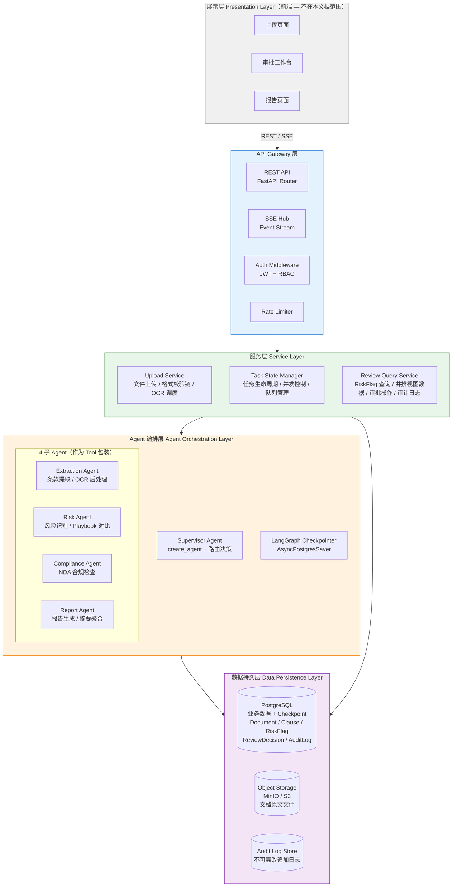
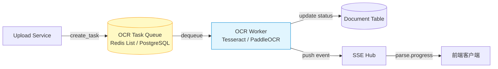
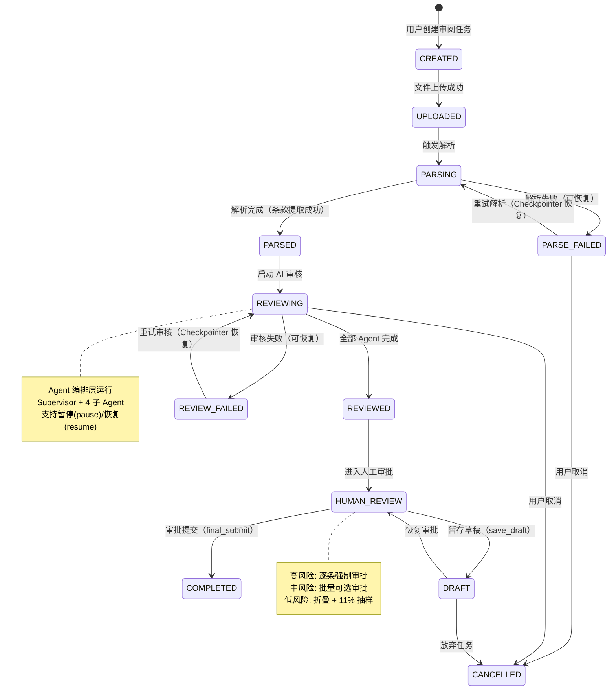
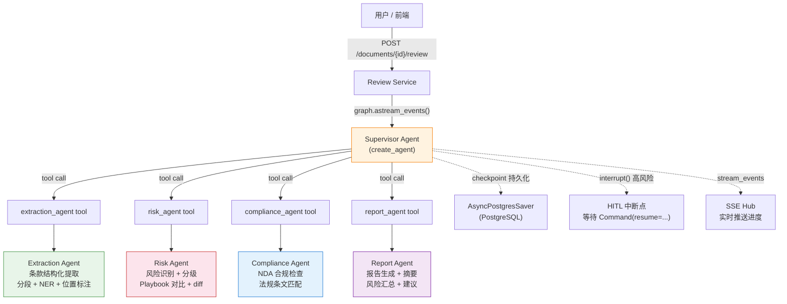
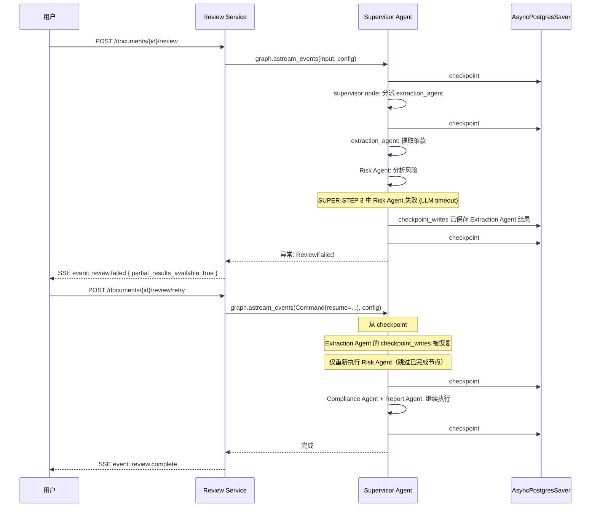
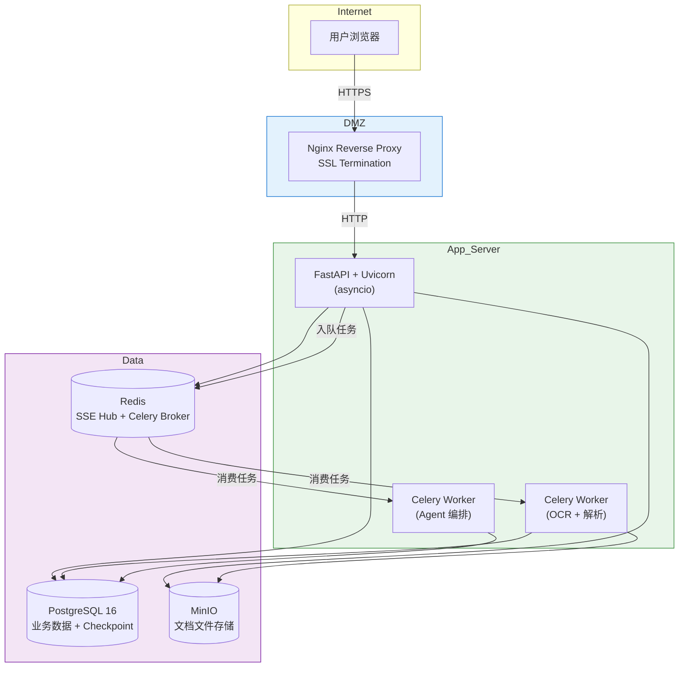

# 后端服务架构设计 v1.0

> **版本**: v1.0
> **创建日期**: 2026-07-30
> **文档性质**: 架构设计文档 — 严格基于上游业务建模与交互规范，引用 LangChain/LangGraph 官方规范
> **上游依赖**:
> - `docs/03_business_modeling/business_model.md` — 业务问题建模（MVP 范围、7 业务实体、HITL 约束）
> - `docs/04_interaction_design/flow_state_spec.md` — 状态流转规范（三阶段职责边界、9 状态生命周期）
> - `docs/06_system_architecture/frontend_backend_boundary_spec-v1.0.md` — 前后端边界规范（32 API 端点、通信模式）
> - LangChain 官方文档（docs-langchain MCP）+ LangChain API 参考（reference-langchain MCP）
> **下游读者**: 数据模型设计 (`docs/07_data_model/`)、API 规范 (`docs/08_api_specification/`)、后端实现计划 (`docs/10_backend_plan/`)

---

## 一、架构总览

### 1.1 五层架构图



### 1.2 架构层次职责

| 层次 | 核心职责 | 技术栈 |
|------|---------|--------|
| **展示层** | 用户交互、UI 渲染、SSE 消费 | React / Vue（不在本文档范围） |
| **API Gateway 层** | 路由分发、认证鉴权、限流、SSE 连接管理 | FastAPI + Uvicorn + JWT + asyncio |
| **服务层** | 文件上传校验、任务状态管理、审核结果查询、审批操作执行 | Python 3.12+ / FastAPI / Celery（可选）/ aiofiles |
| **Agent 编排层** | Supervisor + 4 子 Agent 编排、Checkpointer 断点恢复、interrupt 人工审批 | LangGraph / LangChain `create_agent` / `AsyncPostgresSaver` |
| **数据持久层** | 业务数据存储、文件存储、审计日志不可篡改写入 | PostgreSQL 16 / MinIO (S3 兼容) / JSONB |

### 1.3 核心设计原则

| 原则 | 来源 | 说明 |
|------|------|------|
| 后端是唯一数据源 | `boundary_spec` §一 | 所有 RiskFlag、ReviewDecision、AuditLog 由后端生成和持久化 |
| AI 初筛 + 人工终审 | `business_model` §1.2 | 非对称风险控制：AI 作为加速器，人类作为最终决策者 |
| HITL 不可跳过 | `business_model` §4.1 | 高风险条款的 interrupt 不可跳过，4 层约束（前端 UI → API 409 → Agent interrupt → 数据库锁） |
| 断点恢复透明 | `flow_state_spec` §3.2 | Checkpointer 持久化中间结果，失败后从最近 checkpoint 恢复 |
| MVP 仅 NDA + PDF/DOCX | `business_model` §5.1 | v1 仅 NDA 协议、PDF 和 DOCX 格式 |

---

## 二、文件上传服务架构

### 2.1 上传流程总览

```
客户端                           API Gateway                     Upload Service                  文件存储
  │                                  │                                │                              │
  │ 1. POST /documents/upload        │                                │                              │
  │ (multipart/form-data)            │                                │                              │
  ├─────────────────────────────────▶│                                │                              │
  │                                  │ 2. Auth + Rate Limit           │                              │
  │                                  │ 3. 转发文件流                  │                              │
  │                                  ├───────────────────────────────▶│                              │
  │                                  │                                │ 4. magic byte 校验           │
  │                                  │                                │ 5. 加密检测                  │
  │                                  │                                │ 6. 损坏检测                  │
  │                                  │                     ┌─────────┤ 7. OCR 检测                  │
  │                                  │                     │ 失败     │ 8. 写入文件存储              │
  │                                  │                     ▼         ├──────────────────────────────▶│
  │                                  │              返回错误响应      │                              │
  │                                  │◀───────────────────────────────┤                              │
  │◀─────────────────────────────────┤                                │                              │
  │ 9. 201 { document_id, status }   │                                │                              │
```

### 2.2 格式校验链（五层纵深防御）

基于 `boundary_spec` §2.1 中定义的前后端职责分工，校验链从客户端逐层深入：

| 层 | 位置 | 校验内容 | 拒绝策略 | 来源 |
|:--:|------|---------|---------|------|
| L1 | **客户端** | 文件扩展名白名单（.pdf / .docx）、MIME type 检查 | 阻止上传请求 | `boundary_spec` §2.1 第3行 |
| L2 | **API Gateway** | 文件大小硬限制（max 50MB）、请求频率限制 | HTTP 413 / 429 | 设计决策 |
| L3 | **Upload Service** | magic byte 验证（PDF: `%PDF-` / DOCX: `PK\x03\x04` + ZIP 结构） | 拒绝存储，返回 400 | `boundary_spec` §2.1 第5行 |
| L4 | **Upload Service** | PDF 加密标记检测（读取 encryption dict）| 返回 400 + `{"encrypted": true}` | `boundary_spec` §2.1 第6行 |
| L5 | **Upload Service** | PDF 结构完整性验证（xref table / trailer / stream 解析）| 返回 400 + `{"corrupted": true}` | `boundary_spec` §2.1 第7行 |

**实现设计**：

```python
# Upload Service 校验链的链式处理模式
class ValidationPipeline:
    """五层校验链，逐层过滤，任一层失败即终止"""

    def __init__(self):
        self.validators = [
            MagicByteValidator(),       # L3
            EncryptionDetector(),       # L4
            CorruptionDetector(),       # L5
        ]

    async def validate(self, file_stream: BinaryIO, filename: str) -> ValidationResult:
        for validator in self.validators:
            result = await validator.check(file_stream, filename)
            if not result.passed:
                return result  # 立即返回失败，不再继续
        return ValidationResult.passed()
```

### 2.3 OCR 检测与异步处理

**触发条件**：PDF 文件无文本层（扫描版 PDF）

**双模式设计**（基于 `flow_state_spec` §3.1 第8行 OCR 双模式）：

| 模式 | 用户选择 | 后端行为 | 适用场景 |
|------|---------|---------|---------|
| **immediate** | "立即处理" | 前端等待 OCR 完成后再进入解析 | 单文件、文件较小 |
| **background** | "后台处理并通知" | 立即返回 document_id，OCR 异步执行后通过 SSE 通知 | 大文件、批量处理 |

**异步 OCR 任务队列模式**：



**任务队列存储选择**：

| 方案 | 适用场景 | 优势 | 劣势 |
|------|---------|------|------|
| Redis List + RQ | 轻量部署 | 快速入队/出队，运维简单 | 无持久化保证（可配 AOF） |
| PostgreSQL-based task queue | 统一技术栈 | 单数据库管理一切，事务一致 | 高并发下性能不及 Redis |
| **Celery + Redis** | **生产推荐** | 成熟生态、重试机制、优先级队列 | 额外运维复杂度 |

> **MVP 阶段推荐**：Celery + Redis 作为任务队列后端。解析任务和审核任务分别使用独立队列。

### 2.4 文件存储策略

| 维度 | MVP 方案 | 生产扩展 | 说明 |
|------|---------|---------|------|
| **存储后端** | MinIO（S3 兼容 API） | AWS S3 / 阿里云 OSS | 本地开发可用本地文件系统模拟 |
| **存储路径结构** | `/{tenant_id}/{document_id}/{version}/original.{ext}` | 同左，加 lifecycle policy | 支持版本管理和多租户隔离 |
| **访问控制** | Presigned URL（有效期 1h） | CDN + Signed Cookie | 前端加载原文通过后端签名的临时 URL |
| **安全隔离** | 按 tenant_id 分 bucket | IAM policy 细粒度控制 | MVP 阶段单租户可不设 bucket 级隔离 |
| **文件加密** | 服务端 AES-256 加密 | KMS 密钥管理 | MinIO 内置 SSE-S3 |

### 2.5 Upload Service 内部模块

```
Upload Service
├── ValidationPipeline      # 五层校验链
│   ├── MagicByteValidator
│   ├── EncryptionDetector
│   └── CorruptionDetector
├── OCRDetector             # PDF 文本层检测
├── FileStorageAdapter      # 文件存储抽象（MinIO / S3 / Local）
├── TaskDispatcher          # OCR 任务入队
└── UploadOrchestrator      # 编排上述模块，返回结果
```

---

## 三、任务状态管理架构

### 3.1 任务生命周期状态机

基于 `flow_state_spec` §3.2 中 Teammate 2 定义的 9 状态生命周期，结合 `boundary_spec` §2.2 中的审核状态管理，扩展为完整状态机：



### 3.2 状态管理器设计

**核心设计**：任务状态存储在 PostgreSQL 的 `documents` 表中，而 Agent 编排状态（checkpoint）存储在 LangGraph 的 `AsyncPostgresSaver` 中。两者通过 `thread_id` 关联。

```
┌─────────────────────────────────────────┐
│          Task State Manager              │
│                                          │
│  ┌──────────────┐   ┌────────────────┐  │
│  │ Task Lifecycle│   │ Concurrency    │  │
│  │ State Machine │   │ Controller     │  │
│  │ (Business)    │   │ (Rate Limiting) │  │
│  └──────┬───────┘   └───────┬────────┘  │
│         │                   │            │
│         │     ┌─────────────┘            │
│         ▼     ▼                          │
│  ┌──────────────────────────────┐       │
│  │     Task Repository          │       │
│  │  (PostgreSQL documents 表)   │       │
│  └──────────────────────────────┘       │
│                                          │
│  ┌──────────────────────────────────┐   │
│  │ Agent State Persistence          │   │
│  │ AsyncPostgresSaver (Checkpointer)│   │
│  │ 关联: thread_id ←→ document_id   │   │
│  └──────────────────────────────────┘   │
└─────────────────────────────────────────┘
```

**PostgreSQL `documents` 表状态字段**：

| 字段 | 类型 | 说明 |
|------|------|------|
| `id` | UUID | 主键 |
| `status` | ENUM | 生命周期状态（见状态机） |
| `task_queue_position` | INT | 队列位置（排队时更新） |
| `parse_checkpoint_id` | VARCHAR | 解析 Agent 的 checkpoint ID（用于断点恢复） |
| `review_thread_id` | VARCHAR | AI 审核的 LangGraph thread_id |
| `created_at` / `updated_at` | TIMESTAMP | 创建/更新时间 |

### 3.3 并发控制

基于 `flow_state_spec` §3.1 中的并发限制要求：

| 控制维度 | 限制值 (MVP) | 实现方式 | 来源 |
|---------|:-----------:|---------|------|
| 单用户并发上传数 | 3 | Redis 计数器 / 数据库行锁 | `boundary_spec` §2.1 第16行 |
| 单用户并发解析任务数 | 2 | PostgreSQL advisory lock | 设计决策 |
| 单用户并发审核任务数 | 1 | Redis SETNX / DB unique constraint | 设计决策（Agent 资源密集） |
| 全局 OCR Worker 并发数 | CPU cores * 2 | Celery worker concurrency 配置 | 设计决策 |
| 全局 Agent 并发线程数 | 5 | LangGraph thread pool | 设计决策（LLM API rate limit） |

**并发控制实现模式**：

```python
class ConcurrencyController:
    """基于 PostgreSQL advisory lock 的并发控制"""

    async def acquire_parse_slot(self, user_id: str) -> bool:
        """尝试获取解析任务槽位"""
        async with self.db.transaction():
            current = await self.db.fetchval(
                "SELECT COUNT(*) FROM documents "
                "WHERE user_id = $1 AND status = 'PARSING'",
                user_id
            )
            if current >= self.MAX_PARSE_CONCURRENT:
                return False
            # 获取 advisory lock 防止竞态
            await self.db.execute(
                "SELECT pg_advisory_xact_lock($1)",
                hash(user_id)
            )
        return True
```

### 3.4 任务队列设计

**解析队列与审核队列分离**：

```
                        ┌─────────────────┐
                        │   API Gateway   │
                        └────────┬────────┘
                                 │
              ┌──────────────────┼──────────────────┐
              ▼                                     ▼
    ┌─────────────────┐                   ┌─────────────────┐
    │  Parse Queue     │                   │  Review Queue   │
    │  (Celery Queue)  │                   │  (Celery Queue) │
    │                  │                   │                 │
    │  优先级:          │                   │  优先级:         │
    │  1. immediate    │                   │  1. 新提交任务    │
    │  2. background   │                   │  2. 重试任务      │
    │  3. retry        │                   │  3. 恢复任务      │
    └────────┬────────┘                   └────────┬────────┘
             │                                     │
             ▼                                     ▼
    ┌─────────────────┐                   ┌─────────────────┐
    │  Parse Workers   │                   │  Review Workers │
    │  (OCR + 条款提取) │                   │  (Agent 编排)    │
    └─────────────────┘                   └─────────────────┘
```

> **设计理由**：两类任务资源特征完全不同。解析任务（OCR）是 CPU 密集型，审核任务（Agent）是 IO 密集型（等待 LLM API）。分离队列可以配置不同的 worker 类型、并发数和重试策略。

---

## 四、审核结果查询服务

### 4.1 RiskFlag 查询与过滤 API 设计

基于 `boundary_spec` §2.3 中的审批操作规范：

**REST API 设计**：

```
GET /documents/{id}/risk-flags
  ?risk_level=high|medium|low     # 按风险等级过滤
  &risk_category=liability|...    # 按风险类别过滤
  &status=pending|confirmed|...   # 按审核状态过滤
  &page=1&size=20                 # 分页
  &sort=risk_level                # 排序
```

**查询服务内部架构**：

```
Review Query Service
├── RiskFlagRepository         # RiskFlag 数据访问层
│   ├── list_by_document()     # 分页查询 + 过滤
│   ├── get_with_relations()   # 关联查询 RiskFlag + Clause + PlaybookRule
│   └── aggregate_stats()      # 聚合统计（高/中/低计数）
├── ClausePositionResolver     # 原文位置坐标解析
│   └── resolve_for_highlight() # 将 Clause.position 转换为前端高亮坐标
├── ReviewDecisionService      # 审批操作编排
│   ├── approve() / edit() / reject()
│   ├── batch_approve() / spot_check()
│   ├── escalate() / manual_add()
│   └── final_submit() / save_draft()
└── AuditLogWriter             # 审计日志写入
    └── append()               # 不可篡改追加写入
```

### 4.2 并排视图数据提供

基于 `business_model` §3.2（场景 2 并排视图）和 `boundary_spec` §2.3 第85行：

**左侧（文档原文 + 条款高亮）** 所需数据：

```
GET /documents/{id}/clauses
返回: Clause[] 含 position 字段 { page, paragraph, char_offset_start, char_offset_end }
```

**右侧（风险分析面板）** 所需数据：

```
GET /documents/{id}/risk-flags?include=playbook_diff,clause_text,decisions
返回: RiskFlag[] 含
  - risk_level, risk_category, confidence
  - suggestion (修改建议)
  - clause: { text, position }
  - playbook_rule: { standard_clause, diff }
  - latest_decision: { type, note }
```

**联合查询 SQL 设计（PostgreSQL JSONB 聚合）**：

```sql
SELECT
    rf.id,
    rf.risk_level,
    rf.risk_category,
    rf.confidence,
    rf.reasoning_text,
    rf.suggestion,
    jsonb_build_object(
        'text', c.text,
        'clause_type', c.clause_type,
        'position', c.position
    ) AS clause,
    jsonb_build_object(
        'id', pr.id,
        'rule_name', pr.rule_name,
        'standard_clause', pr.standard_clause
    ) AS playbook_rule,
    (
        SELECT jsonb_build_object('type', rd.decision_type, 'note', rd.note)
        FROM review_decisions rd
        WHERE rd.risk_flag_id = rf.id
        ORDER BY rd.created_at DESC
        LIMIT 1
    ) AS latest_decision
FROM risk_flags rf
JOIN clauses c ON rf.clause_id = c.id
LEFT JOIN playbook_rules pr ON rf.playbook_rule_id = pr.id
WHERE rf.document_id = $1
ORDER BY rf.risk_level_priority, rf.created_at
```

### 4.3 审批操作 API 设计

基于 `boundary_spec` §3.2 中定义的 8 种操作（approve/edit/reject/batch_approve/spot_check/escalate/manual_add/final_submit）：

| 操作 | 方法 + 路径 | 请求体 | 后端行为 |
|------|------------|--------|---------|
| **approve** | `POST /risk-flags/{id}/approve` | `{}` | 更新 status -> CONFIRMED + 写入 ReviewDecision + 写入 AuditLog |
| **edit** | `POST /risk-flags/{id}/edit` | `{ modified_fields, note }` | 更新 status -> AMENDED + 保存修改字段 + 写入 ReviewDecision + 写入 AuditLog |
| **reject** | `POST /risk-flags/{id}/reject` | `{ reason }` | 更新 status -> REJECTED + 写入拒绝原因 + 写入 ReviewDecision + 写入 AuditLog |
| **batch_approve** | `POST /risk-flags/batch-approve` | `{ document_id }` | 批量更新所有中风险 UNREVIEWED -> UNREVIEWED_AUTO_PASSED + 批量写入 ReviewDecision + 批量写入 AuditLog |
| **spot_check** | `POST /risk-flags/sample` | `{ document_id, sample_rate }` | 确定性随机抽样（11% 默认），返回被抽中的低风险 RiskFlag 列表 |
| **escalate** | `POST /risk-flags/{id}/escalate` | `{ reason }` | 更新 risk_level -> HIGH + 加入高风险强制审批队列 |
| **manual_add** | `POST /risk-flags/manual` | `{ document_id, clause_position, risk_level, risk_category, note }` | 创建 RiskFlag（来源=MANUAL）+ 写入 AuditLog |
| **final_submit** | `POST /documents/{id}/submit` | `{}` | 校验高风险项全部审批 -> 生成 ReviewReport -> 更新 Document.status -> 写入 AuditLog |
| **save_draft** | `POST /documents/{id}/save-draft` | `{}` | 保存当前审批状态，Document.status -> DRAFT |

**final_submit 校验流程（4 层约束）**：

```
前端层：UI 按钮置灰（所有高风险项完成前 disabled）
    │
    ▼
API 层：高风险审批完整性校验
    │  未完成 → HTTP 409 { "incomplete_high_risk_count": N }
    │
    ▼
Agent 层：LangGraph interrupt() 确认最终提交
    │  Command(resume={"action": "submit", "approved_by": user_id})
    │
    ▼
数据库层：事务写入
    │  BEGIN
    │  UPDATE documents SET status = 'COMPLETED'
    │  INSERT INTO review_reports (...)
    │  INSERT INTO audit_logs (...)
    │  COMMIT
```

### 4.4 审计日志不可篡改写入机制

基于 `business_model` §4.3 中 AuditLog 实体定义：

**写入机制**：

```python
class AuditLogWriter:
    """审计日志写入器 — 不可篡改，仅追加"""

    async def append(
        self,
        action_type: str,
        actor_type: Literal["human", "agent"],
        actor_id: str,
        target_entity: str,
        target_id: UUID,
        before_snapshot: dict | None = None,
        after_snapshot: dict | None = None,
        metadata: dict | None = None,
    ) -> AuditLog:
        """追加审计日志条目"""
        entry = AuditLog(
            id=uuid4(),
            timestamp=datetime.utcnow(),
            action_type=action_type,
            actor_type=actor_type,
            actor_id=actor_id,
            target_entity=target_entity,
            target_id=target_id,
            before_snapshot=before_snapshot,  # JSONB 操作前状态快照
            after_snapshot=after_snapshot,    # JSONB 操作后状态快照
            metadata=metadata or {},
            # 防篡改字段
            entry_hash=self._compute_hash(...),
            previous_entry_hash=...  # 链式哈希（类似区块链）
        )
        await self.db.insert(entry)
        return entry

    def _compute_hash(self, ...) -> str:
        """计算条目哈希，包含 previous_entry_hash 形成链式结构"""
        return sha256(json.dumps(entry_data).encode()).hexdigest()
```

**防篡改特性**：

| 特性 | 实现 |
|------|------|
| 仅追加（Append-Only） | 表权限 REVOKE UPDATE/DELETE |
| 链式哈希 | `previous_entry_hash` 字段链接前一条日志 |
| 状态快照 | `before_snapshot` / `after_snapshot`（JSONB）记录操作前后的完整状态 |
| 时间戳不可更改 | 服务端生成（`datetime.utcnow()`），不接受客户端时间 |
| 定期完整性校验 | cron 任务逐条验证 `entry_hash == _compute_hash()` |

---

## 五、与 LangGraph Agent 的集成架构

### 5.1 Supervisor + 4 子 Agent 编排

基于 `business_model` §6.1 中定义的多 Agent 架构和 LangChain 官方 `create_agent` + subagents 模式：



**编排模式**（基于官方 Subagents 模式）：

```python
from langchain.agents import create_agent
from langgraph.checkpoint.postgres.aio import AsyncPostgresSaver

# Step 1: 创建 4 个子 Agent（无 checkpointer，继承父级）
extraction_agent = create_agent(
    model=llm,
    tools=[ocr_cleanup_tool, clause_segment_tool, ner_extract_tool],
    system_prompt="你是条款提取专家...",
    name="extraction_agent"
)

risk_agent = create_agent(
    model=llm,
    tools=[playbook_lookup_tool, clause_compare_tool, risk_grade_tool],
    system_prompt="你是合同风控专家...",
    name="risk_agent"
)

compliance_agent = create_agent(
    model=llm,
    tools=[compliance_check_tool, regulation_lookup_tool],
    system_prompt="你是 NDA 合规审查专家...",
    name="compliance_agent"
)

report_agent = create_agent(
    model=llm,
    tools=[summary_generate_tool, report_format_tool],
    system_prompt="你是审阅报告生成专家...",
    name="report_agent"
)

# Step 2: 将子 Agent 包装为 Tool
def make_subagent_tool(agent, name: str, description: str):
    """将子 Agent 包装为可调用的 Tool"""
    @tool(name, description=description)
    def subagent_wrapper(query: str) -> str:
        result = agent.invoke({"messages": [{"role": "user", "content": query}]})
        return result["messages"][-1].content
    return subagent_wrapper

# Step 3: 创建 Supervisor（唯一配置 checkpointer）
supervisor = create_agent(
    model=llm,
    tools=[
        make_subagent_tool(extraction_agent, "extract_clauses", "提取文档中的条款..."),
        make_subagent_tool(risk_agent, "analyze_risks", "识别条款风险..."),
        make_subagent_tool(compliance_agent, "check_compliance", "检查合规性..."),
        make_subagent_tool(report_agent, "generate_report", "生成审阅报告..."),
    ],
    system_prompt=SUPERVISOR_SYSTEM_PROMPT,
    checkpointer=checkpointer,  # 仅在 Supervisor 层配置
    interrupt_before=["tools"],  # 高风险条款时中断
)

# Step 4: 通过 thread_id 关联每个审阅任务
config = {
    "configurable": {
        "thread_id": f"review-{document_id}"  # 关联 Document
    }
}

# Step 5: 流式执行
async for event in supervisor.astream_events(
    {"messages": [{"role": "user", "content": f"审核文档 {document_id}"}]},
    config,
    version="v3",
):
    # 处理各类事件并推送到 SSE Hub
    ...
```

> **关键架构决策**：Checkpointer 仅在最外层 Supervisor 配置。子 Agent 继承父级的 checkpointer，保证 interrupt 能正确冒泡到顶层。（来源：LangChain 官方文档 `oss/python/migrate/langgraph-supervisor` §Requirements for interrupt propagation）

### 5.2 Agent 与后端服务的通信模式

基于 `boundary_spec` §4.2 的实时推送需求：

```
通信模式决策：SSE 事件推送（非回调/轮询）

架构选择理由：
┌────────────────────────────────────────────────────────┐
│ 回调 (Webhook)     ❌ Agent 不能主动回调 HTTP 端点     │
│                        需要额外的消息队列              │
│ 轮询 (Polling)     ❌ 延迟高（秒级），浪费资源         │
│ 事件推送 (SSE)     ✅ 单向推送，低延迟（<100ms）       │
│                        客户端被动接收，实现简单        │
│                        基于 HTTP，无需 WebSocket 协议   │
└────────────────────────────────────────────────────────┘
```

**SSE 事件类型定义**（基于 `boundary_spec` §4.2 + LangGraph `stream_events` v3 API）：

| 事件类型 | event 字段 | 来源 | 触发时机 |
|---------|-----------|------|---------|
| `parse.progress` | `{ agent_name, progress_pct, current_clause_type }` | Extraction Agent | 条款提取进度 |
| `parse.complete` | `{ document_id, clause_count }` | Extraction Agent | 提取完成 |
| `parse.failed` | `{ error_type, error_message, recoverable }` | Extraction Agent | 提取失败 |
| `review.progress` | `{ agent_name, clauses_processed, total_clauses, current_dimension }` | Risk / Compliance Agent | AI 审核进度 |
| `review.interrupt` | `{ risk_flag_id, risk_level, clause_text, suggestion }` | Supervisor interrupt() | 高风险条款命中 interrupt |
| `review.log` | `{ timestamp, agent_name, message }` | 各 Agent tool | 实时操作日志 |
| `review.complete` | `{ summary: { high, medium, low } }` | Report Agent | 审核完成 |
| `review.failed` | `{ fail_category, message, partial_results_available }` | Supervisor | 审核失败 |
| `review.timeout` | `{ completed_count, total_count }` | Supervisor | 审核超时 |

**SSE Hub 实现架构**：

```python
class SSEHub:
    """
    SSE 事件中心 — 管理客户端连接并广播事件

    每个 document_id 对应一个事件频道。
    前端通过 GET /documents/{id}/events 建立 SSE 连接。
    """

    def __init__(self):
        # document_id -> set of asyncio.Queue
        self._channels: dict[str, set[asyncio.Queue]] = defaultdict(set)

    async def subscribe(self, document_id: str) -> asyncio.Queue:
        """创建 SSE 连接，返回事件队列"""
        queue = asyncio.Queue(maxsize=100)
        self._channels[document_id].add(queue)
        return queue

    async def unsubscribe(self, document_id: str, queue: asyncio.Queue):
        """关闭 SSE 连接"""
        self._channels[document_id].discard(queue)

    async def publish(self, document_id: str, event_type: str, data: dict):
        """向指定频道的所有连接推送事件"""
        dead_queues = set()
        for queue in self._channels.get(document_id, set()):
            try:
                queue.put_nowait((event_type, data))
            except asyncio.QueueFull:
                dead_queues.add(queue)
        self._channels[document_id] -= dead_queues
```

**SSE 端点实现（FastAPI）**：

```python
@router.get("/documents/{document_id}/events")
async def sse_events(document_id: UUID, request: Request):
    """SSE 端点 — 建立 event stream 连接"""

    async def event_generator():
        queue = await sse_hub.subscribe(document_id)
        try:
            while True:
                if await request.is_disconnected():
                    break
                try:
                    event_type, data = await asyncio.wait_for(
                        queue.get(), timeout=30
                    )
                    yield f"event: {event_type}\ndata: {json.dumps(data)}\n\n"
                except asyncio.TimeoutError:
                    yield ": keepalive\n\n"  # 30s 心跳
        finally:
            await sse_hub.unsubscribe(document_id, queue)

    return StreamingResponse(
        event_generator(),
        media_type="text/event-stream",
        headers={
            "Cache-Control": "no-cache",
            "Connection": "keep-alive",
            "X-Accel-Buffering": "no",  # nginx 禁用缓冲
        }
    )
```

**Agent 层事件桥接**：Agent 执行过程中通过 `get_stream_writer()` / `config.writer()` 将事件推送到 SSE Hub：

```python
from langgraph.config import get_stream_writer

async def risk_analysis_node(state: ReviewState):
    writer = get_stream_writer()

    # 推送进度事件
    writer({
        "event_type": "review.progress",
        "data": {
            "agent_name": "risk_agent",
            "clauses_processed": state.processed_count,
            "total_clauses": state.total_clauses,
            "current_dimension": "责任条款风险分析"
        }
    })

    # 执行实际分析...
    result = await analyze(state)

    # 高风险条款触发 interrupt
    if result.has_high_risk:
        interrupt({
            "risk_flag": result.risk_flag,
            "instruction": "高风险条款需人工审批"
        })

    return result
```

### 5.3 Checkpointer 选型

**PostgreSQL vs MongoDB 对比**：

| 维度 | PostgreSQL (`AsyncPostgresSaver`) | MongoDB (`AsyncMongoDBSaver`) |
|------|----------------------------------|------------------------------|
| **官方推荐度** | LangSmith 默认后端 | LangSmith 可配置替代 |
| **事务一致性** | ACID 完全支持 | 副本集最终一致性 |
| **JSON 支持** | JSONB（索引 + 查询优化） | BSON（原生文档） |
| **Checkpoint 写入模式** | 行级（checkpoint / checkpoint_writes 表） | 文档级（单一 collection） |
| **运维复杂度** | 数据库已存在（业务数据） | 需要额外部署集群 |
| **向量搜索** | pgvector 扩展 | MongoDB Atlas 集成向量搜索 |
| **并发恢复** | MVCC 快照隔离 | 乐观并发控制 |
| **断点恢复延迟** | <10ms（主键索引） | <10ms（_id 索引） |

> **MVP 阶段选型决策：PostgreSQL (`AsyncPostgresSaver`)**
>
> **理由**：
> 1. **统一技术栈** — 业务数据（Document/Clause/RiskFlag/ReviewDecision）已在 PostgreSQL，Checkpointer 共用同一数据库避免运维双数据库
> 2. **事务一致性** — ACID 保证 checkpoint 写入与业务数据写入的一致性
> 3. **断点恢复性能** — checkpoint 表的主键索引（thread_id + checkpoint_ns + checkpoint_id）保证 <10ms 恢复
> 4. **Super-step 粒度** — 每个 super-step 边界自动生成 checkpoint，已覆盖所有断点恢复场景
>
> MongoDB 作为 v2+ 的可选方案，当需要跨数据中心部署或利用 Atlas 向量搜索时再评估。

**Checkpointer 内部表结构**（PostgreSQL）：

| 表名 | 用途 | 关键字段 |
|------|------|---------|
| `checkpoints` | 存储每个 super-step 的完整状态快照 | `thread_id`, `checkpoint_ns`, `checkpoint_id`, `parent_checkpoint_id`, `checkpoint` (JSONB) |
| `checkpoint_writes` | 存储每个 node 的任务级写入 | `thread_id`, `checkpoint_ns`, `checkpoint_id`, `task_id`, `channel`, `value` |
| `checkpoint_blobs` | 存储序列化后的状态 blob | `thread_id`, `checkpoint_ns`, `channel`, `version`, `blob` |

### 5.4 断点恢复流程

基于 LangGraph 的 super-step checkpoint + pending writes 恢复机制：



**断点恢复关键机制**（来自 LangGraph 官方文档）：

1. **Super-step 级别的 checkpoint** — 每个 super-step 完成后生成完整状态快照，断点恢复从最近的完整 checkpoint 开始
2. **Pending writes 恢复** — 同一 super-step 中已完成 node 的写入（`checkpoint_writes`）在恢复时自动读取，不会重复执行
3. **interrupt 隔离** — `interrupt()` 触发后，恢复通过 `Command(resume=...)` 从 interrupt 点继续，不会重复执行 interrupt 之前的节点逻辑
4. **幂等性要求** — 从 checkpoint 恢复时节点会从函数开头重新执行，因此节点内副作用（如数据库写入）必须设计为幂等

---

## 六、横切关注点

### 6.1 安全架构

| 关注点 | MVP 实现 | 说明 |
|--------|---------|------|
| **认证** | JWT Bearer Token | Access token 15min + Refresh token 7d |
| **授权** | RBAC（Role-Based） | 角色：viewer / reviewer / admin |
| **文件病毒扫描** | ClamAV（可选集成） | MVP 阶段可跳过，v2 加入 |
| **SQL 注入防护** | SQLAlchemy 参数化查询 | 100% 使用 ORM / 参数化查询 |
| **CORS** | 白名单域名 | MVP 仅允许前端域名 |
| **API Key** | LLM API Key 仅存后端环境变量（`.env`） | 严禁前端直接调用 LLM API |

### 6.2 可观测性

| 组件 | 工具 | 说明 |
|------|------|------|
| **日志** | structlog + JSON 格式 | 结构化日志，每行一个 JSON 对象 |
| **链路追踪** | OpenTelemetry + Jaeger | Agent 调用链追踪 |
| **指标** | Prometheus + Grafana | API 延迟、Agent 耗时、LLM token 消耗 |
| **健康检查** | `/health` 端点 | 数据库 + 对象存储 + LLM API 连通性 |

### 6.3 错误处理策略

| 错误类型 | 处理策略 | HTTP 状态码 |
|---------|---------|:----------:|
| 文件格式无效 | 返回具体校验失败原因 | 400 |
| 文件加密 | 返回 `{"encrypted": true}` | 400 |
| 文件损坏 | 返回 `{"corrupted": true}` | 400 |
| 并发限制 | 返回排队位置或拒绝 | 429 |
| 解析失败（可恢复） | 保存 checkpoint，返回重试入口 | 500 + `{"recoverable": true}` |
| 审核失败（可恢复） | 保存 checkpoint，返回 retry 入口 | 500 + `{"recoverable": true, "partial_results": true}` |
| LLM API 超时 | 重试 3 次 -> 标记 partial | 503 |
| 高风险未审批提交 | 返回未完成计数 | 409 |

### 6.4 部署架构



### 6.5 技术栈总览

| 层次 | 技术 | 版本/Python 包 |
|------|------|---------------|
| **Web 框架** | FastAPI | 0.115+ |
| **ASGI 服务器** | Uvicorn | 0.34+ |
| **任务队列** | Celery + Redis broker | Celery 5.5+ |
| **ORM** | SQLAlchemy 2.0 (async) | 2.0+ |
| **数据库驱动** | asyncpg | 0.30+ |
| **Agent 框架** | LangGraph + LangChain | langgraph>=1.0, langchain>=1.0 |
| **Checkpointer** | AsyncPostgresSaver | langgraph-checkpoint-postgres |
| **LLM** | 通过 LangChain 模型抽象层 | `init_chat_model()` |
| **文件存储** | MinIO Python SDK | minio 7.2+ |
| **OCR** | Tesseract / PaddleOCR | 按需选择 |
| **可观测性** | structlog + OpenTelemetry + Prometheus | - |
| **依赖管理** | uv | 项目标准（`CLAUDE.md` §二） |

---

## 附录 A: 与上游设计文档的对齐验证

| 上游约束 | 来源 | 本文档章节 | 对齐状态 |
|---------|------|:--:|:--:|
| 7 个核心业务实体 (Document/Clause/RiskFlag/ReviewDecision/PlaybookRule/AuditLog/ReviewReport) | `business_model` §4.3 | 数据持久层、第四章节 | 已对齐 |
| HITL 分级告警（高/中/低）+ interrupt 不可跳过 | `business_model` §4.1 | 5.2 节 interrupt + 4.3 节 4 层约束 | 已对齐 |
| 三阶段串联（上传解析→AI审核→人工审批） | `flow_state_spec` §2.1 | 第二至第五章对应四服务域 | 已对齐 |
| 9 状态生命周期 | `flow_state_spec` §3.2 | 3.1 节状态机 | 已对齐 |
| OCR 双模式 (immediate/background) | `flow_state_spec` §3.1 | 2.3 节 | 已对齐 |
| 4 Agent 并行进度可视化 | `flow_state_spec` §3.2 | 5.1 节编排模式 + 5.2 节 SSE 事件 | 已对齐 |
| Checkpointer 断点恢复 | `flow_state_spec` §3.2 | 5.3 节 Checkpointer 选型 + 5.4 节断点恢复流程 | 已对齐 |
| 8 审批操作 6 要素规范 | `flow_state_spec` §3.3 | 4.3 节 | 已对齐 |
| 32 API 端点最小集 | `boundary_spec` §六 | 贯穿第二至第五章各 API 设计 | 已对齐 |
| REST + SSE + multipart 通信模式 | `boundary_spec` §四 | 1.1 节架构图 + 5.2 节 SSE | 已对齐 |
| 前端不允许调用 LLM API | `boundary_spec` §五 | 6.1 节安全架构 | 已对齐 |
| MVP 仅 NDA + PDF/DOCX | `business_model` §5.1 | 贯穿全文 | 已对齐 |
| 后端是唯一数据源 | `boundary_spec` §一 | 1.3 节设计原则 | 已对齐 |

## 附录 B: LangChain 官方规范引用

| 规范主题 | 官方来源 | 本文档应用 |
|---------|---------|-----------|
| `interrupt()` / `Command(resume=...)` | `langgraph.types.interrupt` + `langgraph.types.Command` | 5.2 节 HITL 中断 + 5.4 节断点恢复 |
| `create_agent()` factory + subagents 模式 | `langchain.agents.factory.create_agent` | 5.1 节 Supervisor 编排 |
| Super-step checkpoint 机制 | LangGraph persistence documentation | 5.3 节 Checkpointer 选型 |
| Pending writes 恢复 | LangGraph checkpointers documentation (§Super-steps) | 5.4 节断点恢复 |
| `stream_events(version="v3")` + `get_stream_writer()` | LangGraph event streaming | 5.2 节 SSE 事件桥接 |
| Checkpointer 仅配置在最外层 | LangGraph supervisor migration guide | 5.1 节架构决策 |
| Interrupt 冒泡机制（嵌套 create_agent） | LangGraph subgraph persistence | 5.1 节编排模式 |
| `HumanInTheLoopMiddleware` | LangChain middleware built-in | 4.3 节审批操作设计参考 |
| PostgreSQL / MongoDB Checkpointer 对比 | LangGraph checkpointer integrations | 5.3 节选型决策 |
| Agent Server SSE endpoint | LangSmith Agent Server API streaming | 5.2 节 SSE Hub 实现 |

---

> **上游文档**:
> - `../03_business_modeling/business_model.md` — 业务问题建模
> - `../04_interaction_design/flow_state_spec.md` — 状态流转规范
> - `./frontend_backend_boundary_spec-v1.0.md` — 前后端边界规范
> - LangChain 官方文档（docs-langchain MCP + reference-langchain MCP）
> **下游文档**:
> - `../07_data_model/` — 数据模型设计（7 实体 -> 数据库 Schema）
> - `../08_api_specification/` — API 规范（32 端点 -> OpenAPI 3.1）
> - `../10_backend_plan/` — 后端实现计划（架构 -> 实现任务拆分）
