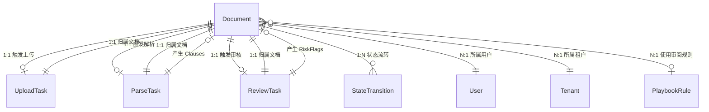
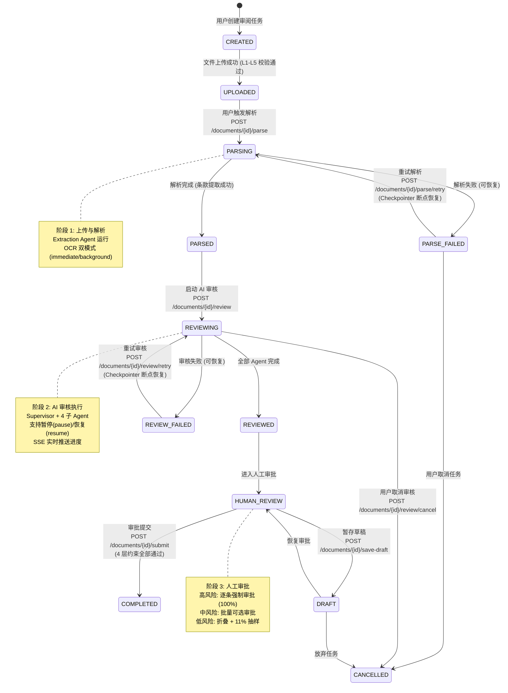
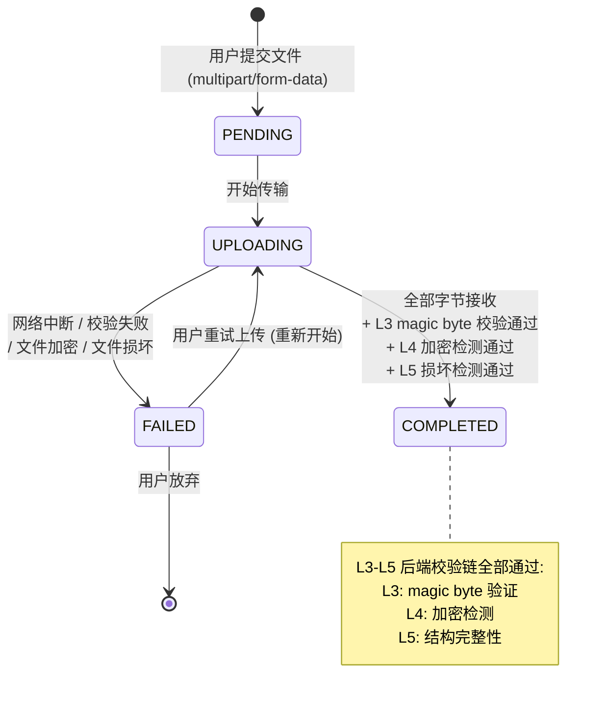
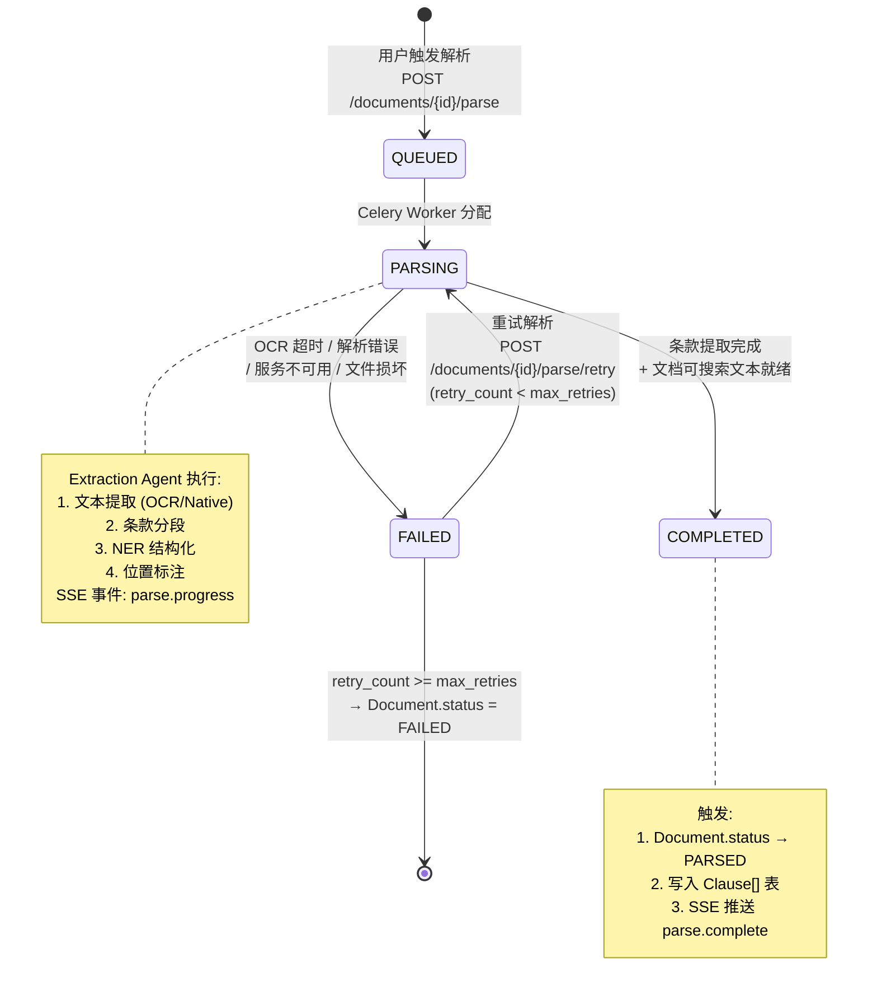
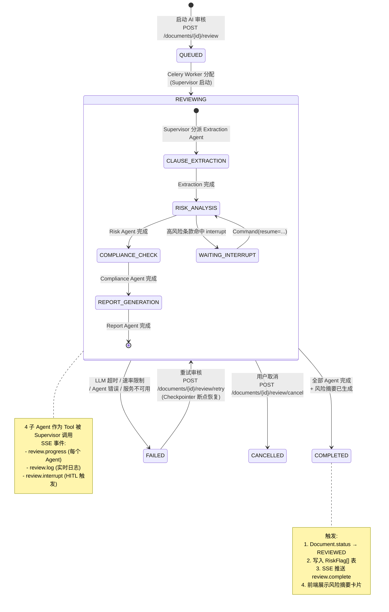
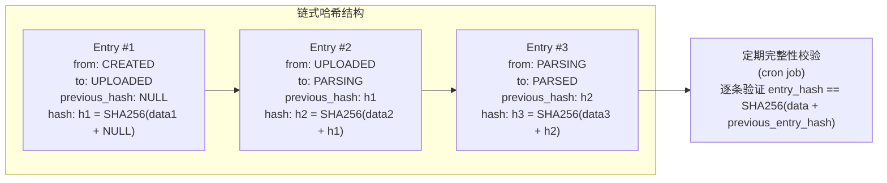
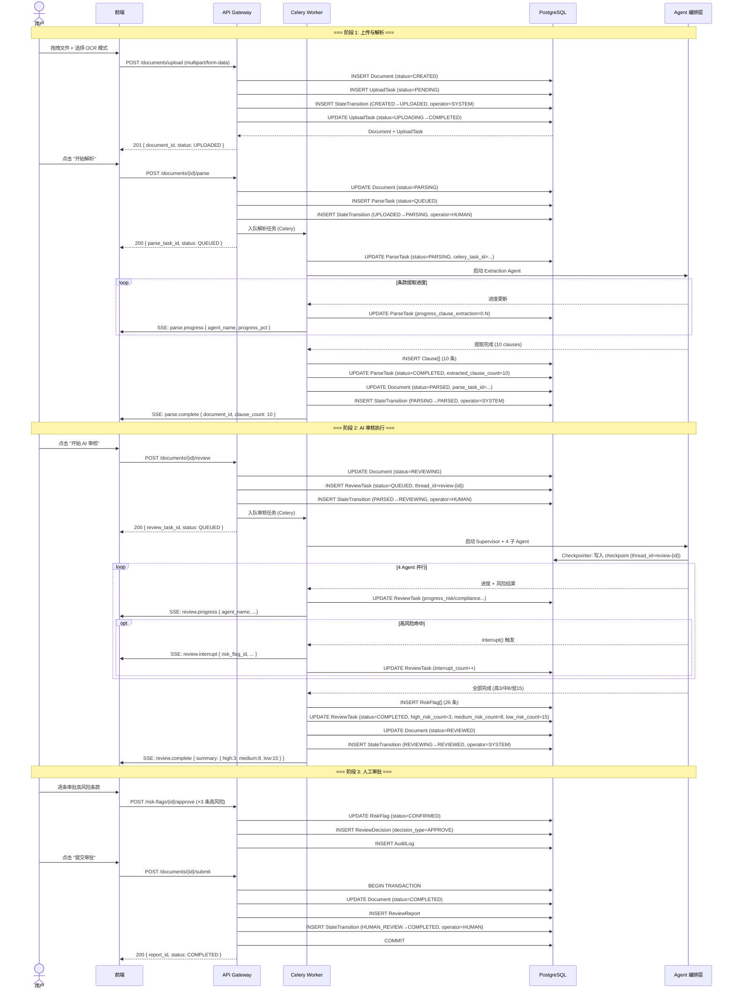

# 文档上传与任务状态数据模型 v1.0

> **版本**: v1.0
> **创建日期**: 2026-07-30
> **文档性质**: 数据模型设计 — 严格基于上游业务建模、系统架构、前后端边界规范
> **上游依赖**:
> - `docs/03_business_modeling/business_model.md` §4.3 实体定义 — 7 核心业务实体 (Document 为锚点)
> - `docs/06_system_architecture/backend_service_arch-v1.0.md` §2 文件上传服务 (5 层校验链) + §3 任务状态管理器 (9 状态生命周期)
> - `docs/06_system_architecture/frontend_backend_boundary_spec-v1.0.md` §三 数据归属 (后端唯一数据源，前端仅展示)
> - `docs/04_interaction_design/flow_state_spec.md` — 9 状态生命周期 + 4 Agent 并行进度维度 + HITL 4 层约束
> **下游读者**: API 规范 (`docs/08_api_specification/`)、后端实现计划 (`docs/10_backend_plan/`)、数据库迁移脚本

---

## 一、模型关系总览 (ER 图)



### 1.1 模型职责划分

| 模型 | 业务含义 | 生命周期 | 数据量级 | 上游来源 |
|------|---------|---------|:--:|---------|
| **Document** | 待审阅合同文档的核心实体，承载全部业务上下文 | 9 状态生命周期 (CREATED → COMPLETED) | 1 条/文档 | `business_model` §4.3 Document |
| **UploadTask** | 文件上传异步任务记录，记录传输过程与五层校验结果 | pending → uploading → completed / failed | 1 条/上传 | `backend_service_arch` §2.1 上传流程 |
| **ParseTask** | 文档解析异步任务记录，按 4 Agent 维度追踪条款提取进度 | queued → parsing → completed / failed | 1 条/文档 | `backend_service_arch` §2.5 TaskDispatcher |
| **ReviewTask** | AI 审核异步任务记录，追踪 Supervisor+4 子 Agent 执行进度与风险摘要 | 9 状态生命周期中的审核阶段 | 1 条/文档 | `backend_service_arch` §3 + §5.1 |
| **StateTransition** | 状态流转不可篡改日志，记录每次状态变更的完整审计链 | 无独立生命周期（仅追加） | N 条/文档 | `backend_service_arch` §4.4 AuditLog |

### 1.2 模型间的 ID 引用链

```
Document.id ─── UploadTask.document_id (FK)
             ─── ParseTask.document_id (FK)
             ─── ReviewTask.document_id (FK, 同时 thread_id 关联 LangGraph checkpoint)
             ─── StateTransition.document_id (FK)
             ─── Clause.document_id (FK, 见 clause_models 设计)
             ─── RiskFlag.document_id (FK, 见 review_models 设计)
```

---

## 二、Document（文档）

- **业务含义**: 一份待审阅的合同/法务文档，是全部业务操作的聚合根实体。从上传创建到最终审批完成，全程追踪文档状态。
- **来源**: `business_model` §4.3 Document 定义 + `backend_service_arch` §3.2 documents 表

### 2.1 字段清单

| 字段名 | 类型 | 必填 | 业务含义 | 示例值 | 前端展示 | 后端存储 | 说明 |
|--------|------|:--:|---------|--------|:--:|:--:|------|
| **基础标识** |
| `id` | UUID | ✅ | 文档全局唯一标识 | `a3b7f8c1-...` | ✅ | ✅ | 主键，后端生成 |
| `user_id` | UUID | ✅ | 上传者标识 | `d4e5f6a7-...` | ❌ | ✅ | FK → users，仅后端查询时使用 |
| `tenant_id` | UUID | ✅ | 所属租户标识 | `b8c9d0e1-...` | ❌ | ✅ | FK → tenants，多租户隔离 |
| **文档基本信息** |
| `original_filename` | VARCHAR(512) | ✅ | 上传时的原始文件名 | `保密协议_供应商_v3.pdf` | ✅ | ✅ | 用于前端列表展示和下载命名 |
| `title` | VARCHAR(256) | ❌ | 用户自定义文档标题 | `XYZ 项目 NDA 审阅` | ✅ | ✅ | 用户在 P2 解析配置页设置；为空时回退到原始文件名 |
| `document_type` | ENUM | ✅ | 文档类型 | `NDA` | ✅ | ✅ | MVP 仅 `NDA`；v2+ 扩展 `PURCHASE`/`SERVICE`/`HR` 等 |
| `format` | ENUM | ✅ | 文件格式 | `PDF` | ✅ | ✅ | MVP: `PDF`, `DOCX`；由 magic byte 校验确定 |
| `file_size_bytes` | BIGINT | ✅ | 文件大小（字节） | `2456789` | ✅ | ✅ | 前端 P2 展示文件大小和上传进度 |
| `page_count` | INT | ❌ | 文档总页数 | `12` | ✅ | ✅ | PDF 直接读取；DOCX 估算；扫描版 PDF 有文本层则为 0 |
| `uploaded_at` | TIMESTAMP | ✅ | 上传完成时间 | `2026-07-30T10:15:00Z` | ✅ | ✅ | 服务端时间戳，非客户端时间 |
| `md5_hash` | VARCHAR(32) | ✅ | 文件 MD5 哈希 | `d41d8cd98f00b204e...` | ❌ | ✅ | 去重和完整性校验，前端不展示 |
| `storage_path` | VARCHAR(1024) | ✅ | 对象存储路径 | `/tenant_a/a3b7f8c1.../v1/original.pdf` | ❌ | ✅ | 后端内部路径，前端通过 presigned URL 访问 |
| **文档状态** |
| `status` | ENUM | ✅ | 文档生命周期状态 | `REVIEWING` | ✅ | ✅ | 9 状态生命周期，见 §2.3 状态流转 |
| `sub_status` | ENUM | ❌ | 当前主状态下的子状态 | `PARSING_CLAUSES` | ⚠️ | ✅ | 仅在 PARSING / REVIEWING 状态下有值，用于细化进度展示 |
| **OCR 与加密状态** |
| `ocr_status` | ENUM | ✅ | OCR 处理状态 | `COMPLETED` | ✅ | ✅ | 枚举见 §2.2；前端根据此状态决定是否显示 "OCR 处理中" |
| `ocr_mode` | ENUM | ❌ | 用户选择的 OCR 模式 | `IMMEDIATE` | ✅ | ✅ | `IMMEDIATE` / `BACKGROUND`；仅扫描版 PDF 有值 |
| `encryption_status` | ENUM | ✅ | PDF 加密状态 | `NONE` | ✅ | ✅ | `NONE` / `ENCRYPTED`；上游 L4 校验层检测 |
| `corruption_status` | ENUM | ✅ | 文件损坏状态 | `VALID` | ✅ | ✅ | `VALID` / `CORRUPTED`；上游 L5 校验层检测 |
| **解析元数据** |
| `parse_task_id` | UUID | ❌ | 关联的解析任务 ID | `f1e2d3c4-...` | ❌ | ✅ | FK → parse_tasks；解析触发前为 NULL |
| `parse_progress` | JSONB | ❌ | 解析进度（4 Agent 维度） | `{"clause_extraction": 0.8, ...}` | ✅ | ✅ | 见 §2.2 结构定义；解析完成后清理 |
| `parse_error_message` | TEXT | ❌ | 解析失败错误信息 | `OCR 引擎超时` | ✅ | ✅ | PARSE_FAILED 状态下展示给用户 |
| **审核元数据** |
| `review_thread_id` | VARCHAR(128) | ❌ | LangGraph 审核线程 ID | `review-a3b7f8c1` | ❌ | ✅ | 关联 LangGraph checkpoint；审核启动前为 NULL |
| `playbook_id` | UUID | ❌ | 使用的审阅规则集 ID | `c4d5e6f7-...` | ✅ | ✅ | FK → playbook_rules；P2 用户选择 Playbook |
| **审计时间戳** |
| `created_at` | TIMESTAMP | ✅ | 记录创建时间（= 任务创建时间） | `2026-07-30T10:14:50Z` | ✅ | ✅ | 服务端时间戳 |
| `updated_at` | TIMESTAMP | ✅ | 记录最后更新时间 | `2026-07-30T10:45:30Z` | ✅ | ✅ | 每次状态变更或字段更新时自动刷新 |

### 2.2 枚举与 JSONB 结构定义

**`status` 枚举值（9 状态生命周期）**:

| 序号 | 枚举值 | 中文名称 | 阶段 | 含义 |
|:--:|--------|---------|:--:|------|
| 1 | `CREATED` | 已创建 | 阶段 1 | 用户创建审阅任务，尚未上传文件 |
| 2 | `UPLOADED` | 已上传 | 阶段 1 | 文件上传成功，通过五层校验，等待触发解析 |
| 3 | `PARSING` | 解析中 | 阶段 1 | 解析 Agent 正在提取条款 |
| 4 | `PARSED` | 已解析 | 阶段 1 | 条款提取完成，等待触发 AI 审核 |
| — | `PARSE_FAILED` | 解析失败 | 阶段 1 | 解析失败（可恢复），支持 Checkpointer 断点重试 |
| 5 | `REVIEWING` | 审核中 | 阶段 2 | Supervisor + 4 Agent 正在执行 AI 审核 |
| 6 | `REVIEWED` | 已审核 | 阶段 2 | AI 审核全部完成，等待进入人工审批 |
| — | `REVIEW_FAILED` | 审核失败 | 阶段 2 | AI 审核失败（可恢复），支持 Checkpointer 断点重试 |
| 7 | `HUMAN_REVIEW` | 人工审批中 | 阶段 3 | 审核员正在进行 approve/edit/reject 等审批操作 |
| — | `DRAFT` | 草稿 | 阶段 3 | 审批中途暂存，可恢复继续审批 |
| 8 | `COMPLETED` | 已完成 | 终点 | 审批提交完成，报告已生成 |
| 9 | `FAILED` | 已失败 | 终点 | 不可恢复的失败（如文件永久损坏） |
| 10 | `CANCELLED` | 已取消 | 终点 | 用户主动取消任务 |

> **注**: `PARSE_FAILED`、`REVIEW_FAILED`、`DRAFT` 是过渡性子状态，在主状态 ENUM 中作为独立值存在，但属于对应阶段的异常/暂停分支。9 状态生命周期指 7 个正向流转状态 + 3 个终端状态中，不含过渡性子状态。

**`ocr_status` 枚举值**:

| 枚举值 | 含义 |
|--------|------|
| `NONE` | 无需 OCR（文档有文本层） |
| `PENDING` | OCR 任务已入队，等待处理 |
| `PROCESSING` | OCR 正在执行 |
| `COMPLETED` | OCR 完成 |
| `FAILED` | OCR 失败 |

**`parse_progress` JSONB 结构**:

```json
{
  "clause_extraction": 0.85,
  "risk_analysis": 0.0,
  "compliance": 0.0,
  "report": 0.0,
  "current_agent": "clause_extraction",
  "current_clause_type": "保密义务条款",
  "updated_at": "2026-07-30T10:20:30Z"
}
```

> **说明**: 4 个进度值均为 0.0-1.0 的浮点数。解析阶段仅 `clause_extraction` 有实际进度，其余保持 0.0。该字段在解析完成后通过 SSE `parse.complete` 事件后置空或覆盖。审核阶段的进度存储在 `ReviewTask` 中。

### 2.3 状态流转图



### 2.4 与其他模型的关系

| 关系 | 对方模型 | 类型 | 说明 |
|------|---------|:--:|------|
| Document → UploadTask | UploadTask | 1:1 | 每份文档关联一条上传任务记录 |
| Document → ParseTask | ParseTask | 1:1 | 每份文档关联一条解析任务记录 |
| Document → ReviewTask | ReviewTask | 1:1 | 每份文档关联一条审核任务记录 |
| Document → StateTransition | StateTransition | 1:N | 每次状态变更写入一条流转日志 |
| Document → Clause | Clause | 1:N | 解析后产生 N 条条款记录 |
| Document → RiskFlag | RiskFlag | 1:N | 审核后产生 N 条风险标记 |
| Document → User | User | N:1 | 每个文档归属一个上传用户 |
| Document → PlaybookRule | PlaybookRule | N:1 | 可选，使用某套审阅规则集 |

---

## 三、UploadTask（上传任务）

- **业务含义**: 文件上传的异步任务记录，追踪文件从客户端传输到服务端的全过程，包括五层格式校验链 (L1-L5) 的结果和上传进度。
- **来源**: `backend_service_arch` §2.1 上传流程 + §2.2 五层校验链 + `boundary_spec` §2.1 上传功能归属

### 3.1 字段清单

| 字段名 | 类型 | 必填 | 业务含义 | 示例值 | 前端展示 | 后端存储 | 说明 |
|--------|------|:--:|---------|--------|:--:|:--:|------|
| **基础标识** |
| `id` | UUID | ✅ | 上传任务唯一标识 | `b2c3d4e5-...` | ✅ | ✅ | 主键，后端生成。前端通过此 ID 查询上传状态 |
| `document_id` | UUID | ✅ | 关联的文档 ID | `a3b7f8c1-...` | ✅ | ✅ | FK → documents；文档创建后立即关联 |
| **任务状态** |
| `status` | ENUM | ✅ | 上传任务状态 | `COMPLETED` | ✅ | ✅ | 枚举: `PENDING` / `UPLOADING` / `COMPLETED` / `FAILED` |
| **上传进度** |
| `bytes_uploaded` | BIGINT | ✅ | 已上传字节数 | `2456789` | ✅ | ✅ | 用于前端渲染进度条 `(bytes_uploaded / total_bytes) * 100%` |
| `total_bytes` | BIGINT | ✅ | 文件总字节数 | `2456789` | ✅ | ✅ | 来自客户端 `Content-Length` 头或 chunked 传输元数据 |
| `upload_speed_bytes_per_sec` | INT | ❌ | 上传速度 (B/s) | `1048576` | ✅ | ✅ | 前端渲染 "1.0 MB/s"；仅 UPLOADING 状态下有值 |
| `estimated_remaining_seconds` | INT | ❌ | 预计剩余秒数 | `3` | ✅ | ✅ | 前端渲染 "预计剩余 3 秒"；仅 UPLOADING 状态下有值 |
| **五层校验链结果** |
| `client_validation_passed` | BOOLEAN | ✅ | L1 客户端校验是否通过 | `true` | ❌ | ✅ | 前端预检已拦截失败的请求；后端记录校验快照 |
| `gateway_size_limit_passed` | BOOLEAN | ✅ | L2 Gateway 大小限制是否通过 | `true` | ❌ | ✅ | 前端 50MB 前端预检 + API Gateway 硬限制二次确认 |
| `magic_byte_validated` | BOOLEAN | ✅ | L3 magic byte 校验是否通过 | `true` | ✅ | ✅ | PDF: `%PDF-`; DOCX: `PK\x03\x04` + ZIP 结构 |
| `encryption_detected` | BOOLEAN | ✅ | L4 PDF 加密检测结果 | `false` | ✅ | ✅ | `true` 时前端展示 "文件已加密，无法处理" |
| `corruption_detected` | BOOLEAN | ✅ | L5 文件损坏检测结果 | `false` | ✅ | ✅ | `true` 时前端展示 "文件已损坏" + 错误详情 |
| `corruption_details` | VARCHAR(1024) | ❌ | 损坏详细描述 | `xref table offset 0x1A2B invalid` | ✅ | ✅ | 仅 corruption_detected=true 时有值 |
| **OCR 检测** |
| `ocr_required` | BOOLEAN | ✅ | 是否需要 OCR | `false` | ✅ | ✅ | 扫描版 PDF (无文本层) 时为 true，触发 OCR 流程 |
| `ocr_mode_selected` | ENUM | ❌ | 用户选择的 OCR 模式 | `IMMEDIATE` | ✅ | ✅ | `IMMEDIATE` / `BACKGROUND` / NULL (不需要 OCR) |
| **审计时间戳** |
| `started_at` | TIMESTAMP | ❌ | 上传开始时间 | `2026-07-30T10:14:55Z` | ⚠️ | ✅ | UPLOADING 状态下展示 "上传中..." |
| `completed_at` | TIMESTAMP | ❌ | 上传完成时间 | `2026-07-30T10:15:00Z` | ❌ | ✅ | COMPLETED / FAILED 状态时记录 |
| `created_at` | TIMESTAMP | ✅ | 记录创建时间 | `2026-07-30T10:14:55Z` | ❌ | ✅ | 服务端时间戳 |

### 3.2 枚举定义

**`status` 枚举值**:

| 枚举值 | 含义 | 可迁移至 |
|--------|------|---------|
| `PENDING` | 等待上传（任务已创建，传输未开始） | `UPLOADING` |
| `UPLOADING` | 正在上传（数据传输中） | `COMPLETED` / `FAILED` |
| `COMPLETED` | 上传成功（全部字节已接收 + L3-L5 校验通过） | (终端状态) |
| `FAILED` | 上传失败（网络中断 / 校验不通过 / 服务端错误） | `UPLOADING` (重试) |

**`ocr_mode_selected` 枚举值**:

| 枚举值 | 含义 | 来源 |
|--------|------|------|
| `IMMEDIATE` | 立即处理 — 前端等待 OCR 完成 | `flow_state_spec` §3.1 OCR 双模式 |
| `BACKGROUND` | 后台处理 — 立即返回，SSE 通知完成 | `flow_state_spec` §3.1 OCR 双模式 |

### 3.3 状态流转图



### 3.4 与其他模型的关系

| 关系 | 对方模型 | 类型 | 说明 |
|------|---------|:--:|------|
| UploadTask → Document | Document | 1:1 | 每一条上传任务严格归属一份文档 |
| UploadTask → StateTransition | (间接) | — | 上传完成后触发 Document.status: CREATED → UPLOADED |

---

## 四、ParseTask（解析任务）

- **业务含义**: 文档解析的异步任务记录，追踪条款提取 Agent 的执行进度。按 4 个 Agent 维度分别记录进度，支持 Checkpointer 断点恢复。
- **来源**: `backend_service_arch` §2.3 OCR 检测 + §2.5 Upload Service 内部模块 + §3.4 任务队列设计 + `flow_state_spec` §3.1 解析进度透明展示

### 4.1 字段清单

| 字段名 | 类型 | 必填 | 业务含义 | 示例值 | 前端展示 | 后端存储 | 说明 |
|--------|------|:--:|---------|--------|:--:|:--:|------|
| **基础标识** |
| `id` | UUID | ✅ | 解析任务唯一标识 | `f1e2d3c4-...` | ✅ | ✅ | 主键，后端生成；前端通过 document_id 查询 |
| `document_id` | UUID | ✅ | 关联的文档 ID | `a3b7f8c1-...` | ✅ | ✅ | FK → documents；唯一约束（一份文档仅一条解析任务） |
| `celery_task_id` | VARCHAR(128) | ❌ | Celery 任务 ID | `7a8b9c0d-...` | ❌ | ✅ | 用于后端任务追踪、取消和重试 |
| **任务状态** |
| `status` | ENUM | ✅ | 解析任务状态 | `PARSING` | ✅ | ✅ | 枚举: `QUEUED` / `PARSING` / `COMPLETED` / `FAILED` |
| **4 Agent 维度进度** |
| `progress_clause_extraction` | FLOAT | ✅ | 条款提取 Agent 进度 | `0.85` | ✅ | ✅ | 0.0-1.0；解析阶段这是唯一的活跃维度 |
| `progress_risk_analysis` | FLOAT | ✅ | 风险分析 Agent 进度 | `0.0` | ✅ | ✅ | 解析阶段始终为 0.0；解耦设计为后续扩展预留 |
| `progress_compliance` | FLOAT | ✅ | 合规检查 Agent 进度 | `0.0` | ✅ | ✅ | 解析阶段始终为 0.0 |
| `progress_report` | FLOAT | ✅ | 报告生成 Agent 进度 | `0.0` | ✅ | ✅ | 解析阶段始终为 0.0 |
| `current_clause_type` | VARCHAR(128) | ❌ | 当前正在提取的条款类型 | `保密义务条款` | ✅ | ✅ | 前端展示 "正在提取: 保密义务条款..." |
| **解析结果** |
| `extracted_clause_count` | INT | ❌ | 已提取条款数量 | `10` | ✅ | ✅ | COMPLETED 时最终值；PARSING 时实时更新 |
| `error_message` | TEXT | ❌ | 解析失败错误信息 | `OCR 引擎超时: Tesseract process timeout` | ✅ | ✅ | FAILED 状态下展示给用户 |
| `error_category` | ENUM | ❌ | 错误类别 | `OCR_TIMEOUT` | ✅ | ✅ | `OCR_TIMEOUT` / `PARSE_ERROR` / `SERVICE_UNAVAILABLE`；影响重试策略 |
| **断点恢复** |
| `checkpointer_token` | JSONB | ❌ | Checkpointer 恢复令牌 | `{"checkpoint_id": "...", "thread_id": "..."}` | ❌ | ✅ | LangGraph Checkpointer 用于断点恢复的内部数据 |
| `retry_count` | INT | ✅ | 已重试次数 | `0` | ⚠️ | ✅ | 前端在 retry_count > 0 时展示 "已重试 N 次" |
| `max_retries` | INT | ✅ | 最大重试次数 | `3` | ❌ | ✅ | 系统配置，超出后标记为 FAILED (不可恢复) |
| **审计时间戳** |
| `queued_at` | TIMESTAMP | ❌ | 入队时间 | `2026-07-30T10:15:05Z` | ❌ | ✅ | Celery 任务创建时间 |
| `started_at` | TIMESTAMP | ❌ | 开始执行时间 | `2026-07-30T10:15:10Z` | ✅ | ✅ | 前端展示 "解析开始于 10:15" |
| `completed_at` | TIMESTAMP | ❌ | 完成时间 | `2026-07-30T10:20:30Z` | ✅ | ✅ | COMPLETED / FAILED 状态时记录 |
| `created_at` | TIMESTAMP | ✅ | 记录创建时间 | `2026-07-30T10:15:05Z` | ❌ | ✅ | 服务端时间戳 |
| `updated_at` | TIMESTAMP | ✅ | 记录最后更新时间 | `2026-07-30T10:20:30Z` | ❌ | ✅ | 每次进度更新时自动刷新 |

### 4.2 枚举定义

**`status` 枚举值**:

| 枚举值 | 含义 | 可迁移至 |
|--------|------|---------|
| `QUEUED` | 已入队，等待 Worker 分配 | `PARSING` |
| `PARSING` | 解析执行中 | `COMPLETED` / `FAILED` |
| `COMPLETED` | 解析完成 | (终端状态 → 触发 ReviewTask) |
| `FAILED` | 解析失败 | `PARSING` (重试) / (终端: 超过 max_retries) |

**`error_category` 枚举值**:

| 枚举值 | 含义 | 重试策略 |
|--------|------|---------|
| `OCR_TIMEOUT` | OCR 引擎超时 | 自动重试 (指数退避) |
| `PARSE_ERROR` | 解析逻辑错误 | 需人工判断是否重试 |
| `SERVICE_UNAVAILABLE` | OCR / NLP 服务不可用 | 自动重试 (指数退避) |
| `FILE_CORRUPTED` | 文件在解析阶段发现更深层损坏 | 不可重试 (需重新上传) |

### 4.3 状态流转图



### 4.4 与其他模型的关系

| 关系 | 对方模型 | 类型 | 说明 |
|------|---------|:--:|------|
| ParseTask → Document | Document | 1:1 | 关联到被解析的文档 (document_id FK) |
| ParseTask → Clause | Clause | 1:N | 解析完成后产生 N 条 Clause 记录 |
| ParseTask → StateTransition | (间接) | — | 解析完成后触发 Document.status 流转 |

---

## 五、ReviewTask（审核任务）

- **业务含义**: AI 审核执行的异步任务记录，追踪 Supervisor + 4 子 Agent 的并行执行进度与风险分析结果摘要。支持断点恢复和部分成功场景。
- **来源**: `backend_service_arch` §3 任务状态管理 + §5.1 Supervisor + 4 子 Agent 编排 + `flow_state_spec` §3.2 中间审核状态

### 5.1 字段清单

| 字段名 | 类型 | 必填 | 业务含义 | 示例值 | 前端展示 | 后端存储 | 说明 |
|--------|------|:--:|---------|--------|:--:|:--:|------|
| **基础标识** |
| `id` | UUID | ✅ | 审核任务唯一标识 | `e5f6a7b8-...` | ✅ | ✅ | 主键，后端生成 |
| `document_id` | UUID | ✅ | 关联的文档 ID | `a3b7f8c1-...` | ✅ | ✅ | FK → documents；唯一约束 |
| `thread_id` | VARCHAR(128) | ✅ | LangGraph 审核线程 ID | `review-a3b7f8c1` | ❌ | ✅ | 关联 LangGraph checkpoint；格式: `review-{document_id}` |
| `celery_task_id` | VARCHAR(128) | ❌ | Celery 任务 ID | `c4d5e6f7-...` | ❌ | ✅ | 用于后端任务追踪 |
| **任务状态** |
| `status` | ENUM | ✅ | 审核任务执行状态 | `REVIEWING` | ✅ | ✅ | 复用 Document.status 中审核相关的状态枚举值 |
| `sub_status` | ENUM | ❌ | 审核子状态 | `RISK_ANALYSIS` | ⚠️ | ✅ | 细粒度状态: `CLAUSE_EXTRACTION` / `RISK_ANALYSIS` / `COMPLIANCE_CHECK` / `REPORT_GENERATION` |
| **4 Agent 进度** |
| `progress_extraction` | FLOAT | ✅ | Extraction Agent 进度 | `1.0` | ✅ | ✅ | 0.0-1.0；审核阶段通常已完成，为 1.0 |
| `progress_risk` | FLOAT | ✅ | Risk Agent 进度 | `0.6` | ✅ | ✅ | 0.0-1.0 |
| `progress_compliance` | FLOAT | ✅ | Compliance Agent 进度 | `0.4` | ✅ | ✅ | 0.0-1.0 |
| `progress_report` | FLOAT | ✅ | Report Agent 进度 | `0.0` | ✅ | ✅ | 0.0-1.0；通常在所有分析完成后开始 |
| `current_dimension` | VARCHAR(256) | ❌ | 当前分析维度描述 | `责任条款风险分析` | ✅ | ✅ | 前端 Agent 卡片展示 "正在分析: ..." |
| **审核结果摘要** |
| `high_risk_count` | INT | ❌ | 高风险标记数量 | `3` | ✅ | ✅ | 审核完成后填充；P4 风险摘要卡片展示 |
| `medium_risk_count` | INT | ❌ | 中风险标记数量 | `8` | ✅ | ✅ | 审核完成后填充 |
| `low_risk_count` | INT | ❌ | 低风险标记数量 | `15` | ✅ | ✅ | 审核完成后填充 |
| `total_risk_count` | INT | ❌ | 风险标记总数 | `26` | ✅ | ✅ | high + medium + low |
| **条款处理统计** |
| `completed_clause_count` | INT | ❌ | 已完成分析的条款数 | `10` | ✅ | ✅ | 实时更新；P4 进度展示 "10/12" |
| `total_clause_count` | INT | ✅ | 待分析条款总数 | `12` | ✅ | ✅ | 来自 ParseTask.extracted_clause_count |
| **部分成功标记** |
| `is_partial_success` | BOOLEAN | ✅ | 是否为部分成功 | `false` | ✅ | ✅ | `true` 时前端渲染三区结果面板（完成区/待审区/全局操作区） |
| `failed_agent_list` | JSONB | ❌ | 失败的 Agent 列表 | `["compliance"]` | ✅ | ✅ | `is_partial_success=true` 时，列举哪些 Agent 未完成 |
| **断点恢复** |
| `checkpoint_id` | VARCHAR(256) | ❌ | 最新的 LangGraph checkpoint ID | `1ef7e123-...` | ❌ | ✅ | 用于断点恢复定位 |
| `interrupt_count` | INT | ✅ | HITL interrupt 触发次数 | `2` | ❌ | ✅ | 统计高风险条款命中 interrupt 的次数 |
| `retry_count` | INT | ✅ | 已重试次数 | `0` | ⚠️ | ✅ | 前端在 retry_count > 0 时展示 |
| `max_retries` | INT | ✅ | 最大重试次数 | `2` | ❌ | ✅ | 系统配置 |
| **失败信息** |
| `fail_category` | ENUM | ❌ | 失败类别 | `LLM_TIMEOUT` | ✅ | ✅ | 枚举见 §5.2 |
| `error_message` | TEXT | ❌ | 失败错误信息 | `Risk Agent: LLM API rate limit exceeded` | ✅ | ✅ | 前端 FAILED 状态展示 |
| `partial_results_available` | BOOLEAN | ✅ | 是否有部分结果可查看 | `true` | ✅ | ✅ | `true` 时前端展示已完成 Agent 的结果 + 重试按钮 |
| **审计时间戳** |
| `queued_at` | TIMESTAMP | ❌ | 入队时间 | `2026-07-30T10:20:35Z` | ❌ | ✅ | |
| `started_at` | TIMESTAMP | ❌ | 审核开始时间 | `2026-07-30T10:20:40Z` | ✅ | ✅ | |
| `completed_at` | TIMESTAMP | ❌ | 审核完成/失败时间 | `2026-07-30T10:25:40Z` | ✅ | ✅ | 前端展示 "审核耗时 5 分钟" |
| `created_at` | TIMESTAMP | ✅ | 记录创建时间 | `2026-07-30T10:20:35Z` | ❌ | ✅ | |
| `updated_at` | TIMESTAMP | ✅ | 记录最后更新时间 | `2026-07-30T10:25:40Z` | ❌ | ✅ | |

### 5.2 枚举定义

**`status` 枚举值（审核相关状态子集）**:

| 枚举值 | 含义 | 对应 Document.status |
|--------|------|---------------------|
| `QUEUED` | 已入队，等待 Worker 分配 | `REVIEWING` |
| `REVIEWING` | Supervisor + 4 Agent 执行中 | `REVIEWING` |
| `COMPLETED` | 全部 Agent 完成 | `REVIEWED` |
| `FAILED` | 审核失败 (可恢复或不可恢复) | `REVIEW_FAILED` |
| `CANCELLED` | 用户取消 | `CANCELLED` |

**`sub_status` 枚举值**:

| 枚举值 | 含义 | 活跃 Agent |
|--------|------|-----------|
| `CLAUSE_EXTRACTION` | 条款提取阶段 | Extraction Agent |
| `RISK_ANALYSIS` | 风险识别阶段 | Risk Agent |
| `COMPLIANCE_CHECK` | 合规检查阶段 | Compliance Agent |
| `REPORT_GENERATION` | 报告生成阶段 | Report Agent |
| `WAITING_INTERRUPT` | 等待 HITL interrupt 响应 | (暂停) |

**`fail_category` 枚举值**:

| 枚举值 | 含义 | 重试策略 |
|--------|------|---------|
| `LLM_TIMEOUT` | LLM API 调用超时 | 自动重试 (指数退避) |
| `LLM_RATE_LIMITED` | LLM API 速率限制 | 自动重试 (指数退避 + 更长间隔) |
| `AGENT_ERROR` | Agent 内部逻辑错误 | 需分析日志后重试 |
| `CHECKPOINT_ERROR` | Checkpointer 读写失败 | 标记不可恢复 |
| `SERVICE_UNAVAILABLE` | 后端服务不可用 | 自动重试 |
| `PARTIAL_SUCCESS` | 部分 Agent 完成，部分失败 | 展示部分结果 + 手动重试 |

### 5.3 状态流转图



### 5.4 与其他模型的关系

| 关系 | 对方模型 | 类型 | 说明 |
|------|---------|:--:|------|
| ReviewTask → Document | Document | 1:1 | 关联到被审核的文档 (document_id FK) |
| ReviewTask → RiskFlag | RiskFlag | 1:N | 审核完成后产生 N 条 RiskFlag 记录 |
| ReviewTask → LangGraph Checkpointer | AsyncPostgresSaver | 1:1 | thread_id 关联 checkpoint 表 |
| ReviewTask → StateTransition | (间接) | — | 审核阶段每次状态变更触发 StateTransition |

---

## 六、StateTransition（状态流转日志）

- **业务含义**: 不可篡改的状态流转日志，记录文档从创建到终态的每一次状态变更，包括来源状态、目标状态、触发原因、操作人和时间戳。是审计追踪的数据基础。
- **来源**: `backend_service_arch` §4.4 AuditLog 不可篡改机制 + `flow_state_spec` 9 状态生命周期 + `boundary_spec` §2.2 状态管理

### 6.1 字段清单

| 字段名 | 类型 | 必填 | 业务含义 | 示例值 | 前端展示 | 后端存储 | 说明 |
|--------|------|:--:|---------|--------|:--:|:--:|------|
| **基础标识** |
| `id` | UUID | ✅ | 流转日志唯一标识 | `7f3a2b1c-...` | ✅ | ✅ | 主键；前端通过 document_id 批量查询 |
| `document_id` | UUID | ✅ | 关联的文档 ID | `a3b7f8c1-...` | ✅ | ✅ | FK → documents；建立索引用于按文档查询审计时间线 |
| **状态变更信息** |
| `from_status` | ENUM | ✅ | 来源状态 | `PARSING` | ✅ | ✅ | 状态变更前的 Document.status 值 |
| `to_status` | ENUM | ✅ | 目标状态 | `PARSED` | ✅ | ✅ | 状态变更后的 Document.status 值 |
| `transition_type` | ENUM | ✅ | 流转类型 | `AUTO` | ✅ | ✅ | `AUTO` (系统自动) / `MANUAL` (用户手动) / `ERROR` (错误触发) |
| `trigger_reason` | VARCHAR(512) | ✅ | 触发原因描述 | `条款提取完成，10 条 clause 已写入` | ✅ | ✅ | 前端审计时间线和 P6 审计追踪展示 |
| **操作人标识** |
| `operator_type` | ENUM | ✅ | 操作人类型 | `SYSTEM` | ✅ | ✅ | `HUMAN` / `SYSTEM` / `AGENT` |
| `operator_id` | VARCHAR(128) | ❌ | 操作人/系统标识 | `user_d4e5f6a7` (HUMAN) / `extraction_agent` (AGENT) / `task_state_manager` (SYSTEM) | ✅ | ✅ | HUMAN: user_id; AGENT: agent_name; SYSTEM: service_name |
| **时间戳** |
| `transitioned_at` | TIMESTAMP | ✅ | 状态变更时间 | `2026-07-30T10:20:30.123Z` | ✅ | ✅ | 服务端时间戳(毫秒精度)，前端审计时间线按此排序 |
| **防篡改字段** |
| `before_snapshot` | JSONB | ❌ | 变更前状态快照 | `{"status": "PARSING", "parse_progress": {"clause_extraction": 0.85}}` | ❌ | ✅ | 记录 Document 关键字段的变更前快照 |
| `after_snapshot` | JSONB | ❌ | 变更后状态快照 | `{"status": "PARSED", "extracted_clause_count": 10}` | ❌ | ✅ | 记录 Document 关键字段的变更后快照 |
| `entry_hash` | VARCHAR(64) | ✅ | 条目哈希 (SHA-256) | `e3b0c44298fc1c14...` | ❌ | ✅ | 包含 previous_entry_hash 形成链式结构 |
| `previous_entry_hash` | VARCHAR(64) | ❌ | 前条日志哈希 | `d4e5f6a7b8c9...` | ❌ | ✅ | 链式哈希，首条为 NULL |
| **扩展信息** |
| `metadata` | JSONB | ❌ | 扩展元数据 | `{"retry_count": 1, "checkpoint_id": "..."}` | ⚠️ | ✅ | 前端仅在调试/技术模式展示；存储任意上下文字段 |
| `created_at` | TIMESTAMP | ✅ | 记录创建时间 | `2026-07-30T10:20:30.123Z` | ❌ | ✅ | 服务端时间戳，与 transitioned_at 相同（原子写入） |

### 6.2 枚举定义

**`transition_type` 枚举值**:

| 枚举值 | 含义 | 示例场景 |
|--------|------|---------|
| `AUTO` | 系统自动流转 | 解析完成后自动 PARSING → PARSED |
| `MANUAL` | 用户手动触发 | 用户点击 "开始审核" → PARSED → REVIEWING |
| `ERROR` | 错误触发的异常流转 | 解析失败 → PARSING → PARSE_FAILED |

**`operator_type` 枚举值**:

| 枚举值 | 含义 | operator_id 示例 |
|--------|------|-----------------|
| `HUMAN` | 人类用户 | `user_d4e5f6a7` (user_id) |
| `SYSTEM` | 后端系统服务 | `task_state_manager` / `upload_service` / `celery_worker` |
| `AGENT` | AI Agent | `extraction_agent` / `risk_agent` / `compliance_agent` / `report_agent` / `supervisor_agent` |

### 6.3 防篡改机制



**防篡改特性**:

| 特性 | 实现 | 来源 |
|------|------|------|
| 仅追加 (Append-Only) | 表权限 REVOKE UPDATE/DELETE | `backend_service_arch` §4.4 |
| 链式哈希 | `previous_entry_hash` 链接前条日志 | `backend_service_arch` §4.4 |
| 状态快照 | `before_snapshot` / `after_snapshot` (JSONB) | `backend_service_arch` §4.4 |
| 服务端时间戳 | `transitioned_at` 不接受客户端时间 | `backend_service_arch` §4.4 |
| 定期完整性校验 | cron 逐条验证哈希链 | `backend_service_arch` §4.4 |

### 6.4 状态流转日志示例序列

```
Document: a3b7f8c1 (NDA 保密协议审阅)

#1: CREATED     → UPLOADED     | SYSTEM | upload_service      | 文件上传成功
#2: UPLOADED    → PARSING      | HUMAN  | user_d4e5f6a7       | 用户触发解析
#3: PARSING     → PARSED       | SYSTEM | task_state_manager  | 条款提取完成(10条)
#4: PARSED      → REVIEWING    | HUMAN  | user_d4e5f6a7       | 用户触发 AI 审核
#5: REVIEWING   → REVIEWED     | SYSTEM | task_state_manager  | 4 Agent 全部完成(高3/中8/低15)
#6: REVIEWED    → HUMAN_REVIEW | SYSTEM | task_state_manager  | 进入人工审批阶段
#7: HUMAN_REVIEW → DRAFT       | HUMAN  | user_d4e5f6a7       | 用户暂存草稿
#8: DRAFT       → HUMAN_REVIEW | HUMAN  | user_d4e5f6a7       | 用户恢复审批
#9: HUMAN_REVIEW → COMPLETED   | HUMAN  | user_d4e5f6a7       | 用户提交审批(final_submit)
```

### 6.5 与其他模型的关系

| 关系 | 对方模型 | 类型 | 说明 |
|------|---------|:--:|------|
| StateTransition → Document | Document | N:1 | 每条流转日志归属一份文档 |
| StateTransition → (无直接FK) | UploadTask / ParseTask / ReviewTask | (间接) | 通过 metadata JSONB 中的关联 ID 引用 |

---

## 七、跨模型协作时序视图

### 7.1 完整生命周期：5 模型协作



---

## 八、与上游文档的对齐验证

| 上游约束 | 来源 | 本文档章节 | 对齐状态 |
|---------|------|:--:|:--:|
| Document 为聚合根，承载 9 状态生命周期 | `business_model` §4.3 + `flow_state_spec` §3.2 | §2.3 状态流转图 | 已对齐 |
| 五层格式校验链 (L1-L5) | `backend_service_arch` §2.2 | §3.1 UploadTask 字段 (L3-L5 校验结果) | 已对齐 |
| OCR 双模式 (immediate/background) | `flow_state_spec` §3.1 | §2.2 ocr_mode 枚举 + §3.2 ocr_mode_selected | 已对齐 |
| 4 Agent 并行进度维度 | `flow_state_spec` §3.2 | §4.1 ParseTask 4 进度字段 + §5.1 ReviewTask 4 进度字段 | 已对齐 |
| Checkpointer 断点恢复 | `backend_service_arch` §5.3-5.4 | §4.1 checkpointer_token + §5.1 checkpoint_id | 已对齐 |
| HITL interrupt 不可跳过 | `business_model` §4.1 + `flow_state_spec` §3.3 | §5.1 interrupt_count + §5.3 WAITING_INTERRUPT 子状态 | 已对齐 |
| 部分成功差异化处理 | `flow_state_spec` §3.2 | §5.1 is_partial_success / failed_agent_list / partial_results_available | 已对齐 |
| 审计日志不可篡改 (链式哈希) | `backend_service_arch` §4.4 | §6.1 防篡改字段 (entry_hash / previous_entry_hash) + §6.3 | 已对齐 |
| 后端是唯一数据源 | `boundary_spec` §三 | 全部字段: 前端展示 vs 后端存储 标注 | 已对齐 |
| MVP 仅 NDA + PDF/DOCX | `business_model` §5.1 | §2.1 document_type ENUM + format ENUM | 已对齐 |
| 状态流转日志记录每次变更 | `backend_service_arch` §3.2 | §6 StateTransition 完整设计 | 已对齐 |
| 任务队列分离 (Parse Queue vs Review Queue) | `backend_service_arch` §3.4 | §4.1 / §5.1 celery_task_id + 独立设计 | 已对齐 |

---

## 九、附录：字段标注规范说明

### 9.1 前端展示列

| 标注 | 含义 |
|:--:|------|
| ✅ | 前端直接展示（如列表字段、详情字段、卡片数据） |
| ❌ | 前端不需要展示（内部标识、哈希、存储路径等仅后端使用的字段） |
| ⚠️ | 条件展示（仅在特定状态/条件下展示，如错误信息仅在失败状态展示） |

### 9.2 后端存储列

| 标注 | 含义 |
|:--:|------|
| ✅ | 持久化到 PostgreSQL 表 |
| ❌ | 不持久化（计算字段、传输层临时字段等；本文档中未设计此类字段） |

### 9.3 类型约定

| 文档类型 | PostgreSQL 对应类型 | 说明 |
|---------|-------------------|------|
| `UUID` | `UUID` | Python `uuid.UUID` |
| `VARCHAR(N)` | `VARCHAR(N)` | 可变长度字符串 |
| `ENUM` | 自定义 ENUM 类型 | Python `enum.StrEnum` |
| `INT` | `INTEGER` | 32 位整数 |
| `BIGINT` | `BIGINT` | 64 位整数 |
| `FLOAT` | `REAL` / `DOUBLE PRECISION` | IEEE 754 |
| `BOOLEAN` | `BOOLEAN` | true / false |
| `TIMESTAMP` | `TIMESTAMP WITH TIME ZONE` | ISO 8601，UTC 存储 |
| `TEXT` | `TEXT` | 无限制长度文本 |
| `JSONB` | `JSONB` | 二进制 JSON，支持索引和查询 |

---

> **上游文档**:
> - `../03_business_modeling/business_model.md` — 业务问题建模
> - `../04_interaction_design/flow_state_spec.md` — 状态流转规范
> - `../06_system_architecture/backend_service_arch-v1.0.md` — 后端服务架构
> - `../06_system_architecture/frontend_backend_boundary_spec-v1.0.md` — 前后端边界规范
> **下游文档**:
> - `../08_api_specification/` — API 规范 (32 端点基于本文档模型展开)
> - `../10_backend_plan/` — 后端实现计划 (本文模型 → SQLAlchemy ORM → Alembic 迁移)
