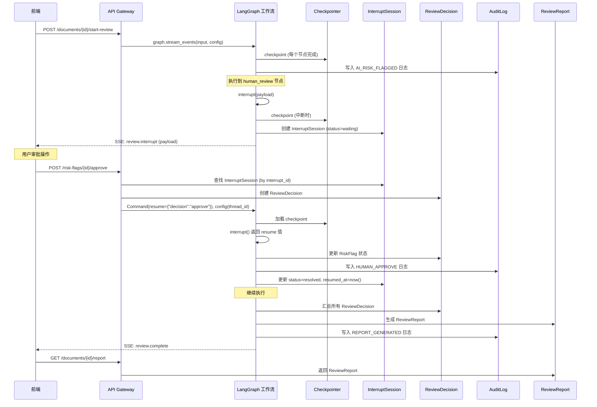

# Agent 智能文档审核系统 -- HITL 交互数据模型 v1.0

> **版本**: v1.0
> **创建日期**: 2026-07-29
> **文档性质**: 数据模型设计 -- 定义人机交互（HITL）流程中涉及的全部数据结构
> **上游依赖**:
> - `docs/03_business_modeling/business_model.md` -- 业务问题建模（7 核心实体、分级告警策略）
> - `docs/04_interaction_design/langchain_hitl_arch-v1.0.md` -- HITL 架构规范（3 中断点、8 操作映射）
> - `docs/06_system_architecture/langchain_hitl_workflow-v1.0.md` -- HITL 工作流设计（State 定义、interrupt/resume 结构）
> **下游读者**: API 规范 (`docs/08_api_specification/`)、后端实现计划 (`docs/10_backend_plan/`)、前端实现计划 (`docs/09_frontend_plan/`)

---

## 目录

1. [模型总览](#一模型总览)
2. [ReviewDecision（审阅决策）](#二reviewdecision审阅决策)
3. [AuditLog（审计日志）](#三auditlog审计日志)
4. [ReviewReport（审阅报告）](#四reviewreport审阅报告)
5. [InterruptSession（中断会话）](#五interruptsession中断会话)
6. [ApprovalProgress（审批进度）](#六approvalprogress审批进度)
7. [模型关系 ER 图](#七模型关系-er-图)
8. [上游约束对齐验证](#八上游约束对齐验证)

---

## 一、模型总览

### 1.1 模型清单

| # | 模型 | 业务含义 | 对应上游定义 | 数据生命周期 |
|---|------|---------|------------|------------|
| 1 | **ReviewDecision** | 人类审核员对 AI 风险标记的单次裁定 | `business_model.md` §4.3 + `workflow` §2.1 `ReviewDecisionDict` | 创建 -> 可修改 -> 提交后不可变 |
| 2 | **AuditLog** | 不可篡改的操作记录 | `business_model.md` §4.3 + `langchain_hitl_arch-v1.0.md` §6.1 审计日志不可篡改 | 追加写入，永不修改/删除 |
| 3 | **ReviewReport** | 一次完整审阅的汇总输出 | `business_model.md` §4.3 + `workflow` §3.4 IP-3 payload 结构 | 生成 -> 签署 -> 导出 |
| 4 | **InterruptSession** | 记录每次 LangGraph `interrupt()` 的会话状态 | `workflow` §2.1 `InterruptStateDict` + §3 中断点设计 | 创建 -> waiting -> resolved / timeout |
| 5 | **ApprovalProgress** | 前端审批进度追踪的聚合数据 | `workflow` §3.2 IP-1 payload `review_progress` + §3.4 IP-3 payload `summary` | 实时计算（可从 ReviewDecision 聚合派生） |

### 1.2 模型间的数据流关系

```
Document ──1:N──> Clause ──1:N──> RiskFlag ──1:N──> ReviewDecision
    │                                    │                │
    │                                    │                │
    │                                    ▼                ▼
    │                              InterruptSession    AuditLog
    │                                    │                │
    │                                    │ (thread_id)     │ (聚合)
    │                                    ▼                ▼
    └──────────────────────────────> ReviewReport <───────┘
                                         │
                                         ▼
                                   ApprovalProgress (派生/聚合视图)
```

---

## 二、ReviewDecision（审阅决策）

### 2.1 模型名称 (ReviewDecision)

- **业务含义**: 人类审核员对 AI 生成的风险标记（RiskFlag）做出的单次裁定，记录裁定类型、裁定内容、裁定人及时间戳，是 HITL 流程的核心决策数据。

### 2.2 字段清单

#### 2.2.1 基础字段（所有决策类型共用）

| 字段名 | 类型 | 必填 | 业务含义 | 示例值 | 前端展示 | 后端存储 | 说明 |
|--------|------|:--:|---------|--------|:--:|:--:|------|
| `decision_id` | `string` | Y | 决策唯一标识 | `"dec_a1b2c3d4e5f6"` | Y | Y | UUID 前缀 `dec_`，12 位 hex |
| `document_id` | `string` | Y | 所属文档标识 | `"doc_001"` | Y | Y | 关联 Document |
| `risk_flag_id` | `string` | Y | 关联的风险标记标识 | `"rf_001"` | Y | Y | 关联 RiskFlag；手动添加时为新建的 flag_id |
| `clause_id` | `string` | N | 关联的条款标识 | `"cl_015"` | Y | Y | 可通过 risk_flag_id JOIN 获取，冗余存储加速查询 |
| `decision_type` | `enum` | Y | 裁定类型 | `"APPROVE"` | Y | Y | 枚举：`APPROVE` / `EDIT` / `REJECT` / `MANUAL_ADD` / `BATCH_CONFIRM` / `ESCALATE` |
| `reviewer_id` | `string` | Y | 裁定人标识 | `"user_joshu"` | Y | Y | 关联用户系统 |
| `timestamp` | `datetime(UTC)` | Y | 裁定提交时间 | `"2026-07-29T14:30:00Z"` | Y | Y | ISO 8601 UTC |
| `interrupt_point` | `enum` | Y | 所属中断点 | `"IP-1"` | Y | Y | `IP-1` / `IP-2` / `IP-3` / `NONE`（手动添加为 NONE） |
| `version` | `int` | Y | 乐观锁版本号 | `1` | N | Y | 每次修改 +1，提交后冻结 |
| `is_finalized` | `bool` | Y | 是否已最终提交 | `true` | Y | Y | `true` 后所有字段不可变 |
| `is_manual_add` | `bool` | Y | 是否为手动补充标记 | `false` | Y | Y | 用于区分 AI 标记裁定 vs 人工新增标记 |

#### 2.2.2 APPROVE（确认 AI 标记）-- 无额外字段

APPROVE 类型仅使用基础字段即可完整表达语义：审核员确认 AI 标记准确，不做任何修改。

| 字段名 | 类型 | 必填 | 业务含义 | 示例值 | 前端展示 | 后端存储 | 说明 |
|--------|------|:--:|---------|--------|:--:|:--:|------|
| `comment` | `string` | N | 可选的审核备注 | `"确认无误"` | Y | Y | APPROVE 时 comment 可选 |

#### 2.2.3 EDIT（修正 AI 标记）-- 条件字段

EDIT 类型在基础字段之上，追加修改内容快照字段：

| 字段名 | 类型 | 必填 | 业务含义 | 示例值 | 前端展示 | 后端存储 | 说明 |
|--------|------|:--:|---------|--------|:--:|:--:|------|
| `comment` | `string` | Y | 修改原因说明 | `"等级下调为中风险，因为..."` | Y | Y | **最少 10 字符** |
| `modified_risk_level` | `string` | N | 修改后的风险等级 | `"中"` | Y | Y | 枚举：`高` / `中` / `低`；降为 `无风险-驳回` 时等同于 REJECT |
| `modified_risk_category` | `string` | N | 修改后的风险类别 | `"期限不合理"` | Y | Y | 自由文本或从预定义类别中选择 |
| `modified_suggestion` | `string` | N | 修改后的建议措辞 | `"建议将...替换为..."` | Y | Y | 审核员编辑后的修改建议文本 |
| `original_risk_level` | `string` | Y | 原始风险等级（快照） | `"高"` | Y | Y | 审计追溯：AI 原始标记值 |
| `original_risk_category` | `string` | Y | 原始风险类别（快照） | `"定义过宽"` | Y | Y | 审计追溯 |
| `original_suggestion` | `string` | N | 原始建议措辞（快照） | `"建议将'任何及所有信息'..."` | Y | Y | 审计追溯 |

**EDIT 的等级降级规则**（来源：`workflow` §3.2 resume_edit 处理逻辑）：

| 修改后等级 | 行为 | RiskFlag 状态变化 |
|-----------|------|-------------------|
| 高 -> 高 | 仅更新类别/建议，保留在高风险队列 | `status` = `MODIFIED` |
| 高 -> 中 | 移出高风险队列，进入中风险队列（IP-2 处理范围） | `status` = `MODIFIED`, `risk_level` = `中` |
| 高 -> 低 | 等同自动通过，移出人工审批队列 | `status` = `MODIFIED`, `risk_level` = `低` |
| 高 -> 无风险-驳回 | 等同于 REJECT | `status` = `REJECTED` |

#### 2.2.4 REJECT（驳回 AI 标记）-- 条件字段

| 字段名 | 类型 | 必填 | 业务含义 | 示例值 | 前端展示 | 后端存储 | 说明 |
|--------|------|:--:|---------|--------|:--:|:--:|------|
| `reject_reason` | `string` | Y | 驳回原因文本 | `"该条款为行业标准表述，在实际司法实践中此类措辞已被广泛接受。"` | Y | Y | **最少 10 字符**；REJECT 时 comment 与 reject_reason 等价，统一存为 reject_reason |
| `original_risk_level` | `string` | Y | 被驳回的原始风险等级（快照） | `"高"` | Y | Y | 审计追溯 |
| `original_risk_category` | `string` | Y | 被驳回的原始风险类别（快照） | `"缺失关键条款"` | Y | Y | 审计追溯 |

**REJECT 语义**：审核员认为 AI 误报，该 RiskFlag 标记为 `REJECTED`，`is_active` = `false`，不计入最终报告的风险计数。

#### 2.2.5 MANUAL_ADD（手动补充标记）-- 条件字段

| 字段名 | 类型 | 必填 | 业务含义 | 示例值 | 前端展示 | 后端存储 | 说明 |
|--------|------|:--:|---------|--------|:--:|:--:|------|
| `clause_location` | `object` | Y | 划选的原文区域位置 | 见下方 ClauseLocation | Y | Y | ClaudeLocation 结构 |
| `manual_risk_level` | `string` | Y | 手动设置的风险等级 | `"高"` | Y | Y | 枚举：`高` / `中` / `低` |
| `manual_risk_category` | `string` | Y | 手动设置的风险类别 | `"用途限制过宽"` | Y | Y | 自由文本 |
| `description` | `string` | Y | 人工补充的说明文本 | `"该条款未明确允许接收方在法规要求下..."` | Y | Y | 最少 10 字符 |
| `comment` | `string` | N | 可选的附加备注 | `""` | Y | Y | 可选 |

**ClauseLocation 子结构**：

| 字段名 | 类型 | 必填 | 业务含义 | 示例值 |
|--------|------|:--:|---------|--------|
| `clause_text` | `string` | Y | 划选的原文文本 | `"接收方不得将保密信息用于本协议目的之外的任何用途。"` |
| `position_start` | `int` | Y | 起始字符偏移 | `142` |
| `position_end` | `int` | Y | 结束字符偏移 | `175` |
| `page_number` | `int` | N | 所在页码 | `3` |

**MANUAL_ADD 设计决策**（来源 `workflow` §5.1 操作 7）：
- manual_add 不通过 `interrupt()` 触发，而是独立的 API 调用 `POST /risk-flags/manual`
- 后端通过 `graph.update_state()` 将新 RiskFlag 注入 state
- MVP 单人审核场景手动标记提交后直接生效
- 若标记为高风险，节点重入后追加到 IP-1 循环中

#### 2.2.6 BATCH_CONFIRM（批量确认）-- 条件字段

| 字段名 | 类型 | 必填 | 业务含义 | 示例值 | 前端展示 | 后端存储 | 说明 |
|--------|------|:--:|---------|--------|:--:|:--:|------|
| `batch_flag_ids` | `list[string]` | Y | 批量确认的 flag_id 列表 | `["rf_011", "rf_012", "rf_013"]` | Y | Y | 仅 IP-2 中风险批量确认；若为空则确认全部未审核中风险项 |
| `comment` | `string` | N | 可选的批量确认备注 | `""` | Y | Y | 可选 |

#### 2.2.7 ESCALATE（风险升级）-- 条件字段

| 字段名 | 类型 | 必填 | 业务含义 | 示例值 | 前端展示 | 后端存储 | 说明 |
|--------|------|:--:|---------|--------|:--:|:--:|------|
| `new_risk_level` | `string` | Y | 升级后的风险等级 | `"高"` | Y | Y | 必须高于原始等级 |
| `escalation_reason` | `string` | Y | 升级原因 | `"该条款虽被AI标记为低风险，但..."` | Y | Y | 最少 10 字符 |
| `original_risk_level` | `string` | Y | 原始风险等级（快照） | `"低"` | Y | Y | 审计追溯 |
| `comment` | `string` | N | 可选的附加备注 | `""` | Y | Y | 可选 |

### 2.3 状态流转

```
ReviewDecision 生命周期
========================

创建 (is_finalized = false, version = 1)
  │
  │  审核员可修改（每次修改 version +1，旧值写入 AuditLog.before_snapshot）
  │
  ├── 审核员确认提交
  │     │
  │     ▼
  │   is_finalized = true  (不可变)
  │     │
  │     │  version 冻结
  │     │  所有字段不可再修改
  │     │  AuditLog 记录 FINAL_SUBMIT 事件
  │
  └── 审核员放弃修改
        │
        ▼
      决策保持原值，在文档最终提交时一并锁定
```

### 2.4 与其他模型的关系

| 关系 | 目标模型 | 基数 | 说明 |
|------|---------|:--:|------|
| 属于 | `RiskFlag` | N:1 | 一个 RiskFlag 可被多次裁定（修改场景）；通过 `risk_flag_id` 关联 |
| 属于 | `Document` | N:1 | 通过 `document_id` 冗余关联，加速按文档查询决策列表 |
| 属于 | `Clause` | N:1 | 通过 `clause_id` 冗余关联 |
| 触发 | `AuditLog` | 1:1 | 每次创建/修改 ReviewDecision 均写入一条 AuditLog |
| 聚合到 | `ReviewReport` | N:1 | 所有决策按类型汇总到报告摘要中 |

---

## 三、AuditLog（审计日志）

### 3.1 模型名称 (AuditLog)

- **业务含义**: 不可篡改的操作记录，以链式哈希确保完整性，完整追溯从文档上传到最终提交的全部操作轨迹。

### 3.2 字段清单

| 字段名 | 类型 | 必填 | 业务含义 | 示例值 | 前端展示 | 后端存储 | 说明 |
|--------|------|:--:|---------|--------|:--:|:--:|------|
| `log_id` | `string` | Y | 日志条目唯一标识 | `"log_7f3a1b2c"` | Y | Y | UUID 前缀 `log_` |
| `timestamp` | `datetime(UTC)` | Y | 操作发生时间 | `"2026-07-29T14:30:01.123Z"` | Y | Y | 毫秒精度，不可事后修改 |
| `operation_type` | `enum` | Y | 操作类型 | `"HUMAN_EDIT"` | Y | Y | 见下方操作类型枚举 |
| `user_id` | `string` | N | 人类操作人标识 | `"user_joshu"` | Y | Y | 系统自动操作为 null |
| `agent_name` | `string` | N | AI Agent 标识 | `"risk_analysis"` | Y | Y | 人类操作为 null；Agent 操作为 Agent 名称 |
| `document_id` | `string` | N | 关联文档标识 | `"doc_001"` | Y | Y | 文档级操作必填 |
| `clause_id` | `string` | N | 关联条款标识 | `"cl_015"` | Y | Y | 条款级操作必填 |
| `risk_flag_id` | `string` | N | 关联风险标记标识 | `"rf_001"` | Y | Y | 风险级操作必填 |
| `decision_id` | `string` | N | 关联审阅决策标识 | `"dec_a1b2c3d4e5f6"` | Y | Y | 决策操作必填 |
| `before_snapshot` | `JSON` | N | 操作前状态快照 | `{"status": "PENDING_REVIEW", "risk_level": "高"}` | Y | Y | JSON 对象，记录变更前的关键字段 |
| `after_snapshot` | `JSON` | N | 操作后状态快照 | `{"status": "MODIFIED", "risk_level": "中"}` | Y | Y | JSON 对象，记录变更后的关键字段 |
| `diff` | `JSON` | N | 前后差异计算 | `{"risk_level": {"from": "高", "to": "中"}}` | Y | Y | 可选，前端可展示变更对比 |
| `prev_hash` | `string` | Y | 前一条日志的哈希值 | `"a1b2c3...e5f6"` | N | Y | 链式哈希的前驱，首条为 `"GENESIS"` |
| `current_hash` | `string` | Y | 本条日志的哈希值 | `"7f3a1b...2c4d"` | N | Y | SHA256(prev_hash + 序列化条目数据)，不可变 |
| `block_index` | `int` | Y | 链上序号（从 0 开始） | `42` | N | Y | 自增，便于逐条验证 |

### 3.3 操作类型枚举 (operation_type)

| 枚举值 | 类别 | 触发时机 | actor_id 来源 |
|--------|------|---------|-------------|
| `UPLOAD` | 文档 | 用户上传文档 | `user_id` |
| `PARSE_START` | 文档 | 开始文档解析 | `agent_name` = `"parser"` |
| `PARSE_COMPLETE` | 文档 | 解析完成 | `agent_name` = `"parser"` |
| `PARSE_FAILED` | 文档 | 解析失败 | `agent_name` = `"parser"` |
| `REVIEW_START` | AI 审核 | 4 Agent 并行审核启动 | `agent_name` = `"supervisor"` |
| `AI_CLAUSE_EXTRACTED` | AI 审核 | 条款提取完成 | `agent_name` = `"clause_extraction"` |
| `AI_RISK_FLAGGED` | AI 审核 | 单个风险标记生成 | `agent_name` = `"risk_analysis"` 或 `"compliance"` |
| `AI_REVIEW_COMPLETE` | AI 审核 | AI 审核全部完成 | `agent_name` = `"supervisor"` |
| `AI_REVIEW_FAILED` | AI 审核 | AI 审核失败 | `agent_name` = `"supervisor"` |
| `HUMAN_APPROVE` | 人工审批 | 审核员确认 AI 标记 | `user_id` |
| `HUMAN_EDIT` | 人工审批 | 审核员修正 AI 标记 | `user_id` |
| `HUMAN_REJECT` | 人工审批 | 审核员驳回 AI 标记 | `user_id` |
| `MANUAL_ADD` | 人工审批 | 审核员手动补充风险标记 | `user_id` |
| `BATCH_CONFIRM` | 人工审批 | 批量确认中风险 | `user_id` |
| `SPOT_CHECK_APPROVE` | 人工审批 | 低风险抽样确认 | `user_id` |
| `SPOT_CHECK_SKIP` | 人工审批 | 低风险抽样跳过 | `user_id` |
| `SPOT_CHECK_ESCALATE` | 人工审批 | 低风险抽样升级 | `user_id` |
| `INTERRUPT_TRIGGERED` | 系统 | `interrupt()` 被调用 | `agent_name` = `"langgraph"` |
| `INTERRUPT_RESUMED` | 系统 | `Command(resume=...)` 被处理 | 系统自动 |
| `FINAL_SUBMIT` | 文档 | 审核员最终提交 | `user_id` |
| `DRAFT_SAVED` | 文档 | 暂存草稿 | `user_id` |
| `REVIEW_CANCELLED` | 文档 | 审核取消 | `user_id` |
| `REPORT_GENERATED` | 报告 | 最终报告生成完成 | `agent_name` = `"report"` |
| `REPORT_EXPORTED` | 报告 | 报告导出 | `user_id` |
| `REPORT_SIGNED` | 报告 | 报告签署 | `user_id` |
| `ERROR_OCCURRED` | 系统 | 任意未预期错误 | `agent_name` 或 `user_id` |

### 3.4 链式哈希机制

#### 3.4.1 设计原理

每条 AuditLog 条目通过 SHA-256 与前一条条目链式绑定，形成防篡改的证据链。任意条目的内容被修改后，其 `current_hash` 将不再与后继条目的 `prev_hash` 匹配，从而使篡改可被检测。

#### 3.4.2 哈希计算公式

```
current_hash = SHA256(
    prev_hash
    || timestamp
    || operation_type
    || (user_id || "")
    || (agent_name || "")
    || (document_id || "")
    || (clause_id || "")
    || (risk_flag_id || "")
    || (decision_id || "")
    || CANONICAL_JSON(before_snapshot)
    || CANONICAL_JSON(after_snapshot)
    || block_index
)
```

其中：
- `||` 表示字符串拼接（无分隔符，所有字段为固定顺序，null 字段取空字符串）
- `CANONICAL_JSON()` 表示按 key 字母序排序的 JSON 序列化（无空格），例如 `{"risk_level":"高","status":"PENDING_REVIEW"}`

#### 3.4.3 伪代码实现

```python
import hashlib
import json
from typing import Optional, Any


def canonical_json(obj: Optional[dict]) -> str:
    """将 dict 序列化为按 key 排序的紧凑 JSON 字符串。null 返回空字符串。"""
    if obj is None:
        return ""
    return json.dumps(obj, sort_keys=True, separators=(",", ":"), ensure_ascii=False)


def compute_audit_hash(
    prev_hash: str,
    timestamp: str,
    operation_type: str,
    user_id: Optional[str],
    agent_name: Optional[str],
    document_id: Optional[str],
    clause_id: Optional[str],
    risk_flag_id: Optional[str],
    decision_id: Optional[str],
    before_snapshot: Optional[dict],
    after_snapshot: Optional[dict],
    block_index: int,
) -> str:
    """
    计算单条 AuditLog 的 SHA-256 哈希值。

    所有字段按固定顺序拼接，null 字段取空字符串。
    """
    payload: str = (
        prev_hash
        + timestamp
        + operation_type
        + (user_id or "")
        + (agent_name or "")
        + (document_id or "")
        + (clause_id or "")
        + (risk_flag_id or "")
        + (decision_id or "")
        + canonical_json(before_snapshot)
        + canonical_json(after_snapshot)
        + str(block_index)
    )
    return hashlib.sha256(payload.encode("utf-8")).hexdigest()


def append_audit_log(
    prev_entry: dict,             # 上一条 AuditLog 条目 (至少包含 current_hash, block_index)
    new_entry_data: dict,         # 新条目的业务数据
) -> dict:
    """
    追加一条审计日志，自动计算链式哈希。

    prev_entry 可为 None（链的起始）。
    """
    if prev_entry is None:
        prev_hash = "GENESIS"
        block_index = 0
    else:
        prev_hash = prev_entry["current_hash"]
        block_index = prev_entry["block_index"] + 1

    current_hash = compute_audit_hash(
        prev_hash=prev_hash,
        timestamp=new_entry_data["timestamp"],
        operation_type=new_entry_data["operation_type"],
        user_id=new_entry_data.get("user_id"),
        agent_name=new_entry_data.get("agent_name"),
        document_id=new_entry_data.get("document_id"),
        clause_id=new_entry_data.get("clause_id"),
        risk_flag_id=new_entry_data.get("risk_flag_id"),
        decision_id=new_entry_data.get("decision_id"),
        before_snapshot=new_entry_data.get("before_snapshot"),
        after_snapshot=new_entry_data.get("after_snapshot"),
        block_index=block_index,
    )

    return {
        **new_entry_data,
        "block_index": block_index,
        "prev_hash": prev_hash,
        "current_hash": current_hash,
    }


def verify_chain_integrity(chain: list[dict]) -> tuple[bool, Optional[int]]:
    """
    验证整条审计链的完整性。

    返回 (is_valid, first_violation_block_index)。
    block_index 为 None 表示验证通过。
    """
    for i, entry in enumerate(chain):
        if i == 0:
            expected_prev = "GENESIS"
        else:
            expected_prev = chain[i - 1]["current_hash"]

        if entry["prev_hash"] != expected_prev:
            return False, entry["block_index"]

        if entry["block_index"] != i:
            return False, entry["block_index"]

        computed = compute_audit_hash(
            prev_hash=entry["prev_hash"],
            timestamp=entry["timestamp"],
            operation_type=entry["operation_type"],
            user_id=entry.get("user_id"),
            agent_name=entry.get("agent_name"),
            document_id=entry.get("document_id"),
            clause_id=entry.get("clause_id"),
            risk_flag_id=entry.get("risk_flag_id"),
            decision_id=entry.get("decision_id"),
            before_snapshot=entry.get("before_snapshot"),
            after_snapshot=entry.get("after_snapshot"),
            block_index=entry["block_index"],
        )

        if computed != entry["current_hash"]:
            return False, entry["block_index"]

    return True, None
```

#### 3.4.4 链式哈希的防篡改保证

| 攻击场景 | 检测机制 | 检测时机 |
|---------|---------|---------|
| 修改单条日志的业务数据 | `current_hash` 重新计算后与存储值不匹配 | 逐条验证时立即发现 |
| 删除中间某条日志 | 后继条目的 `prev_hash` 无法匹配前驱 | 遍历验证时 `block_index` 不连续 + `prev_hash` 断裂 |
| 插入伪造日志 | `block_index` 不连续；`prev_hash` 链断裂 | 遍历验证时发现 |
| 整链替换 | 尾条 `current_hash` 与外部存储（如区块链存证）不一致 | 与外部锚点对比时发现 |
| 修改条目后重新计算全链 | 计算成本极高（需重新计算所有后继哈希）；若无外部锚点则仅能通过操作审计（如数据库 WAL）检测 | 数据库审计 + 定期外部存证 |

**MVP 策略**：
- MVP 阶段在 PostgreSQL 同一事务中写入日志并计算哈希（数据库事务保证原子性）
- v2+ 可引入外部锚点：定期将尾条 `current_hash` 写入区块链或第三方时间戳服务

### 3.5 与其他模型的关系

| 关系 | 目标模型 | 基数 | 说明 |
|------|---------|:--:|------|
| 引用 | `Document` | N:1 | 通过 `document_id` |
| 引用 | `Clause` | N:1 | 通过 `clause_id` |
| 引用 | `RiskFlag` | N:1 | 通过 `risk_flag_id` |
| 引用 | `ReviewDecision` | N:1 | 通过 `decision_id` |
| 链式关联 | `AuditLog` (自身) | 1:1 (前驱) | 通过 `prev_hash` -> `current_hash` 形成单向链 |

---

## 四、ReviewReport（审阅报告）

### 4.1 模型名称 (ReviewReport)

- **业务含义**: 一次完整文档审阅的汇总输出，包含风险摘要统计、高风险条款清单、操作细目、签署状态及导出信息。

### 4.2 字段清单

#### 4.2.1 报告元数据

| 字段名 | 类型 | 必填 | 业务含义 | 示例值 | 前端展示 | 后端存储 | 说明 |
|--------|------|:--:|---------|--------|:--:|:--:|------|
| `report_id` | `string` | Y | 报告唯一标识 | `"rpt_doc001_v1"` | Y | Y | 前缀 `rpt_` + document_id |
| `document_id` | `string` | Y | 所属文档标识 | `"doc_001"` | Y | Y | 1:1 关联 Document |
| `generated_at` | `datetime(UTC)` | Y | 报告生成时间 | `"2026-07-29T15:00:00Z"` | Y | Y | `finalize_report` 节点完成时间 |
| `sign_status` | `enum` | Y | 签署状态 | `"UNSIGNED"` | Y | Y | `UNSIGNED` / `PENDING_SIGN` / `SIGNED` |
| `signer_name` | `string` | N | 签署人姓名 | `"张三"` | Y | Y | 签署状态为 SIGNED 时必填 |
| `signed_at` | `datetime(UTC)` | N | 签署时间 | `"2026-07-29T15:05:00Z"` | Y | Y | 签署状态为 SIGNED 时必填 |
| `signer_id` | `string` | N | 签署人标识 | `"user_joshu"` | N | Y | 用于 AuditLog 关联 |
| `review_duration_minutes` | `int` | Y | 审核耗时（分钟） | `12` | Y | Y | 从 REVIEW_START 到 FINAL_SUBMIT 的时间差 |
| `report_version` | `int` | Y | 报告版本号 | `1` | Y | Y | 每次重新生成 +1 |

#### 4.2.2 风险摘要聚合

来源对齐 `workflow` §3.4 IP-3 payload `summary` 结构。

| 字段名 | 类型 | 必填 | 业务含义 | 示例值 | 前端展示 | 后端存储 | 说明 |
|--------|------|:--:|---------|--------|:--:|:--:|------|
| `total_ai_flags` | `int` | Y | AI 生成的风险标记总数 | `60` | Y | Y | source = "AI" 的 RiskFlag 总数 |
| `high_risk_total` | `int` | Y | 高风险项总数 | `3` | Y | Y | |
| `high_confirmed` | `int` | Y | 高风险-确认数（APPROVE） | `2` | Y | Y | decay_type = APPROVE |
| `high_amended` | `int` | Y | 高风险-修正数（EDIT） | `0` | Y | Y | decay_type = EDIT |
| `high_rejected` | `int` | Y | 高风险-驳回数（REJECT） | `1` | Y | Y | decay_type = REJECT |
| `medium_risk_total` | `int` | Y | 中风险项总数 | `12` | Y | Y | |
| `medium_reviewed` | `int` | Y | 中风险-已审核确认数 | `2` | Y | Y | 深入审核后确认的中风险项 |
| `medium_auto_passed` | `int` | Y | 中风险-自动通过数 | `10` | Y | Y | BATCH_CONFIRM 决策覆盖的项 |
| `low_risk_total` | `int` | Y | 低风险项总数 | `45` | Y | Y | |
| `low_auto_passed` | `int` | Y | 低风险-自动通过数（未抽样） | `40` | Y | Y | 未落入抽样范围的低风险项 |
| `low_spot_checked` | `int` | Y | 低风险-抽样检查数 | `5` | Y | Y | 落入 11% 抽样范围的低风险项 |
| `low_spot_check_confirmed` | `int` | Y | 低风险-抽样确认数 | `4` | Y | Y | 抽样后确认 |
| `low_spot_check_skipped` | `int` | Y | 低风险-抽样跳数过 | `1` | Y | Y | 抽样后跳过 |
| `manual_added_total` | `int` | Y | 手动补充标记总数 | `2` | Y | Y | source = "MANUAL" 的 RiskFlag |
| `manual_added_confirmed` | `int` | Y | 手动补充-已确认数 | `2` | Y | Y | |
| `escalated_total` | `int` | Y | 升级项总数 | `0` | Y | Y | 被 SPOT_CHECK_ESCALATE 的项 |

#### 4.2.3 操作细目

来源对齐 `workflow` §3.4 IP-3 payload `operations_breakdown`。

| 字段名 | 类型 | 必填 | 业务含义 | 示例值 | 前端展示 | 后端存储 | 说明 |
|--------|------|:--:|---------|--------|:--:|:--:|------|
| `total_operations` | `int` | Y | 审批操作总次数 | `15` | Y | Y | ReviewDecision 总数 |
| `op_approve` | `int` | Y | APPROVE 操作次数 | `6` | Y | Y | |
| `op_edit` | `int` | Y | EDIT 操作次数 | `0` | Y | Y | |
| `op_reject` | `int` | Y | REJECT 操作次数 | `1` | Y | Y | |
| `op_batch_confirm` | `int` | Y | BATCH_CONFIRM 操作次数 | `1` | Y | Y | |
| `op_spot_check_confirm` | `int` | Y | 抽样确认操作次数 | `4` | Y | Y | |
| `op_spot_check_skip` | `int` | Y | 抽样跳过操作次数 | `1` | Y | Y | |
| `op_manual_add` | `int` | Y | MANUAL_ADD 操作次数 | `2` | Y | Y | |
| `op_escalate` | `int` | Y | 升级操作次数 | `0` | Y | Y | |

#### 4.2.4 高风险条款清单（嵌套数组）

| 字段名 | 类型 | 必填 | 业务含义 | 示例值 | 前端展示 | 后端存储 | 说明 |
|--------|------|:--:|---------|--------|:--:|:--:|------|
| `high_risk_details` | `array[object]` | Y | 高风险条款最终状态列表 | 见下方子结构 | Y | Y | JSONB 存储 |

**high_risk_details 子结构**（来源 `workflow` §3.4 IP-3 payload）：

| 字段名 | 类型 | 必填 | 业务含义 | 示例值 |
|--------|------|:--:|---------|--------|
| `flag_id` | `string` | Y | 风险标记标识 | `"rf_001"` |
| `clause_type` | `string` | Y | 条款类型 | `"保密义务范围"` |
| `risk_category` | `string` | Y | 风险类别 | `"定义过宽"` |
| `final_status` | `string` | Y | 最终状态 | `"CONFIRMED"` |
| `reject_reason` | `string` | N | 驳回原因（仅 REJECT 时有值） | `"该条款将除外信息定义分散在第5条和第8条..."` |

#### 4.2.5 导出信息

| 字段名 | 类型 | 必填 | 业务含义 | 示例值 | 前端展示 | 后端存储 | 说明 |
|--------|------|:--:|---------|--------|:--:|:--:|------|
| `last_exported_at` | `datetime(UTC)` | N | 最后导出时间 | `"2026-07-29T15:10:00Z"` | Y | Y | null 表示尚未导出 |
| `export_format` | `string` | N | 导出格式 | `"PDF"` | Y | Y | `PDF` / `DOCX` / `JSON` |
| `export_file_path` | `string` | N | 导出文件存储路径 | `"s3://exports/rpt_doc001_v1.pdf"` | N | Y | MinIO/S3 路径 |
| `export_count` | `int` | Y | 累计导出次数 | `0` | Y | Y | 每次导出 +1 |

### 4.3 与其他模型的关系

| 关系 | 目标模型 | 基数 | 说明 |
|------|---------|:--:|------|
| 属于 | `Document` | 1:1 | 一个文档对应一份最终报告 |
| 聚合 | `RiskFlag` | 1:N | 报告中统计所有 RiskFlag |
| 聚合 | `ReviewDecision` | 1:N | 报告中统计所有 ReviewDecision |
| 引用 | `AuditLog` | 1:N | 报告中的审计追踪摘要来源于 AuditLog |

---

## 五、InterruptSession（中断会话）

### 5.1 模型名称 (InterruptSession)

- **业务含义**: 记录每次 LangGraph `interrupt()` 调用的会话状态，桥接前端审批交互与 LangGraph Checkpointer 的底层状态持久化机制。前端通过 InterruptSession 获取中断上下文并构建 `Command(resume=...)` 参数。

### 5.2 字段清单

| 字段名 | 类型 | 必填 | 业务含义 | 示例值 | 前端展示 | 后端存储 | 说明 |
|--------|------|:--:|---------|--------|:--:|:--:|------|
| `interrupt_id` | `string` | Y | 中断会话唯一标识 | `"intr_7f3a1b2c4d5e"` | Y | Y | 对应 LangGraph `Interrupt.id`，前缀 `intr_` |
| `interrupt_point` | `enum` | Y | 中断点类型 | `"IP-1"` | Y | Y | `IP-1` / `IP-2` / `IP-3` |
| `status` | `enum` | Y | 会话状态 | `"waiting"` | Y | Y | `waiting` / `resolved` / `timeout` |
| `thread_id` | `string` | Y | LangGraph Checkpointer 会话标识 | `"doc-review-doc_001"` | N | Y | 对应 `config["configurable"]["thread_id"]` |
| `checkpoint_id` | `string` | N | 恢复时使用的 checkpoint 标识 | `"1ef7c8e4-..."` | N | Y | 中断时由 Checkpointer 自动生成；resume 后填充 |
| `created_at` | `datetime(UTC)` | Y | 中断创建时间 | `"2026-07-29T14:25:00Z"` | Y | Y | `interrupt()` 被调用的时刻 |
| `resumed_at` | `datetime(UTC)` | N | 恢复时间 | `"2026-07-29T14:30:00Z"` | Y | Y | `Command(resume=...)` 被接收处理完成的时刻 |
| `timeout_at` | `datetime(UTC)` | N | 超时时间 | `null` | Y | Y | MVP 阶段 TBD：允许 null 表示无超时限制 |
| `interrupt_payload` | `JSON` | Y | 传给前端的中断数据快照 | 见下方 Payload 结构 | Y | Y | 即 `interrupt(value)` 的 `value` 参数，JSONB 存储 |
| `resume_payload` | `JSON` | N | 前端返回的决策数据 | 见下方 Resume 结构 | N | Y | 即 `Command(resume=...)` 的 `resume` 参数，JSONB 存储 |
| `document_id` | `string` | Y | 所属文档标识 | `"doc_001"` | Y | Y | 冗余关联加速查询 |
| `expanded_from` | `string` | N | 上游中断 ID | `null` | N | Y | IP-2 deep_dive 子中断 -> IP-2 父中断 |

### 5.3 三种中断点的 Payload 结构差异

#### 5.3.1 IP-1 Payload（高风险逐条审批）

```json
{
    "interrupt_type": "HIGH_RISK_APPROVAL",
    "interrupt_point": "IP-1",
    "risk_flag": {
        "flag_id": "rf_001",
        "clause_id": "cl_015",
        "risk_level": "高",
        "risk_category": "定义过宽",
        "ai_confidence": 0.92,
        "reasoning": "1. '任何及所有信息' -- 范围无边界...",
        "suggestion": "建议将'与披露方有关的任何及所有信息'替换为...",
        "playbook_rule_id": "PB-NDA-003",
        "playbook_diff": "缺少标识要求 + 缺少三项标准排除"
    },
    "clause_context": {
        "clause_type": "保密义务范围",
        "clause_text": "接收方承诺对其因履行本协议而知悉的...",
        "position_start": 1420,
        "position_end": 1520,
        "page_number": 2
    },
    "review_progress": {
        "current_index": 1,
        "total_high_risk": 3,
        "remaining": 2
    },
    "allowed_decisions": ["approve", "edit", "reject"],
    "constraints": {
        "reject_requires_reason": true,
        "reason_min_length": 10,
        "edit_requires_changes": true
    }
}
```

#### 5.3.2 IP-2 Payload（中风险批量审批）

```json
{
    "interrupt_type": "MEDIUM_RISK_BATCH_APPROVAL",
    "interrupt_point": "IP-2",
    "summary": {
        "total_medium_risk": 12,
        "already_reviewed": 2,
        "auto_pass_candidates": 10,
        "default_action": "auto_pass"
    },
    "items": [
        {
            "flag_id": "rf_010",
            "clause_id": "cl_030",
            "risk_category": "法域不利",
            "ai_confidence": 0.78,
            "clause_type": "管辖法律",
            "status": "PENDING_REVIEW",
            "resolved": false
        }
    ],
    "allowed_decisions": ["batch_confirm", "deep_dive"]
}
```

#### 5.3.3 IP-3 Payload（最终确认）

```json
{
    "interrupt_type": "FINAL_REVIEW_CONFIRMATION",
    "interrupt_point": "IP-3",
    "precondition_check": {
        "all_high_risk_resolved": true,
        "has_at_least_one_operation": true
    },
    "summary": {
        "total_ai_flags": 60,
        "high_risk": { "total": 3, "confirmed": 2, "modified": 0, "rejected": 1 },
        "medium_risk": { "total": 12, "reviewed_confirmed": 2, "auto_passed": 10 },
        "low_risk": { "total": 45, "auto_passed": 40, "spot_checked": 5,
                       "spot_check_confirmed": 4, "spot_check_skipped": 1 },
        "manual_additions": { "total": 2, "confirmed": 2 }
    },
    "operations_breakdown": {
        "total_operations": 15,
        "approve": 6, "edit": 0, "reject": 1,
        "batch_approve": 1, "spot_check_confirm": 4,
        "skip": 1, "manual_add": 2
    },
    "review_duration_minutes": 12,
    "allowed_decisions": ["confirm_submit", "save_draft", "back_to_review"]
}
```

### 5.4 与 LangGraph Checkpointer 的关系

#### 5.4.1 核心绑定

InterruptSession 是 **应用层** 的记录模型，LangGraph Checkpointer 是 **基础设施层** 的状态持久化机制。两者的绑定关系：

```
InterruptSession (应用层)            LangGraph Checkpointer (基础设施层)
┌──────────────────────────┐        ┌─────────────────────────────────┐
│ interrupt_id             │   ←──→ │ Interrupt.id                    │
│ thread_id                │   ←──→ │ config["configurable"]          │
│                          │        │   ["thread_id"]                 │
│ checkpoint_id            │   ←──→ │ state.config["configurable"]    │
│                          │        │   ["checkpoint_id"]             │
│ interrupt_payload (JSON) │   ←──→ │ Interrupt.value                 │
│ resume_payload (JSON)    │   ←──→ │ Command(resume=...) 的 resume   │
│ status (waiting/resolved)│   ←──→ │ stream.interrupted (bool)       │
└──────────────────────────┘        └─────────────────────────────────┘
```

#### 5.4.2 生命周期对照

| 阶段 | InterruptSession 状态 | LangGraph 状态 | 触发事件 |
|------|----------------------|---------------|---------|
| 1. 中断前 | (尚未创建) | `stream_events` 驱动图形执行 | 前端发起审阅 |
| 2. 中断触发 | 创建记录，`status` = `waiting`，填充 `thread_id` + `interrupt_payload` | `interrupt()` 被调用，`Interrupt` 对象生成，checkpoint 写入 | SSE `review.interrupt` |
| 3. 等待审批 | `status` = `waiting` | `stream.interrupted` = `True`，图形暂停等待 `Command(resume=...)` | 前端渲染审批 UI |
| 4. 前端提交 | 更新 `resume_payload`，`status` = `resolved`，填充 `resumed_at` + `checkpoint_id` | `Command(resume=...)` 传入，图形从 checkpoint 恢复，`interrupt()` 返回 resume 值 | HTTP POST + SSE reconnect |
| 5. 超时（可选） | `status` = `timeout`，填充 `timeout_at` | 图形保持暂停状态，可用相同 `thread_id` 恢复 | 定时任务检测 |

#### 5.4.3 恢复流程中的 ID 传递链

```
前端审批操作 (approve/edit/reject)
  │
  │  POST /api/risk-flags/{id}/approve
  │  Body: { interrupt_id, flag_id, decision, ... }
  │
  ▼
后端 API Handler
  │
  │  1. 通过 interrupt_id 查找 InterruptSession
  │  2. 获取 thread_id
  │  3. 构建 Command(resume={"decision": "approve", ...})
  │  4. 调用 graph.stream_events(Command(resume=...),
  │        config={"configurable": {"thread_id": thread_id}},
  │        version="v3")
  │  5. 更新 InterruptSession: status="resolved", resumed_at=now(), resume_payload=...
  │
  ▼
LangGraph Checkpointer
  │
  │  1. 通过 thread_id 加载最近 checkpoint
  │  2. 节点从头重执行（interrupt() 返回 resume 值）
  │  3. 继续执行剩余逻辑
  │
  ▼
InterruptSession 关闭
```

#### 5.4.4 关键设计决策

| 决策 | 理由 |
|------|------|
| `thread_id` = `"doc-review-{document_id}"` | 每个文档独立一条 thread，天然隔离。同一文档多个中断共享同一 thread_id |
| InterruptSession 不替代 Checkpointer | InterruptSession 记录业务语义（IP-1/2/3、审批进度），Checkpointer 记录技术状态（graph state 快照）。两者互补 |
| `interrupt_payload` 存储完整快照 | Checkpointer 的 state 可能很大（全量 RiskFlag），InterruptSession 仅存储前端需要的子集，减少传输和查询开销 |
| 服务重启后通过 `thread_id` 恢复 | `graph.stream_events(Command(resume=...), config, version="v3")` 使用相同 `thread_id` 即可从持久化 checkpoint 恢复，不需要 InterruptSession 的 `checkpoint_id` |

### 5.5 与其他模型的关系

| 关系 | 目标模型 | 基数 | 说明 |
|------|---------|:--:|------|
| 属于 | `Document` | N:1 | 通过 `document_id` 关联 |
| 关联 | `ReviewDecision` | 1:N | 一个中断会话可能产生多个 ReviewDecision（如 IP-1 逐条审批循环中的每次 interrupt 产生一个 InterruptSession，但一次 IP-2 批量提交可产生多条 ReviewDecision） |
| 触发 | `AuditLog` | 1:1 | INTERRUPT_TRIGGERED / INTERRUPT_RESUMED 事件 |

---

## 六、ApprovalProgress（审批进度）

### 6.1 模型名称 (ApprovalProgress)

- **业务含义**: 前端审批进度追踪的聚合数据，提供实时的审批完成率可视化。本模型为**派生/聚合视图**，其值可从 `RiskFlag` + `ReviewDecision` 实时计算得出，也可缓存为物化视图以提升查询性能。

### 6.2 字段清单

| 字段名 | 类型 | 必填 | 业务含义 | 示例值 | 前端展示 | 后端存储 | 说明 |
|--------|------|:--:|---------|--------|:--:|:--:|------|
| `document_id` | `string` | Y | 所属文档标识 | `"doc_001"` | Y | Y | 主键关联 |
| `current_stage` | `enum` | Y | 当前审批阶段 | `"high_risk_review"` | Y | Y | `high_risk_review` / `medium_risk_review` / `final_confirmation` / `completed` |
| `current_interrupt_point` | `enum` | N | 当前活跃中断点 | `"IP-1"` | Y | Y | null 表示无活跃中断 |
| `total_high_risk` | `int` | Y | 总高风险项数 | `3` | Y | Y | |
| `approved_high_risk` | `int` | Y | 已审批高风险项数（含 confirm + modified + rejected） | `2` | Y | Y | status 非 PENDING_REVIEW 的高风险 RiskFlag 数 |
| `total_medium_risk` | `int` | Y | 总中风险项数 | `12` | Y | Y | |
| `reviewed_medium_risk` | `int` | Y | 已审核中风险项数 | `2` | Y | Y | status 非 PENDING_REVIEW 的中风险 RiskFlag 数 |
| `low_risk_sample_total` | `int` | Y | 低风险抽样总数 | `5` | Y | Y | 基于确定性种子(11%)计算 |
| `low_risk_sample_checked` | `int` | Y | 低风险抽样已检查数 | `4` | Y | Y | |
| `low_risk_sample_result` | `JSON` | N | 低风险抽样结果明细 | `{"confirmed": 4, "skipped": 1, "escalated": 0}` | Y | Y | |
| `total_manual_added` | `int` | Y | 手动补充标记数 | `2` | Y | Y | |
| `completion_rate_pct` | `float` | Y | 审批完成率百分比 | `66.7` | Y | Y | 计算公式见下方 |
| `last_updated_at` | `datetime(UTC)` | Y | 最后更新时间 | `"2026-07-29T14:35:00Z"` | N | Y | 缓存失效判断 |

### 6.3 审批完成率计算

```
completion_rate_pct = (
    高风险: approved_high_risk / total_high_risk * 权重0.50
  + 中风险: reviewed_medium_risk / total_medium_risk * 权重0.30
  + 低风险: low_risk_sample_checked / low_risk_sample_total * 权重0.15
  + 手动补充: min(total_manual_added / max(total_manual_added, 1), 1.0) * 权重0.05
) * 100
```

> 权重基于 `business_model.md` §4.1 分级告警策略：高风险为审核核心（最高权重），中风险次之，低风险仅抽样检查影响较小。

### 6.4 数据来源与派生方式

ApprovalProgress 的所有字段均可从以下上游模型派生：

| 字段 | 派生来源 | 查询方式 |
|------|---------|---------|
| `total_high_risk` | RiskFlag WHERE risk_level = "高" | COUNT |
| `approved_high_risk` | RiskFlag WHERE risk_level = "高" AND status != "PENDING_REVIEW" | COUNT |
| `total_medium_risk` | RiskFlag WHERE risk_level = "中" | COUNT |
| `reviewed_medium_risk` | RiskFlag WHERE risk_level = "中" AND status != "PENDING_REVIEW" | COUNT |
| `low_risk_sample_total` | 确定性抽样算法（seed = hash(document_id), rate = 0.11） | 计算 |
| `low_risk_sample_checked` | RiskFlag WHERE risk_level = "低" AND sampled = true AND status != "PENDING_REVIEW" | COUNT |
| `current_stage` | DocumentReviewState.current_stage 或 InterruptSession.status | 取最新 InterruptSession |
| `completion_rate_pct` | 上述字段按公式计算 | 计算 |

**MVP 存储策略**：
- 前端请求时实时计算（数据量小，计算成本低）
- 可选：作为 PostgreSQL 物化视图，通过 SSE `review.progress` 事件推送更新

### 6.5 与其他模型的关系

| 关系 | 目标模型 | 基数 | 说明 |
|------|---------|:--:|------|
| 派生自 | `Document` | 1:1 | 按 document_id 聚合 |
| 派生自 | `RiskFlag` | 1:N | 计数聚合 |
| 派生自 | `ReviewDecision` | 1:N | 进度推断 |
| 关联 | `InterruptSession` | 1:1 (最新) | 取最新 status 判断当前阶段 |

---

## 七、模型关系 ER 图

### 7.1 完整 ER 图

```mermaid
erDiagram
    Document ||--o{ Clause : "1:N 包含"
    Clause ||--o{ RiskFlag : "1:N 被标记"
    RiskFlag ||--o{ ReviewDecision : "1:N 被裁定"
    RiskFlag ||--o{ AuditLog : "1:N 被记录"
    ReviewDecision ||--o{ AuditLog : "1:N 触发日志"
    Document ||--o{ AuditLog : "1:N 文档级日志"
    Document ||--|| ReviewReport : "1:1 汇总为"
    Document ||--o{ InterruptSession : "1:N 中断会话"
    InterruptSession ||--o{ ReviewDecision : "1:N 会话产生决策"
    Document ||--|| ApprovalProgress : "1:1 进度追踪"

    Document {
        string document_id PK "文档唯一标识"
        string doc_filename "文件名"
        string doc_format "PDF/DOCX"
        string doc_status "九状态生命周期"
        datetime created_at "上传时间"
    }

    Clause {
        string clause_id PK "条款唯一标识"
        string document_id FK "所属文档"
        string clause_type "条款类型"
        string raw_text "原文文本"
        int position_start "起始偏移"
        int position_end "结束偏移"
        int page_number "页码"
        string source "AI/MANUAL"
    }

    RiskFlag {
        string flag_id PK "标记唯一标识"
        string clause_id FK "关联条款"
        string document_id FK "关联文档"
        string risk_level "高/中/低"
        string risk_category "风险类别"
        float ai_confidence "AI置信度 0-1"
        string reasoning "判定依据"
        string suggestion "修改建议"
        string playbook_rule_id FK "关联规则"
        string status "PENDING_REVIEW/CONFIRMED/MODIFIED/REJECTED等"
        string resolution "HUMAN_CONFIRMED/AUTO_PASSED等"
        string source "AI/MANUAL"
        bool escalated "是否升级"
        bool sampled "是否抽样"
    }

    ReviewDecision {
        string decision_id PK "决策唯一标识"
        string document_id FK "所属文档"
        string risk_flag_id FK "关联标记"
        string clause_id FK "关联条款"
        string decision_type "裁定类型"
        string reviewer_id "裁定人"
        datetime timestamp "裁定时间"
        string comment "审核备注"
        json modified_fields "编辑字段"
        json original_values "原始快照"
        json new_values "新值快照"
        string reject_reason "驳回原因"
        int version "乐观锁版本"
        bool is_finalized "是否锁定"
        bool is_manual_add "是否手动补充"
        string interrupt_point "中断点"
    }

    AuditLog {
        string log_id PK "日志唯一标识"
        datetime timestamp "操作时间"
        string operation_type "操作类型枚举"
        string user_id "操作人"
        string agent_name "Agent名称"
        string document_id FK "关联文档"
        string clause_id FK "关联条款"
        string risk_flag_id FK "关联标记"
        string decision_id FK "关联决策"
        json before_snapshot "操作前快照"
        json after_snapshot "操作后快照"
        json diff "差异"
        string prev_hash "前驱哈希"
        string current_hash "本条哈希"
        int block_index "链序号"
    }

    ReviewReport {
        string report_id PK "报告唯一标识"
        string document_id FK "所属文档"
        datetime generated_at "生成时间"
        string sign_status "签署状态"
        string signer_name "签署人"
        datetime signed_at "签署时间"
        int high_confirmed "高风险确认数"
        int high_amended "高风险修正数"
        int high_rejected "高风险驳回数"
        int medium_auto_passed "中风险自动通过数"
        int medium_reviewed "中风险已审核数"
        int low_auto_passed "低风险自动通过数"
        int low_spot_checked "低风险抽样数"
        int manual_added "手动补充数"
        int total_operations "总操作次数"
        datetime last_exported_at "最后导出时间"
        string export_format "导出格式"
    }

    InterruptSession {
        string interrupt_id PK "中断唯一标识"
        string document_id FK "所属文档"
        string interrupt_point "IP-1/IP-2/IP-3"
        string status "waiting/resolved/timeout"
        string thread_id "LangGraph线程ID"
        string checkpoint_id "Checkpoint ID"
        datetime created_at "创建时间"
        datetime resumed_at "恢复时间"
        datetime timeout_at "超时时间"
        json interrupt_payload "中断载荷"
        json resume_payload "恢复载荷"
        string expanded_from FK "父中断ID"
    }

    ApprovalProgress {
        string document_id PK_FK "所属文档"
        string current_stage "当前阶段"
        int total_high_risk "总高风险项数"
        int approved_high_risk "已审批高风险项数"
        int total_medium_risk "总中风险项数"
        int reviewed_medium_risk "已审核中风险项数"
        int low_risk_sample_total "低风险抽样总数"
        int low_risk_sample_checked "低风险抽样已检查数"
        float completion_rate_pct "审批完成率"
        datetime last_updated_at "最后更新时间"
    }
```

### 7.2 HITL 核心流程中的模型交互



---

## 八、上游约束对齐验证

| # | 约束 | 来源 | 本模型对应 |
|---|------|------|-----------|
| 1 | 7 核心业务实体 (Document, Clause, RiskFlag, ReviewDecision, PlaybookRule, AuditLog, ReviewReport) | `business_model.md` §4.3 | ReviewDecision、AuditLog、ReviewReport 完整覆盖 + 新增 InterruptSession、ApprovalProgress |
| 2 | 分级告警：高风险 100% 强制、中风险批量可选、低风险自动+抽样 | `business_model.md` §4.1 | ReviewDecision.decision_type 区分 APPROVE/EDIT/REJECT/BATCH_CONFIRM；ApprovalProgress 分高/中/低统计 |
| 3 | HITL 约束：interrupt 不可跳过 | `business_model.md` §4.1 | InterruptSession.interrupt_point = "IP-1" / "IP-3" 不可跳过；IP-3 提交前验证 |
| 4 | 3 中断点 (IP-1/IP-2/IP-3) | `langchain_hitl_arch-v1.0.md` §五 | InterruptSession.interrupt_point 枚举 + 3 种 payload 结构完整定义 |
| 5 | 8 前端操作映射 (approve/edit/reject/batch/spot-check/escalate/manual-add/final-submit) | `langchain_hitl_arch-v1.0.md` §5.1 | ReviewDecision.decision_type 枚举覆盖全部 6 种决策类型（approve/edit/reject/manual_add/batch_confirm/escalate）；spot-check 复用 approve/edit/reject；final-submit 触发 ReviewReport 生成 |
| 6 | approve/edit/reject 三种决策的字段差异 | `workflow` §3.2 + §5.1 操作 1-3 | ReviewDecision §2.2.2-2.2.4 条件字段组完整定义 |
| 7 | Checkpointer 选型 (InMemorySaver -> AsyncPostgresSaver) | `langchain_hitl_arch-v1.0.md` §六 | InterruptSession.thread_id / checkpoint_id 与 Checkpointer 绑定关系 §5.4 |
| 8 | 审计日志不可篡改 | `langchain_hitl_arch-v1.0.md` §7 约束 11 | AuditLog 链式哈希机制 §3.4（含伪代码 + 防篡改攻击矩阵） |
| 9 | SSE 事件类型 | `langchain_hitl_arch-v1.0.md` §6.3 | InterruptSession 作为 SSE `review.interrupt` 事件的数据载体 |
| 10 | MVP 仅 NDA | `business_model.md` §5.1 | 模型设计通用，不受文档类型限制；playbook_rule_id 字段指向 NDA Playbook |
| 11 | 决策提交前可修改、提交后不可变 | 本任务需求 §ReviewDecision | ReviewDecision.version + is_finalized 状态流转 §2.3 |
| 12 | 驳回原因 >= 10 字符 | `workflow` §3.2 constraints | ReviewDecision.reject_reason 校验约束 |
| 13 | IP-3 submit 前双重验证 | `workflow` §3.4 | ReviewReport.§4.2.2 precondition_check + ApprovalProgress.completion_rate_pct |

---

> **上游文档**:
> - `../03_business_modeling/business_model.md` -- 业务问题建模
> - `../04_interaction_design/langchain_hitl_arch-v1.0.md` -- HITL 架构规范
> - `../06_system_architecture/langchain_hitl_workflow-v1.0.md` -- HITL 工作流设计
> **下游文档**:
> - `../08_api_specification/` -- API 规范
> - `../09_frontend_plan/` -- 前端实现计划
> - `../10_backend_plan/` -- 后端实现计划
