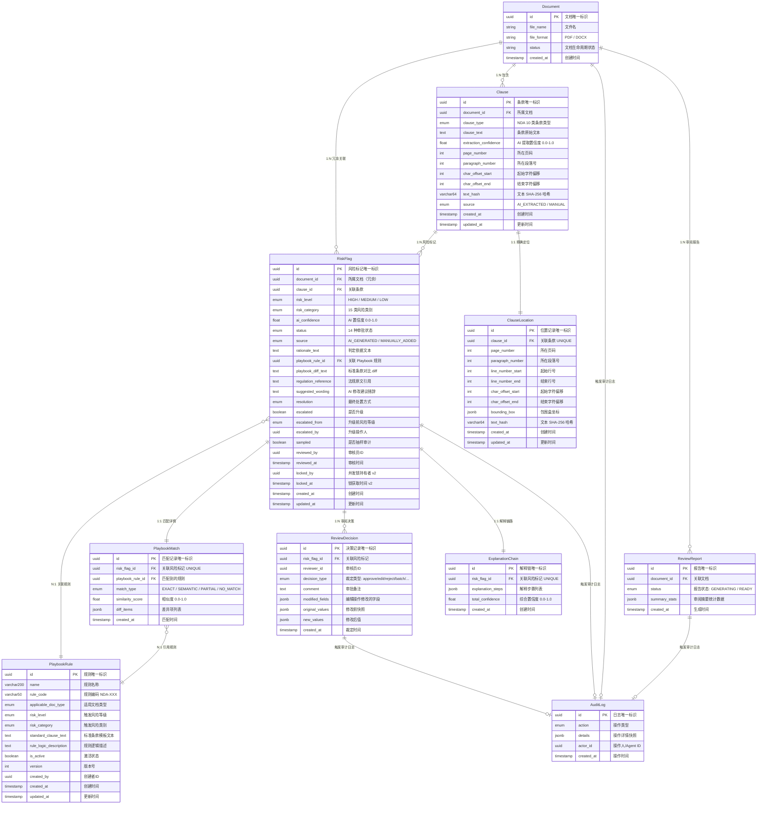

# 审核分析数据模型 v1.0

> **版本**: v1.0
> **创建日期**: 2026-07-29
> **文档性质**: 数据模型设计规范 -- 严格基于上游业务建模、交互设计、架构规范
> **上游依赖**:
> - `docs/03_business_modeling/business_model.md` §4.3 -- 业务实体定义 + 关键业务属性
> - `docs/04_interaction_design/human_approval_flow.md` -- 审批卡片结构 + 状态枚举 + 风险处置策略
> - `docs/06_system_architecture/frontend_backend_boundary_spec-v1.0.md` §三 -- 数据归属规范（后端生成、前端展示）
> **下游读者**: API 规范 (`docs/08_api_specification/`)、后端实现计划 (`docs/10_backend_plan/`)、前端实现计划 (`docs/09_frontend_plan/`)

---

## 一、设计概述

### 1.1 设计范围

本文档定义 **Agent 智能文档审核系统** 中与 **审核分析链路** 直接相关的 6 个核心数据模型：

| # | 模型 | 中文名 | 核心职责 | 上游依据 |
|---|------|--------|---------|---------|
| 1 | **Clause** | 条款 | 从文档中提取的结构化条款单元 | `business_model.md` §4.3 Clause 实体 |
| 2 | **RiskFlag** | 风险标记 | AI 对条款的风险判定，携带完整解释性数据 | `business_model.md` §4.3 RiskFlag + `human_approval_flow.md` §3.2 审批卡片 |
| 3 | **PlaybookRule** | 审阅规则 | 企业自定义的合同审阅标准模板 | `business_model.md` §4.3 PlaybookRule 实体 |
| 4 | **PlaybookMatch** | 规则匹配结果 | AI 将条款与 Playbook 规则的匹配详情 | `human_approval_flow.md` §3.2 Playbook 对比区 |
| 5 | **ClauseLocation** | 条款位置 | 条款在文档中的精确定位（前端并排视图高亮数据源） | `frontend_backend_boundary_spec-v1.0.md` §三 条款位置数据 |
| 6 | **ExplanationChain** | 解释链 | AI 风险判定的完整解释步骤链路 | `business_model.md` 解释性数据差异化 + `human_approval_flow.md` §3.2 AI 判定区 |

### 1.2 设计原则

1. **后端是唯一数据源**：所有模型数据的生成、持久化、校验均由后端负责；前端仅消费和渲染（`frontend_backend_boundary_spec-v1.0.md` §一）。
2. **解释性字段为核心差异化**：RiskFlag 的解释性字段群（判定依据、Playbook diff、法规引用、修改建议）是本系统区别于竞品的核心数据资产（`business_model.md` §1.3）。
3. **位置数据驱动前端高亮**：Clause + ClauseLocation 的定位字段直接映射到前端并排视图的高亮覆盖层渲染（`human_approval_flow.md` §2.4 并排视图）。
4. **MVP 聚焦 NDA**：所有枚举值、条款类型、风险类别以 NDA 协议为边界（`business_model.md` §5.1）。

### 1.3 与上下游实体的关系

本文档 6 模型嵌入在更完整的业务实体体系中。以下实体不属于本文档范围（定义见 `business_model.md` §4.3），但会在 ER 图中体现关联：

| 外部实体 | 与本文档模型的关系 | 定义位置 |
|---------|------------------|---------|
| **Document** | Clause、RiskFlag 的父实体 (1:N) | `business_model.md` §4.3 |
| **ReviewDecision** | RiskFlag 的子实体 (N:1)，记录每次人工裁定 | `business_model.md` §4.3 + `human_approval_flow.md` |
| **ReviewReport** | 聚合所有 RiskFlag + ReviewDecision | `business_model.md` §4.3 |
| **AuditLog** | 横切关注点，记录所有模型变更 | `business_model.md` §4.3 |

---

## 二、模型详细定义

---

### 2.1 Clause（条款）

- **业务含义**: 从文档中提取的结构化条款单元，是 AI 审核的最小分析粒度。可由 AI 自动提取或由审核员手动划选创建。
- **业务边界**: MVP 阶段仅覆盖 NDA 协议的 10 类条款。

#### 字段清单

| 字段名 | 类型 | 必填 | 业务含义 | 示例值 | 前端展示 | 后端存储 | 说明 |
|--------|------|:--:|---------|--------|:--:|:--:|------|
| `id` | UUID | ✅ | 条款唯一标识 | `cla-3f7a-...` | P5 审批卡片、任务队列 row key | `UUID PRIMARY KEY` | 后端生成 |
| `document_id` | UUID (FK) | ✅ | 所属文档引用 | `doc-9b2c-...` | P5 左面板文档关联查询 | `UUID NOT NULL, FK → documents.id` | 建立 Document 1:N Clause |
| `clause_type` | ENUM | ✅ | 条款类型（NDA 10 类） | `CONFIDENTIALITY_OBLIGATION` | P5 审批卡片"条款类型"标签、任务队列列 | `ENUM(...) NOT NULL` | 枚举值见 §三.1 |
| `clause_text` | TEXT | ✅ | 条款原始文本 | "接收方承诺对其因履行本协议而知悉的..." | P5 审批卡片"条款定位"区原文引用 | `TEXT NOT NULL` | 来自文档解析结果，不可被前端编辑 |
| `extraction_confidence` | FLOAT | ✅ | AI 条款提取置信度 | `0.97` | P3 解析结果面板（可选展开） | `FLOAT NOT NULL, CHECK(0.0-1.0)` | 用于前端判断条款提取质量 |
| **定位字段** | | | | | | | |
| `page_number` | INTEGER | ✅ | 条款所在页码 | `3` | P5 审批卡片"页数"标签；左面板 scrollTo(page) | `INTEGER NOT NULL` | 从 1 开始计数 |
| `paragraph_number` | INTEGER | ✅ | 条款所在段落号 | `15` | P5 审批卡片"段落"标签；任务队列排序 | `INTEGER NOT NULL` | 从 1 开始，按文档逻辑段落计算 |
| `char_offset_start` | INTEGER | ✅ | 条款起始字符偏移 | `1247` | P5 左面板高亮覆盖层 Range.start | `INTEGER NOT NULL` | 相对文档全文的 UTF-16 code unit 偏移 |
| `char_offset_end` | INTEGER | ✅ | 条款结束字符偏移 | `1458` | P5 左面板高亮覆盖层 Range.end | `INTEGER NOT NULL, CHECK(> char_offset_start)` | 不含结束位置字符（左闭右开区间） |
| `text_hash` | VARCHAR(64) | ✅ | 条款文本 SHA-256 哈希 | `a1b2c3d4...` | P5 前端校验定位正确性 | `VARCHAR(64) NOT NULL` | 前端 hash(选中文本) === text_hash 则定位正确 |
| `source` | ENUM | ✅ | 条款来源 | `AI_EXTRACTED` | P5 高亮边框样式区分（实线 vs 虚线） | `ENUM('AI_EXTRACTED','MANUAL') NOT NULL` | `MANUAL` = 审核员手动划选创建 |
| `created_at` | TIMESTAMP | ✅ | 创建时间 | `2026-07-29T14:32:00Z` | 不直接展示（审计日志消费） | `TIMESTAMP NOT NULL DEFAULT NOW()` | 后端自动填充 |
| `updated_at` | TIMESTAMP | ✅ | 最后更新时间 | `2026-07-29T14:35:00Z` | 不直接展示 | `TIMESTAMP NOT NULL DEFAULT NOW()` | 每次更新自动刷新 |

#### 与其他模型的关系

| 关系 | 目标模型 | 基数 | 说明 |
|------|---------|:--:|------|
| 所属文档 | Document | N:1 | 每个条款属于一个文档 |
| 精确定位 | ClauseLocation | 1:1 | 每个条款有一份扩展位置数据（用于并排视图像素级定位） |
| 风险标记 | RiskFlag | 1:N | 一个条款可以有多个风险标记（不同风险维度），也可以没有风险标记 |

---

### 2.2 RiskFlag（风险标记） -- 核心模型

- **业务含义**: AI 对某个条款生成的完整风险判定，包含风险等级、类别、置信度、判定依据、修改建议等全套决策数据。是系统 HITL 工作流的核心流转对象，也是前端的审批卡片数据源。
- **差异化定位**: 解释性字段群（`rationale_text`、`playbook_diff_text`、`regulation_reference`、`suggested_wording`）构成本系统区别于竞品的核心数据资产 -- 使人工审核员无需依赖外部知识即可在卡片内完成"理解 AI 判断逻辑 -> 对比标准条款 -> 参考法规 -> 采纳/修改/驳回"的完整决策闭环。

#### 字段清单

| 字段名 | 类型 | 必填 | 业务含义 | 示例值 | 前端展示 | 后端存储 | 说明 |
|--------|------|:--:|---------|--------|:--:|:--:|------|
| `id` | UUID | ✅ | 风险标记唯一标识 | `rf-7d3a-...` | 所有 P5 审批操作的 target ID | `UUID PRIMARY KEY` | 后端生成 |
| `document_id` | UUID (FK) | ✅ | 所属文档引用 | `doc-9b2c-...` | API 路由参数 | `UUID NOT NULL, FK → documents.id` | 冗余字段，加速按文档过滤查询 |
| `clause_id` | UUID (FK) | ✅ | 关联条款引用 | `cla-3f7a-...` | P5 审批卡片"条款定位"数据源 | `UUID NOT NULL, FK → clauses.id` | 建立 Clause 1:N RiskFlag |
| **风险判定字段** | | | | | | | |
| `risk_level` | ENUM | ✅ | 风险等级 | `HIGH` | P5 审批卡片标题色 (红🔴/黄🟡/绿🟢)；仪表盘分桶统计；任务队列排序 | `ENUM('HIGH','MEDIUM','LOW') NOT NULL` | 枚举值定义见 §三.2；决定 HITL 处置策略 |
| `risk_category` | ENUM | ✅ | 风险类别 | `SCOPE_TOO_BROAD` | P5 审批卡片"风险类别"标签；任务队列列、筛选下拉 | `ENUM(...) NOT NULL` | NDA 15 类枚举见 §三.3 |
| `ai_confidence` | FLOAT | ✅ | AI 置信度 (0.0-1.0) | `0.92` | P5 审批卡片置信度进度条 + 百分比数字 | `FLOAT NOT NULL, CHECK(0.0-1.0)` | AI 生成时必填；手动标记时为 NULL（见 source 字段） |
| `status` | ENUM | ✅ | 审批状态（驱动 HITL 工作流） | `PENDING_REVIEW` | P5 任务队列状态列；仪表盘进度统计 | `ENUM(...) NOT NULL` | 14 状态枚举见 §三.4；状态流转规则见 `human_approval_flow.md` §八 |
| `source` | ENUM | ✅ | 标记来源 | `AI_GENERATED` | P5 高亮边框样式（AI 实线 vs 手动虚线） | `ENUM('AI_GENERATED','MANUALLY_ADDED') NOT NULL` | AI_GENERATED 有 ai_confidence；MANUALLY_ADDED 无 ai_confidence |
| **解释性字段（核心差异化）** | | | | | | | |
| `rationale_text` | TEXT | ✅ | **判定依据**：AI 为何判定为风险的多步骤推理 | "1.'任何及所有信息'--范围无边界...2.未要求披露方对保密信息进行合理标识..." | P5 审批卡片"AI 判定依据"区（编号列表渲染） | `TEXT` | **核心解释性字段 #1**。AI 生成时必填；手动标记时为人工填写的详细说明 |
| `playbook_rule_id` | UUID (FK) | ❌ | **关联规则**：匹配到的 Playbook 规则 ID | `pr-1a2b-...` | P5 审批卡片 Playbook 对比区的规则名称+编号引用 | `UUID, FK → playbook_rules.id` | 可以为 NULL（无匹配规则或手动标记） |
| `playbook_diff_text` | TEXT | ❌ | **标准对比**：AI 生成的标准条款对比 diff 文本 | "差异: 缺少标识要求 + 缺少三项标准排除; 偏离程度: 严重偏离" | P5 审批卡片"Playbook 标准条款"区 + 差异高亮 | `TEXT` | **核心解释性字段 #2**。结构化 diff 详情见 PlaybookMatch 模型 |
| `regulation_reference` | TEXT | ❌ | **法规引用**：相关法律法规原文引用 | "参照《反不正当竞争法》第9条: '经营者不得...以不正当手段获取权利人的商业秘密...'" | P5 审批卡片"相关法规"区（可折叠引用块） | `TEXT` | **核心解释性字段 #3**。可包含多条法规引用，以换行分隔 |
| `suggested_wording` | TEXT | ❌ | **修改建议措辞**：AI 建议的替换后条款文本 | "接收方应对披露方以书面形式明确标识为'保密'的信息承担保密义务。保密信息不包括: (i)...(ii)...(iii)..." | P5 审批卡片"AI 修改建议"区（富文本展示）；"编辑"操作的初始值 | `TEXT` | **核心解释性字段 #4**。可被审核员在 Edit 操作中覆盖 |
| **生命周期字段** | | | | | | | |
| `resolution` | ENUM | ❌ | 最终处置方式 | `HUMAN_CONFIRMED` | P6 审阅报告风险摘要统计 | `ENUM(...)` | 枚举见 §三.5；非 NULL 表示已处置 |
| `escalated` | BOOLEAN | ✅ | 是否从更低等级升级上来 | `false` | P5 抽样审计升级确认弹窗 | `BOOLEAN NOT NULL DEFAULT FALSE` | 抽样审计中发现漏报后升级为 true |
| `escalated_from` | ENUM | ❌ | 升级前的原始风险等级 | `LOW` | 审计日志详情 | `ENUM('LOW','MEDIUM')` | 仅 escalated=true 时有值 |
| `escalated_by` | UUID | ❌ | 执行升级操作的用户 ID | `usr-5e6f-...` | 审计日志 | `UUID` | 仅 escalated=true 时有值 |
| `sampled` | BOOLEAN | ✅ | 是否被随机抽中为抽样审计项 | `false` | P5 低风险列表 🎲 图标 | `BOOLEAN NOT NULL DEFAULT FALSE` | 仅低风险 + AI_GENERATED 可被抽样；由后端确定性随机算法设置 |
| `reviewed_by` | UUID | ❌ | 最后操作的审核员 ID | `usr-3c4d-...` | P5 审批卡片"审批历史"区 | `UUID` | approve/edit/reject 操作时写入当前用户 |
| `reviewed_at` | TIMESTAMP | ❌ | 最后审核操作时间 | `2026-07-29T14:35:00Z` | P5 审批卡片收起态时间戳；审计日志 | `TIMESTAMP` | approve/edit/reject 操作时写入 |
| **v2 扩展字段（MVP 阶段预留）** | | | | | | | |
| `locked_by` | UUID | ❌ | 并发锁持有者 (v2) | `usr-5e6f-...` | — (v2) | `UUID` | 多人协同时防止并发编辑；打开卡片时锁定，2 分钟超时释放 |
| `locked_at` | TIMESTAMP | ❌ | 并发锁获取时间 (v2) | `2026-07-29T14:32:00Z` | — (v2) | `TIMESTAMP` | 用于锁超时判定 |
| `created_at` | TIMESTAMP | ✅ | 创建时间 | `2026-07-29T14:30:00Z` | 审计日志 | `TIMESTAMP NOT NULL DEFAULT NOW()` | 后端自动填充 |
| `updated_at` | TIMESTAMP | ✅ | 最后更新时间 | `2026-07-29T14:35:00Z` | 审计日志 | `TIMESTAMP NOT NULL DEFAULT NOW()` | 每次状态变更自动刷新 |

#### 与其他模型的关系

| 关系 | 目标模型 | 基数 | 说明 |
|------|---------|:--:|------|
| 所属条款 | Clause | N:1 | 每个 RiskFlag 关联一个 Clause |
| 所属文档 | Document | N:1 | 冗余关联，加速按文档查询 |
| 关联规则 | PlaybookRule | N:1 | 匹配到的最佳 Playbook 规则（可选） |
| 匹配详情 | PlaybookMatch | 1:1 | 与 PlaybookRule 的详细匹配数据 |
| 解释链路 | ExplanationChain | 1:1 | 完整的解释步骤链 |
| 审阅决策 | ReviewDecision | 1:N | 每次人工裁定产生一条 ReviewDecision 记录 |

---

### 2.3 PlaybookRule（审阅规则）

- **业务含义**: 企业法务团队预先定义的合同审阅标准模板，作为 AI 风险判定的知识基准。每条规则定义了一类条款在理想情况下应包含的要素、措辞和风险边界。
- **生命周期**: 由法务管理员创建和维护；审核员在文档上传阶段选择适用的 Playbook；AI 审核时自动将条款与已激活规则逐一匹配。

#### 字段清单

| 字段名 | 类型 | 必填 | 业务含义 | 示例值 | 前端展示 | 后端存储 | 说明 |
|--------|------|:--:|---------|--------|:--:|:--:|------|
| `id` | UUID | ✅ | 规则唯一标识 | `pr-1a2b-...` | P2 Playbook 下拉框 value；P5 审批卡片规则引用 | `UUID PRIMARY KEY` | 后端生成 |
| `name` | VARCHAR(200) | ✅ | 规则名称（人类可读） | "保密义务范围 - 标准定义" | P2 Playbook 下拉框 label；P5 审批卡片规则标题 | `VARCHAR(200) NOT NULL` | 命名规范: "{条款类型} - {规则要点}" |
| `rule_code` | VARCHAR(50) | ✅ | 规则编码 | `NDA-003` | P5 审批卡片 Playbook 对比区规则编号 | `VARCHAR(50) NOT NULL UNIQUE` | 格式: `{文档类型缩写}-{序号}` |
| `applicable_doc_type` | ENUM | ✅ | 适用文档类型 | `NDA` | P2 Playbook 筛选项 | `ENUM('NDA') NOT NULL` | MVP 仅 NDA；v2 扩展为 `NDA, PURCHASE, SERVICE, HR, PRIVACY...` |
| `risk_level` | ENUM | ✅ | 规则触发时对应的风险等级 | `HIGH` | P5 审批卡片风险等级色 | `ENUM('HIGH','MEDIUM','LOW') NOT NULL` | AI 匹配此规则时，若偏离则标记为此等级 |
| `risk_category` | ENUM | ✅ | 规则对应的风险类别 | `SCOPE_TOO_BROAD` | P5 审批卡片风险类别标签 | `ENUM(...) NOT NULL` | 枚举同 RiskFlag.risk_category |
| `standard_clause_text` | TEXT | ✅ | **标准条款文本（模板）** | "接收方应对披露方以书面形式明确标识为'保密'的信息承担保密义务。保密信息不包括: (i) 接收方在披露前已合法持有的信息; (ii) 非因接收方违反本协议而已为公众所知的信息; (iii) 接收方从有权披露的第三方合法获得的信息。" | P5 审批卡片"Playbook 标准条款"区 | `TEXT NOT NULL` | **核心字段**。作为 AI 对比和 diff 计算的基准 |
| `rule_logic_description` | TEXT | ✅ | **规则逻辑描述（人类可读）** | "检查保密义务定义条款是否: (a) 要求披露方对保密信息进行书面标识; (b) 明确排除三类标准例外信息; (c) 避免使用'任何及所有'等无边界措辞" | P5 审批卡片 Playbook 对比区的规则说明 tooltip（可选展示） | `TEXT NOT NULL` | 帮助审核员理解规则的检查维度 |
| `is_active` | BOOLEAN | ✅ | 激活状态 | `true` | P2 Playbook 列表中的激活/停用开关 | `BOOLEAN NOT NULL DEFAULT TRUE` | 停用的规则不参与 AI 匹配 |
| `version` | INTEGER | ✅ | 规则版本号 | `3` | P5 审批卡片规则版本标注（可选） | `INTEGER NOT NULL DEFAULT 1` | 每次修改规则内容时递增 |
| `created_by` | UUID | ✅ | 创建者 ID | `usr-admin-...` | 审计日志 | `UUID NOT NULL` | 后端从认证上下文获取 |
| `created_at` | TIMESTAMP | ✅ | 创建时间 | `2026-06-15T09:00:00Z` | 审计日志 | `TIMESTAMP NOT NULL DEFAULT NOW()` | 后端自动填充 |
| `updated_at` | TIMESTAMP | ✅ | 最后更新时间 | `2026-07-20T16:00:00Z` | 审计日志 | `TIMESTAMP NOT NULL DEFAULT NOW()` | 每次更新自动刷新 |

#### 与其他模型的关系

| 关系 | 目标模型 | 基数 | 说明 |
|------|---------|:--:|------|
| 风险标记 | RiskFlag | 1:N | 一条规则可被多个 RiskFlag 引用 |
| 匹配结果 | PlaybookMatch | 1:N | 一条规则可产生多个匹配记录 |

---

### 2.4 PlaybookMatch（规则匹配结果）

- **业务含义**: 记录 AI 将一个条款与一条 PlaybookRule 进行匹配的详细过程和结果。存储匹配类型、相似度分数、逐字段差异列表，为前端 Playbook 对比区提供结构化数据。
- **数据来源**: AI 审核 Agent 在风险识别阶段自动生成。

#### 字段清单

| 字段名 | 类型 | 必填 | 业务含义 | 示例值 | 前端展示 | 后端存储 | 说明 |
|--------|------|:--:|---------|--------|:--:|:--:|------|
| `id` | UUID | ✅ | 匹配记录唯一标识 | `pm-8f2c-...` | 不可见（后端关联查询用） | `UUID PRIMARY KEY` | 后端生成 |
| `risk_flag_id` | UUID (FK) | ✅ | 关联风险标记 | `rf-7d3a-...` | 不可见（通过 RiskFlag 间接引用） | `UUID NOT NULL UNIQUE, FK → risk_flags.id` | UNIQUE 约束: 每个 RiskFlag 仅一条 Match 记录 |
| `playbook_rule_id` | UUID (FK) | ✅ | 匹配到的 Playbook 规则 | `pr-1a2b-...` | 不可见（通过 RiskFlag 间接引用） | `UUID NOT NULL, FK → playbook_rules.id` | 最佳匹配的规则 ID |
| `match_type` | ENUM | ✅ | 匹配类型 | `SEMANTIC_MATCH` | P5 审批卡片 Playbook 对比区"匹配类型"标签 | `ENUM('EXACT_MATCH','SEMANTIC_MATCH','PARTIAL_MATCH','NO_MATCH') NOT NULL` | 枚举定义见 §三.6 |
| `similarity_score` | FLOAT | ✅ | 语义相似度分数 (0.0-1.0) | `0.68` | P5 审批卡片"相似度"指示器（可选展示） | `FLOAT NOT NULL, CHECK(0.0-1.0)` | 基于 embedding 余弦相似度 |
| `diff_items` | JSONB | ✅ | **差异项列表**：条款与标准模板的逐字段差异 | 见下方 JSON 示例 | P5 审批卡片 Playbook 对比区"差异项"渲染 | `JSONB NOT NULL DEFAULT '[]'` | **核心字段**。结构见下方说明 |
| `created_at` | TIMESTAMP | ✅ | 匹配时间 | `2026-07-29T14:30:00Z` | 不可见（审计日志消费） | `TIMESTAMP NOT NULL DEFAULT NOW()` | 后端自动填充 |

#### `diff_items` JSON 结构

```json
[
  {
    "field": "保密信息标识要求",
    "standard_value": "要求披露方以书面形式明确标识",
    "actual_value": "未提及标识要求",
    "deviation_type": "MISSING"
  },
  {
    "field": "例外情形 - 事先持有",
    "standard_value": "接收方在披露前已合法持有的信息除外",
    "actual_value": "未排除",
    "deviation_type": "MISSING"
  },
  {
    "field": "例外情形 - 公有领域",
    "standard_value": "非因接收方违反协议而已为公众所知的信息除外",
    "actual_value": "未排除",
    "deviation_type": "MISSING"
  },
  {
    "field": "例外情形 - 第三方来源",
    "standard_value": "从有权披露的第三方合法获得的信息除外",
    "actual_value": "未排除",
    "deviation_type": "MISSING"
  },
  {
    "field": "保密信息范围措辞",
    "standard_value": "明确标识为'保密'的信息",
    "actual_value": "任何及所有信息",
    "deviation_type": "MISMATCHED"
  }
]
```

**`deviation_type` 枚举**:

| 值 | 含义 | 前端渲染 |
|----|------|---------|
| `MISSING` | 条款缺失了标准模板中的必要要素 | 红色"缺失"标签 + 缺失内容用红色删除线展示 |
| `MISMATCHED` | 条款内容与标准模板不一致 | 橙色"偏离"标签 + diff 双栏对比 |
| `MODIFIED` | 条款对标准要素做了改写 | 黄色"改写"标签 |
| `ADDED` | 条款中存在标准模板以外的多余内容 | 蓝色"多余"标签 |

#### 与其他模型的关系

| 关系 | 目标模型 | 基数 | 说明 |
|------|---------|:--:|------|
| 所属风险标记 | RiskFlag | N:1 | 每个 Match 记录属于一个 RiskFlag |
| 匹配规则 | PlaybookRule | N:1 | 引用的 Playbook 规则 |

---

### 2.5 ClauseLocation（条款位置）

- **业务含义**: 条款在原始文档中的精确定位数据。由文档解析 Agent 在条款提取阶段自动生成。是前端并排视图高亮覆盖层渲染的核心数据源。
- **与 Clause 的关系**: Clause 包含基础定位字段（page_number、paragraph_number、char_offset_start/end、text_hash），用于列表视图和审批卡片的快速引用。ClauseLocation 在此基础上扩展了行号级别的精确定位和像素级包围盒坐标，用于并排视图的高精度文本高亮。

#### 字段清单

| 字段名 | 类型 | 必填 | 业务含义 | 示例值 | 前端展示 | 后端存储 | 说明 |
|--------|------|:--:|---------|--------|:--:|:--:|------|
| `id` | UUID | ✅ | 位置记录唯一标识 | `loc-a3f1-...` | 不可见（后端关联查询用） | `UUID PRIMARY KEY` | 后端生成 |
| `clause_id` | UUID (FK) | ✅ | 关联条款引用 | `cla-3f7a-...` | 不可见（通过 Clause 间接引用） | `UUID NOT NULL UNIQUE, FK → clauses.id` | UNIQUE 约束: 每个 Clause 一条定位记录 |
| **文档定位字段** | | | | | | | |
| `page_number` | INTEGER | ✅ | 所在页码 | `3` | P5 并排视图左面板 `scrollToPage(3)` | `INTEGER NOT NULL` | 从 1 开始；与 Clause.page_number 保持一致 |
| `paragraph_number` | INTEGER | ✅ | 所在段落号 | `15` | P5 审批卡片"段落"标签 | `INTEGER NOT NULL` | 从 1 开始；与 Clause.paragraph_number 保持一致 |
| `line_number_start` | INTEGER | ✅ | 起始行号 | `42` | P5 并排视图左面板高亮起始行 | `INTEGER NOT NULL` | 相对于当前页的行号，从 1 开始 |
| `line_number_end` | INTEGER | ✅ | 结束行号 | `48` | P5 并排视图左面板高亮结束行 | `INTEGER NOT NULL, CHECK(>= line_number_start)` | 包含结束行 |
| **字符偏移字段** | | | | | | | |
| `char_offset_start` | INTEGER | ✅ | 条款起始字符偏移（文档全文） | `1247` | P5 并排视图文本层选区的 Selection.start | `INTEGER NOT NULL` | UTF-16 code unit 偏移；与 Clause.char_offset_start 一致 |
| `char_offset_end` | INTEGER | ✅ | 条款结束字符偏移（文档全文） | `1458` | P5 并排视图文本层选区的 Selection.end | `INTEGER NOT NULL, CHECK(> char_offset_start)` | 左闭右开区间 |
| **包围盒字段（像素级定位）** | | | | | | | |
| `bounding_box` | JSONB | ❌ | 包围盒坐标 | `{"x1":85,"y1":420,"x2":530,"y2":532}` | P5 并排视图高亮覆盖层 CSS `position:absolute` 定位 | `JSONB` | 以当前页左上角为原点 (0,0)；单位: 像素 (px)；仅在支持像素级渲染时填充 |
| `text_hash` | VARCHAR(64) | ✅ | 文本片段 SHA-256 哈希 | `a1b2c3d4...` | P5 前端定位校验 | `VARCHAR(64) NOT NULL` | 用于前端验证：hash(按偏移截取的原文) === text_hash |
| `created_at` | TIMESTAMP | ✅ | 创建时间 | `2026-07-29T14:30:00Z` | 不可见 | `TIMESTAMP NOT NULL DEFAULT NOW()` | 后端自动填充 |
| `updated_at` | TIMESTAMP | ✅ | 最后更新时间 | `2026-07-29T14:30:00Z` | 不可见 | `TIMESTAMP NOT NULL DEFAULT NOW()` | 后端自动填充 |

#### 前端并排视图高亮映射说明

ClauseLocation 的数据如何驱动前端并排视图（`human_approval_flow.md` §2.4）的高亮渲染：

```
后端返回 ClauseLocation              前端渲染层
─────────────────────────────       ─────────────────────────────
                                  ┌─────────────────────────────┐
page_number = 3        ──────▶    │ PDF/DOCX 渲染到第 3 页       │
paragraph_number = 15  ──────▶    │ 定位到第 15 段落             │
                                  │                             │
line_number_start = 42 ──────▶    │ 从第 42 行开始高亮          │
line_number_end   = 48 ──────▶    │ 到第 48 行结束高亮          │
                                  │                             │
char_offset_start    ──────▶      │ window.getSelection()       │
  = 1247                          │   .setBaseAndExtent(        │
char_offset_end      ──────▶      │     textNode, 1247,         │
  = 1458                          │     textNode, 1458          │
                                  │   )                         │
                                  │                             │
bounding_box (可选)   ──────▶      │ <div style="               │
  {x1:85,y1:420,                  │   position:absolute;        │
   x2:530,y2:532}                 │   left:85px; top:420px;     │
                                  │   width:445px; height:112px;│
                                  │   background:rgba(220,38,   │
                                  │     38,0.15);               │
                                  │   border-left:3px solid     │
                                  │     #DC2626;                │
                                  │ "></div>                    │
                                  │                             │
text_hash             ──────▶      │ 前端二次校验:               │
  = "a1b2c3d4..."                 │   sha256(                   │
                                  │     text.substring(         │
                                  │       1247, 1458)           │
                                  │   ) === text_hash ✓         │
                                  └─────────────────────────────┘
```

**高亮颜色映射**（依据 `human_approval_flow.md` §6.5）：

| RiskFlag.risk_level + source | 底色 | 左边框 |
|-----------------------------|------|--------|
| HIGH + AI_GENERATED | `rgba(220,38,38,0.15)` | `3px solid #DC2626` |
| MEDIUM + AI_GENERATED | `rgba(217,119,6,0.15)` | `3px solid #D97706` |
| LOW + AI_GENERATED | `rgba(22,163,74,0.10)` | `3px solid #16A34A` |
| MANUALLY_ADDED (任意等级) | `rgba(107,114,128,0.12)` | `3px dashed #6B7280` |
| 当前选中 (叠加) | — | `2px solid #3B82F6` (外发光) |

#### 与其他模型的关系

| 关系 | 目标模型 | 基数 | 说明 |
|------|---------|:--:|------|
| 所属条款 | Clause | N:1 | UNIQUE 约束确保一对一 |

---

### 2.6 ExplanationChain（解释链）

- **业务含义**: 记录 AI 判定一个风险标记的完整推理步骤链。每一步包含推理来源类型、来源引用、解释文本和该步骤对最终置信度的贡献。用于前端"AI 为什么这样判断"的逐层展开展示。
- **差异化定位**: 这是竞品普遍缺失的"可解释 AI"能力的结构化存储。它将 AI 的黑箱推理过程转化为可审计、可展示、可挑战的步骤化数据。

#### 字段清单

| 字段名 | 类型 | 必填 | 业务含义 | 示例值 | 前端展示 | 后端存储 | 说明 |
|--------|------|:--:|---------|--------|:--:|:--:|------|
| `id` | UUID | ✅ | 解释链唯一标识 | `ec-5d9e-...` | 不可见（后端关联查询用） | `UUID PRIMARY KEY` | 后端生成 |
| `risk_flag_id` | UUID (FK) | ✅ | 关联风险标记 | `rf-7d3a-...` | 不可见（通过 RiskFlag 间接引用） | `UUID NOT NULL UNIQUE, FK → risk_flags.id` | UNIQUE: 每个 RiskFlag 一条解释链 |
| `explanation_steps` | JSONB | ✅ | **解释步骤列表** | 见下方 JSON 示例 | P5 审批卡片"AI 判定依据"区（逐层展开） | `JSONB NOT NULL DEFAULT '[]'` | **核心字段**。结构见下方说明 |
| `total_confidence` | FLOAT | ✅ | 综合置信度 | `0.92` | P5 审批卡片置信度总览 | `FLOAT NOT NULL, CHECK(0.0-1.0)` | 应等于 RiskFlag.ai_confidence; 前端可用于交叉验证 |
| `created_at` | TIMESTAMP | ✅ | 创建时间 | `2026-07-29T14:30:00Z` | 不可见 | `TIMESTAMP NOT NULL DEFAULT NOW()` | 后端自动填充 |

#### `explanation_steps` JSON 结构

```json
[
  {
    "step_order": 1,
    "source_type": "PLAYBOOK",
    "source_reference": "NDA-003 §2: 保密信息标识要求",
    "explanation_text": "Playbook 规则 NDA-003 要求保密义务定义中必须包含'披露方以书面形式明确标识为保密'的标识义务。当前条款使用'任何及所有信息'的无边界措辞，未满足此要求。",
    "confidence_contribution": 0.35
  },
  {
    "step_order": 2,
    "source_type": "PLAYBOOK",
    "source_reference": "NDA-003 §3: 标准排除情形",
    "explanation_text": "Playbook 规则 NDA-003 要求明确排除三类标准例外信息：(i)事先持有、(ii)公有领域、(iii)第三方来源。当前条款未包含任何排除条款，存在定义过宽风险。",
    "confidence_contribution": 0.30
  },
  {
    "step_order": 3,
    "source_type": "REGULATION",
    "source_reference": "《反不正当竞争法》第9条 · 商业秘密三要件",
    "explanation_text": "根据《反不正当竞争法》第9条，商业秘密须满足'不为公众所知悉'、'具有商业价值'、'经权利人采取相应保密措施'三要件。当前条款未要求披露方采取保密措施（标识义务），可能导致保密义务范围在法律上被限缩解释。",
    "confidence_contribution": 0.15
  },
  {
    "step_order": 4,
    "source_type": "BENCHMARK",
    "source_reference": "行业基准: 2025年NDA条款市场惯例报告 §4.2",
    "explanation_text": "根据行业基准数据，87%的标准NDA协议在保密义务定义条款中包含书面标识要求和三类标准排除。当前条款偏离行业主流实践。",
    "confidence_contribution": 0.12
  }
]
```

**`source_type` 枚举**:

| 值 | 含义 | 前端图标 | 前端渲染颜色 |
|----|------|---------|------------|
| `PLAYBOOK` | 基于企业 Playbook 规则的判断 | 📋 | 蓝色系 |
| `REGULATION` | 基于法律法规原文的判断 | ⚖️ | 橙色系 |
| `MODEL` | 基于 AI 模型语义理解的判断 | 🤖 | 紫色系 |
| `BENCHMARK` | 基于行业基准数据的判断 | 📊 | 绿色系 |

#### 前端逐层展示交互

```
┌─ AI 判定依据 ─────────────────────────────────────────────┐
│                                                           │
│  ▶ 步骤 1: Playbook 规则检查 (贡献度: 35%)                │  ← 默认展开第一步
│  │  📋 NDA-003 §2                                           │
│  │  当前条款使用'任何及所有信息'的无边界措辞...               │
│  │                                                         │
│  ▶ 步骤 2: Playbook 排除条款检查 (贡献度: 30%)             │  ← 用户点击展开
│  │  📋 NDA-003 §3                                           │
│  │  当前条款未包含任何排除条款...                             │
│  │                                                         │
│  ▸ 步骤 3: 法规符合性检查 (贡献度: 15%)                    │  ← 折叠态
│  ▸ 步骤 4: 行业基准对标 (贡献度: 12%)                      │  ← 折叠态
│                                                           │
│  综合置信度: ████████░░ 92%                                │
└───────────────────────────────────────────────────────────┘
```

#### 与其他模型的关系

| 关系 | 目标模型 | 基数 | 说明 |
|------|---------|:--:|------|
| 所属风险标记 | RiskFlag | N:1 | UNIQUE 约束确保一对一 |

---

## 三、枚举定义汇总

### 3.1 条款类型 (ClauseType)

> MVP 阶段仅覆盖 NDA 协议的 10 类条款

| 枚举值 | 中文名称 | 业务含义 | 来源 |
|--------|---------|---------|------|
| `CONFIDENTIALITY_OBLIGATION` | 保密义务范围 | 定义接收方的保密义务及其信息范围 | `business_model.md` NDA 条款结构 |
| `CONFIDENTIALITY_TERM` | 保密期限 | 保密义务的持续时间 | 同上 |
| `EXCEPTION_CLAUSE` | 例外情形 | 保密义务的排除信息类型 | 同上 |
| `REMEDY_CLAUSE` | 违约救济 | 违反保密义务的法律后果 | 同上 |
| `INFORMATION_RETURN` | 保密信息归还 | 协议终止后保密信息的处理方式 | 同上 |
| `GOVERNING_LAW` | 管辖法律 | 协议适用的法律和管辖法院 | 同上 |
| `INDEMNIFICATION` | 赔偿条款 | 违反保密义务的赔偿责任 | 同上 |
| `ASSIGNMENT` | 转让条款 | 协议权利义务的转让限制 | 同上 |
| `ENTIRE_AGREEMENT` | 完整协议条款 | 协议完整性声明和优先权 | 同上 |
| `NOTICE_CLAUSE` | 通知条款 | 双方通信方式和送达地址 | 同上 |

### 3.2 风险等级 (RiskLevel)

| 枚举值 | 中文名称 | HITL 处置策略 | 前端主色调 |
|--------|---------|-------------|-----------|
| `HIGH` | 高风险 | 100% 强制逐条审批，不可跳过 | 🔴 `#DC2626` |
| `MEDIUM` | 中风险 | 批量审批 + 选择性深入，默认自动通过 | 🟡 `#D97706` |
| `LOW` | 低风险 | 自动通过 + 抽样审计 (11%) | 🟢 `#16A34A` |

> 来源: `human_approval_flow.md` §三/四/五 分级告警策略；`business_model.md` §4.1

### 3.3 风险类别 (RiskCategory)

> MVP 阶段覆盖 NDA 协议常见的 15 类风险

| 枚举值 | 中文名称 | 典型触发条件 |
|--------|---------|------------|
| `SCOPE_TOO_BROAD` | 定义过宽 | 保密信息定义缺少排除条款或边界模糊 |
| `TERM_UNREASONABLE` | 期限不合理 | 保密期限过长或无期限 |
| `MISSING_KEY_CLAUSE` | 缺失关键条款 | 完全缺少某类标准条款 |
| `JURISDICTION_UNFAVORABLE` | 法域不利 | 管辖法律选择对己方不利 |
| `UNILATERAL_INDEMNITY` | 单向赔偿 | 赔偿条款仅单方承担 |
| `TERM_AMBIGUOUS` | 期限模糊 | 期限起算点或结束条件不明确 |
| `AMOUNT_EXCESSIVE` | 金额过高 | 违约金或赔偿上限不合理 |
| `RESTRICTION_MISSING` | 限制缺失 | 缺少必要的权利限制或例外 |
| `PRIORITY_CONFLICT` | 优先权冲突 | 与其他条款或协议的优先级冲突 |
| `WORDING_OPTIMIZABLE` | 措辞可优化 | 措辞不够精准但不构成重大风险 |
| `WORDING_INCOMPLETE` | 措辞不完整 | 条款描述不完整，遗漏必要要素 |
| `LEGAL_REFERENCE_OUTDATED` | 法律引用过时 | 引用的法律法规已更新 |
| `WORDING_REDUNDANT` | 措辞冗余 | 条款存在不必要的重复内容 |
| `ADDRESS_MISSING` | 地址缺失 | 通知地址等关键信息缺失 |
| `CONFIDENTIALITY_SCOPE` | 保密范围问题 | 保密信息范围的合理性存疑 |

### 3.4 风险标记状态 (RiskFlagStatus)

> 完整状态枚举，驱动 HITL 工作流状态机（来源: `human_approval_flow.md` §八 状态流转图）

| 枚举值 | 中文名称 | 触发条件 | 后续操作 |
|--------|---------|---------|---------|
| `PENDING_REVIEW` | 待审核 | AI 审核完成后自动设置（高风险/中风险） | approve / edit / reject |
| `CONFIRMED` | 已确认 | 审核员 approve 高风险 | 进入完成池 |
| `AMENDED` | 已修正 | 审核员 edit 高风险 | 进入完成池 |
| `REJECTED` | 已驳回 | 审核员 reject 高风险 | 从审批队列移除（可通过 reinstate 恢复） |
| `UNREVIEWED_AUTO_PASSED` | 未审核-自动通过 | 中风险批量确认 / 低风险自动通过 | 进入完成池 |
| `REVIEWED_CONFIRMED` | 已审核-确认 | 中风险深入审核 + approve | 进入完成池 |
| `REVIEWED_AMENDED` | 已审核-修正 | 中风险深入审核 + edit | 进入完成池 |
| `REVIEWED_REJECTED` | 已审核-驳回 | 中风险深入审核 + reject | 进入完成池 |
| `SPOT_CHECK_CONFIRMED` | 抽样-已确认 | 低风险抽样审计 + approve | 进入完成池 |
| `SPOT_CHECK_REJECTED` | 抽样-已驳回 | 低风险抽样审计 + reject | 进入完成池 |
| `SPOT_CHECK_SKIPPED` | 抽样-已跳过 | 低风险抽样审计 + skip | 进入完成池 |
| `MANUAL_PENDING` | 手动-待确认 | 审核员提交手动标记（MVP 单人场景） | approve / edit / reject |
| `MANUAL_CONFIRMED` | 手动-已确认 | 审核员确认自己的手动标记 | 进入完成池 |
| `MANUAL_AMENDED` | 手动-已修正 | 审核员编辑自己的手动标记 | 进入完成池 |
| `MANUAL_REJECTED` | 手动-已驳回 | 审核员驳回自己的手动标记 | 进入完成池 |

### 3.5 处置方式 (Resolution)

> 用于审阅报告中的统计归类（来源: `human_approval_flow.md` §4.1 中风险处置策略）

| 枚举值 | 中文名称 | 含义 | 审阅报告呈现 |
|--------|---------|------|------------|
| `HUMAN_CONFIRMED` | 人工确认 | 审核员亲自审阅并确认 AI 标记 | "已审核-确认" + 审核员 ID + 时间戳 |
| `HUMAN_AMENDED` | 人工修正 | 审核员深入审阅并修正了 AI 标记 | "已审核-修正" + 原始值→修改值 diff |
| `HUMAN_REJECTED` | 人工驳回 | 审核员认为 AI 误报 | "已审核-驳回" + 驳回原因 |
| `UNREVIEWED_AUTO_PASSED` | 未审核-自动通过 | 审核员信任 AI，未投入时间审查 | "未审核-自动通过" + AI 置信度参考 |
| `SPOT_CHECK_CONFIRMED` | 抽样确认 | 抽样审计中确认 AI 标记 | "抽样审计-已确认" |
| `SPOT_CHECK_SKIPPED` | 抽样跳过 | 抽样审计中跳过（信任 AI） | "抽样审计-已跳过" |

### 3.6 匹配类型 (MatchType)

| 枚举值 | 含义 | 相似度区间 | 前端展示 |
|--------|------|-----------|---------|
| `EXACT_MATCH` | 条款文本与标准模板完全一致 | 0.95-1.0 | 绿色"精确匹配"标签 |
| `SEMANTIC_MATCH` | 条款语义与标准模板等价（措辞不同） | 0.80-0.95 | 蓝色"语义匹配"标签 |
| `PARTIAL_MATCH` | 条款部分符合标准模板（有可识别差异） | 0.50-0.80 | 黄色"部分匹配"标签 |
| `NO_MATCH` | 条款与标准模板无实质关联 | 0.00-0.50 | 灰色"无匹配"标签 |

---

## 四、模型关系 ER 图



### 关系基数速查表

| 父实体 | 子实体 | 基数 | 约束 | 说明 |
|--------|--------|:--:|------|------|
| Document | Clause | 1:N | FK NOT NULL | 一个文档有多个条款；条款必须属于一个文档 |
| Document | RiskFlag | 1:N | FK NOT NULL | 冗余关联，加速按文档查询风险标记 |
| Clause | RiskFlag | 1:N | FK NOT NULL | 一个条款可以有多个风险标记（不同维度）；也可以无标记（AI 未识别风险） |
| Clause | ClauseLocation | 1:1 | FK UNIQUE | 每个条款有且仅有一份扩展位置数据 |
| RiskFlag | PlaybookRule | N:1 | FK NULLABLE | 多个风险标记可引用同一规则；手动标记可能无规则 |
| RiskFlag | PlaybookMatch | 1:1 | FK UNIQUE | 每个 AI 生成的 RiskFlag 有且仅有一条匹配详情 |
| RiskFlag | ExplanationChain | 1:1 | FK UNIQUE | 每个 AI 生成的 RiskFlag 有且仅有一条解释链 |
| RiskFlag | ReviewDecision | 1:N | FK NOT NULL | 每次审批操作产生一条决策记录 |
| PlaybookMatch | PlaybookRule | N:1 | FK NOT NULL | 多条匹配记录可引用同一规则 |

---

## 五、关键设计决策说明

### 5.1 解释性字段群的设计逻辑

RiskFlag 的 4 个解释性字段（`rationale_text`、`playbook_diff_text`、`regulation_reference`、`suggested_wording`）构成一个完整的"理解-对比-依据-行动"决策支持闭环：

```
rationale_text        →  "AI 为什么判定为风险"      →  理解
playbook_diff_text    →  "与标准条款的差异在哪"     →  对比
regulation_reference  →  "法律法规依据是什么"       →  依据
suggested_wording     →  "建议改成什么样"          →  行动
```

这四个字段的设计来源于 `business_model.md` §1.3 对"解释性数据透明展示"作为系统差异化优势的定位，以及 `human_approval_flow.md` §3.2 审批卡片中的 AI 判定区、Playbook 对比区、修改建议区等 UI 区域。

### 5.2 Clause 与 ClauseLocation 的分离理由

| 维度 | Clause (基础定位) | ClauseLocation (扩展定位) |
|------|------------------|-------------------------|
| **使用场景** | 任务队列列表、审批卡片概要 | 并排视图高精度高亮渲染 |
| **数据精度** | 段落级 | 行级 + 像素级 |
| **计算成本** | 低（解析阶段即可获取） | 中（需要 PDF 渲染引擎计算包围盒） |
| **更新频率** | 低（解析完成后不变） | 可能因渲染引擎升级而重新计算 |
| **存储开销** | 轻量（基本字段） | 较重（JSONB 包围盒、多行号范围） |

分离后，Clause 可用于列表页的快速查询和渲染，ClauseLocation 仅在进入并排视图时按需加载，避免传输冗余数据。

### 5.3 PlaybookMatch 的 diff_items 与 RiskFlag.playbook_diff_text 的关系

| 字段 | 数据类型 | 粒度 | 用途 |
|------|---------|------|------|
| `PlaybookMatch.diff_items` | JSONB（结构化） | 逐字段差异 | 前端渲染结构化 diff 表格（标准值 vs 实际值） |
| `RiskFlag.playbook_diff_text` | TEXT（人类可读） | 摘要描述 | 前端渲染 Playbook 对比区的概况文本 + 导出报告 |

两者互补：`diff_items` 用于前端交互式差异展示，`playbook_diff_text` 用于快速概览和 PDF 报告导出。

### 5.4 ExplanationChain 的 source_type 分类设计

四种来源类型覆盖了 AI 判定的全部信息来源：

| 来源类型 | 知识来源 | 是否可挑战 | 前端交互 |
|---------|---------|:--:|---------|
| PLAYBOOK | 企业自主定义的审阅标准 | 是（企业可修改规则） | 点击可跳转到 Playbook 管理页 |
| REGULATION | 公开的法律法规 | 是（审核员可查询法规原文） | 点击可展开法规原文全文 |
| MODEL | AI 模型的语义理解 | 否（模型内部知识） | 显示为 AI 推理，不可进一步追溯 |
| BENCHMARK | 行业统计数据 | 是（可更新基准数据源） | 点击可查看基准报告引用信息 |

---

## 六、数据完整性约束

### 6.1 跨模型约束

| # | 约束 | 说明 |
|---|------|------|
| 1 | `RiskFlag.ai_confidence` 当 `source = 'AI_GENERATED'` 时必须 0.0-1.0；当 `source = 'MANUALLY_ADDED'` 时为 NULL | 手动标记无 AI 置信度 |
| 2 | `RiskFlag.escalated_from` 仅当 `escalated = true` 时非 NULL | 升级来源仅在升级时记录 |
| 3 | `RiskFlag.sampled = true` 仅当 `risk_level = 'LOW'` 且 `source = 'AI_GENERATED'` 时可能为 true | 仅低风险 AI 标记参与抽样 |
| 4 | `PlaybookMatch` 仅当 `RiskFlag.source = 'AI_GENERATED'` 时存在 | 手动标记不产生匹配记录 |
| 5 | `ExplanationChain` 仅当 `RiskFlag.source = 'AI_GENERATED'` 时存在 | 手动标记无 AI 解释链 |
| 6 | `ClauseLocation.char_offset_start/end` 必须与 `Clause.char_offset_start/end` 一致 | 数据一致性约束 |
| 7 | `ClauseLocation.text_hash` 必须与 `Clause.text_hash` 一致 | 前端校验定位正确性 |
| 8 | `ExplanationChain.total_confidence` 应等于 `sum(explanation_steps[*].confidence_contribution)` | 置信度贡献之和等于总置信度 |

### 6.2 必填字段矩阵（按来源）

| 字段 | AI_GENERATED | MANUALLY_ADDED |
|------|:--:|:--:|
| `RiskFlag.ai_confidence` | ✅ (0.0-1.0) | NULL |
| `RiskFlag.rationale_text` | ✅ (AI 生成) | ✅ (审核员填写) |
| `RiskFlag.playbook_rule_id` | ✅ (可 NULL) | NULL |
| `RiskFlag.playbook_diff_text` | ✅ (可 NULL) | NULL |
| `RiskFlag.regulation_reference` | ❌ (可选) | ❌ (可选) |
| `RiskFlag.suggested_wording` | ❌ (可选) | ❌ (可选) |
| `PlaybookMatch` (关联记录) | ✅ | 不创建 |
| `ExplanationChain` (关联记录) | ✅ | 不创建 |

---

## 七、索引建议

以下为后端数据库索引建议（非本文档模型定义范畴，但为下游 API 规范和后端实现计划的输入）：

| 表 | 索引名 | 列 | 类型 | 用途 |
|----|--------|----|------|------|
| `clauses` | `idx_clauses_document_id` | `document_id` | BTREE | 按文档查询条款列表 |
| `clauses` | `idx_clauses_doc_page` | `document_id, page_number` | BTREE | 按文档+页码排序 |
| `risk_flags` | `idx_risk_flags_document_id` | `document_id` | BTREE | 按文档查询所有风险标记 |
| `risk_flags` | `idx_risk_flags_clause_id` | `clause_id` | BTREE | 按条款查询关联风险标记 |
| `risk_flags` | `idx_risk_flags_status_level` | `status, risk_level` | BTREE | 筛选待审批高风险项（关键查询路径！） |
| `risk_flags` | `idx_risk_flags_playbook_rule` | `playbook_rule_id` | BTREE | 按规则查询关联风险标记 |
| `playbook_rules` | `idx_playbook_rules_active_type` | `is_active, applicable_doc_type` | BTREE | 获取可用的激活规则列表 |
| `playbook_matches` | `idx_playbook_matches_risk_flag` | `risk_flag_id` | BTREE UNIQUE | 按风险标记查询匹配详情 |
| `clause_locations` | `idx_clause_locations_clause` | `clause_id` | BTREE UNIQUE | 按条款查询位置数据 |
| `explanation_chains` | `idx_explanation_chains_risk_flag` | `risk_flag_id` | BTREE UNIQUE | 按风险标记查询解释链 |

> **关键查询路径**: `WHERE status = 'PENDING_REVIEW' AND risk_level = 'HIGH'` 是 HITL 工作流中最高频的查询（提交校验、仪表盘聚合、任务队列排序），需确保 `idx_risk_flags_status_level` 索引存在。

---

## 八、对下游文档的衔接指引

### 8.1 对 API 规范 (`docs/08_api_specification/`)

- 每个模型至少对应以下端点模式：
  - `GET /documents/{id}/clauses` -- 查询条款列表（含基础定位字段）
  - `GET /documents/{id}/risk-flags` -- 查询风险标记列表（含解释性字段）
  - `GET /risk-flags/{id}` -- 查询单个风险标记详情（含关联 PlaybookRule、PlaybookMatch、ExplanationChain）
  - `GET /clauses/{id}/location` -- 查询条款扩展位置数据（进入并排视图时按需加载）
- RiskFlag 的状态变更为核心 API 入口：`POST /risk-flags/{id}/approve|edit|reject`
- 响应体结构参考本文档字段清单中的"前端展示"标注

### 8.2 对后端实现计划 (`docs/10_backend_plan/`)

- ORM 模型定义参考本文档字段清单中的"后端存储"列
- 枚举类定义参考 §三
- 数据完整性约束参考 §六
- 索引建议参考 §七
- PlaybookMatch 的 `diff_items` 和 ExplanationChain 的 `explanation_steps` 使用 JSONB 类型（PostgreSQL）或 JSON TEXT（MySQL），建议 PostgreSQL 以获得 JSONB 索引和查询优势

### 8.3 对前端实现计划 (`docs/09_frontend_plan/`)

- 审批卡片数据来源: RiskFlag (主) + Clause (条款原文) + PlaybookRule (标准条款) + PlaybookMatch (差异详情) + ExplanationChain (解释步骤)
- 并排视图高亮数据来源: ClauseLocation (位置坐标) + RiskFlag (风险等级决定颜色)
- 仪表盘统计数据来源: RiskFlag 聚合查询 (按 status + risk_level 分组)
- 风险标记状态枚举映射到前端 UI 状态标签组件

---

> **上游文档**:
> - `../03_business_modeling/business_model.md` -- 业务实体定义 + 分级告警策略
> - `../04_interaction_design/human_approval_flow.md` -- 审批卡片结构 + 状态枚举 + 交互约束
> - `../06_system_architecture/frontend_backend_boundary_spec-v1.0.md` -- 数据归属规范 + 操作边界
> **下游文档**:
> - `../08_api_specification/` -- API 规范设计
> - `../09_frontend_plan/` -- 前端实现计划
> - `../10_backend_plan/` -- 后端实现计划
